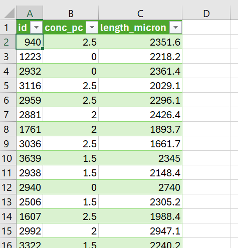
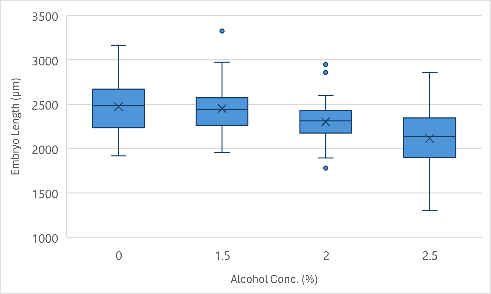

---
output:
  html_document: default
  pdf_document: default
---
\newpage

# Summarising Data and ANOVA in Excel

If you are currently participating in a timetabled BIOS103 QS workshop, please ensure that you cover **all of this section's content** and complete the [**formative and summative assessments**](#complete-your-weekly-assignments) on Canvas before 5 PM today.

In this section we will only be using Excel. No R today! You'll have to contain your excitement for a few more weeks yet.

Working on two important skills:
+ Summarising Data
+ Constructing and testing hypotheses

The ultimate aim is to gain insight and learn something new about the world from the data that we have painstaking measured in our well designed lab experiments. This is a cornerstone of what being a scientist is all about. This is what we are training you to become.

## Summarising Data

Raw data is beautiful, but messy. Showing another person your raw data and expecting them to immediately understand it, not matter how proud you are of the toil expended to generate the data, is an unrealistic expectation. You need to boil it down into something that another person can grasp instantaneously. 

Let's take a look at a Zebrafish dataset from an experiment that is uncannily similar to the one you generated in your lab practical this week.

### Download and Import the CSV File

1. **Download the CSV File:** 
   - Here is an [example dataset](https://www.canvaswizards.org.uk/dataspell/zebrafish/999999999). Download it to your local machine.

2. **Import into Excel:**
   - Open Excel (Use the desktop version - you won't be able to do this using the online version!).
   - Go to `Data > From Text/CSV` and select the downloaded CSV file.
   - When the import wizard appears, click `Load`.

You should now see something like that in Figure \@ref(fig:zebrafish-data-snap). There are 3 columns:
   - `ID` - A unique number to identify a measurement.
   - `conc_pc` - The ethanol concentration (%) that the each embryo was treated with.
   - `length_micron` - The measured lengths, in \( \mu m \) of the embryos.

```{r zebrafish-data-snap, echo=FALSE, fig.cap="Some Figure"}

```
We call this format, in which each row corresponds to a single measure mt, a **long** format.

### Generating a Summary Table

```{r, results='asis', echo=FALSE}
if (knitr::is_html_output()) {
  cat('<iframe width="560" height="315" src="https://www.youtube.com/embed/wji1rnZbe08?si=U7-r_s3RjNafU71v" title="YouTube video player" frameborder="0" allow="accelerometer; autoplay; clipboard-write; encrypted-media; gyroscope; picture-in-picture; web-share" referrerpolicy="strict-origin-when-cross-origin" allowfullscreen></iframe>')
}
```

1. **Identify your Groups**
   - Click anywhere in your table.
   - Select the `Data` menu and click the `Advanced` icon in the `Sort & Filter` section. This will bring up a window called "Advanced Filter".
   - Select the `Copy to another location` action.
   - Your list range should already be set to `$B:$B`, but if not make it so.
   - Set the `Copy to` cell to `$E:$1`
   - Make sure the `Unique records only` check box is selected and click OK.
   - You should now see a complete list of your alcohol concentration groups in a column with a header `conc_pc`. Make this into a new table by clicking on any of the concentration values, and then `Insert > New table > OK`.
   
Nice. Now you're ready to start building out your summary table horizontally. Let's start with calculating the mean Zebrafish length for each group.

Right now, your spreadsheet should look roughly the same as the screenshot in figure \@ref(fig:zebrafish-snap-2)

```{r zebrafish-snap-2, echo=FALSE, fig.cap="Constructing a summary table", out.width="100%"}
knitr::include_graphics("img/02/figure_2.png")
```

2. **Calculating a Mean Column**
   - Create a new column in your summary table by typing the word `Mean` in cell `F1`.
   - Calculate the mean of the Zebrafish lengths for the control group (0% alcohol concentration) by entering the following formula into cell `F2`.
   ```excel
   =AVERAGE(IF($B1:$B161=$E2,$C1:$C161))
   ```
   
> **A Deeper Explanation**  
> 
> The formula `=AVERAGE(IF($B$2:$B$161=$E2,$C$2:$C$161))` is an array formula that calculates the average length of Zebrafish for a specific group based on the concentration of alcohol.
> 
> - **`$B$2:$B$161`**: The `$` symbols before both the column letter `B` and the row numbers `2` and `161` lock the entire range. This means that when you copy the formula to other cells, this range will not change; it will always refer to cells `B2` to `B161`.
> 
> - **`$E2`**: The `$` before the column letter `E` locks the column, but since there's no `$` before the row number `2`, the row number can change if the formula is dragged down across rows. This cell is used to compare each value in the range `$B$2:$B$161` to the specific concentration value in the corresponding row in column `E`.

> 
> - **`$C$2:$C$161`**: Similar to the range for column `B`, this locks the range of cells in column `C` from which the values will be averaged, conditional on the `IF` statement.
> 
> - **`AVERAGE(IF(...))`**: The `IF` function checks each row in the range `$B$2:$B$161` to see if it matches the value in the corresponding row in column `E`. If it matches, the corresponding value in column `$C$2:$C$161` is included in the average calculation. The `AVERAGE` function then calculates the mean of these filtered values.
> 
> This approach is particularly useful when you want to calculate conditional averages across a dataset, ensuring that the correct cells are referenced even when copying the formula to different parts of the spreadsheet.

3. **Calculating More Columns**
   - Create four more columns with headers:
     - Std. Dev.
     - Median
     - Min
     - Max
   - Drag the cell `F2` to `G2`. Change the word `AVERAGE` in the formula in `G2` to `STDEV`. This will calculate the standard deviation for the group and the remaining cells in the column should also auto complete.
    - Do the same for the median, min and max columns. Be sure to use the corresponding function.
   
> **A Deeper Explanation**  
> 
> When analysing data, it's important to understand the basic statistical measures that summarise the data's distribution. Here are some key terms:
> 
> - **Mean**: The mean, often referred to as the average, is the sum of all values in a dataset divided by the number of values. It provides a central value for the data. However, the mean can be influenced by outliers (extremely high or low values).
> 
> - **Standard Deviation**: The standard deviation measures the amount of variation or dispersion in a dataset. It is calculated as the square root of the variance, where variance is the average of the squared differences between each data point and the mean. A low standard deviation indicates that the data points tend to be close to the mean, while a high standard deviation indicates more spread out data.
> 
> - **Median**: The median is the middle value in a dataset when the values are arranged in ascending or descending order. If the dataset has an odd number of values, the median is the central value. If the dataset has an even number of values, the median is the average of the two central values. The median is less affected by outliers compared to the mean.
> 
> - **Min**: The minimum (min) value is the smallest value in the dataset. It provides a measure of the lower bound of the data.
> 
> - **Max**: The maximum (max) value is the largest value in the dataset. It provides a measure of the upper bound of the data.
> 
> These measures are fundamental for understanding the distribution of data. The mean and median give you central tendencies, while the standard deviation tells you how spread out the data is. The minimum and maximum values provide the range within which all the data points fall.

### Presenting Your Summary Table

At some point you may wish to include your Excel summary table in a Word document. There's a lot of wiggle room on how you choose to format your table but there are a few **unbreakable** rules:

+ The table **MUST** have a caption. 
+ The caption should be placed **ABOVE** the table (not below as for a figure or graph).
+ The caption should be numbered accordingly. For example, if this is the first table in your document the figure caption should start "**Figure 1: ...**".
+ The caption should be descriptive and unambiguous. The reader should be able to quickly interpret what is going on without having to read the body of the text.
+ The table headers should be sensible and unambiguous. Any symbols or variables or units should be defined in the caption.
+ The data should be formatted to a sensible number of decimal places (i.e. if you're measurements are made to 1 decimal place, your summary values should not be quoted to more than this).
  
Follow these rules and you can't go wrong. Break them and I **will** find you. Figure \@ref(fig:zebrafish-summary) shows how my summary table looks when copyied and pasted into Word. I like to make my tables span the entire width of my document using the `Auto-fit to window` command. I also like to center my columns. These are personal preferences, but you can't deny they look great!


```{r zebrafish-summary, echo=FALSE, fig.cap="Formatting a summary table in Microsoft Word.", out.width="100%"}
knitr::include_graphics("img/02/figure_3.png")
```


   
## Analysis of Variance (ANOVA)

You're about to learn a critical skill that is important for becoming a scientist: formulating hypotheses and testing them. This is a cornerstone of scientific inquiry.

You've already summarised your data using descriptive statistics. Now, we'll move on to another branch of statistics called inferential statistics. This involves using an appropriate statistical test to determine whether your hypotheses should be accepted or rejected.

Knowing which statistical test to use depends on the data and context. It takes time to become proficient at this, and it's completely normal to consult resources or tools like ChatGPT to decide on the best test for a given situation.

For this example, we'll use our Zebrafish data to determine whether there is an effect of alcohol concentration on the lengths of developing Zebrafish embryos.

### Grouped Boxplot in Excel

Before diving into statistical tests, let's create a boxplot to visually inspect the data.

1. **Insert a Boxplot**: 
   - Select your data.
   - Go to the **Insert** tab, click on **Insert Statistical Chart**, and choose **Box and Whisker**.

2. **Select Data**: 
   - Your plot will look a bit weird. That's because we need to configure the groupings properly.
   - Click the **Select dta** button.
   - Remove the **conc_pc** series from the left-hand list.
   - Click the **Edit** button on the (currently empty) right-hand list.
3. **Boxplots in the wrong order?**
   - Sort the **conc_pc** column from smallest to largest.
4. **Re-scale y-axis**:
   - It's best to re-scale the y-axis to maximise the space used by the boxplots. This will make any effect easier to see.
   - Double-click on the numbers in the y-axis. Set the **Bounds > Minimum**: to 1000.
5. **Add Axis Labels**:
    - Click the green **+** icon in the top-right of your graph.
    - Check the **Axes titles** box.
    - Double-click on each label in turn and update with appropriate labels:
      - X-axis: "Alcohol Conc. (%)"
      - Y-axis: "Embryo Length (\(\mu m\))
    - Note: To use the **\(\mu\)** symbol click **Insert > Symbols > Symbol**. Find the symbol in the list and click **Insert**.
6. **Get Rid of Chart Title**:
    - If you're going to be presenting this figure in a report or poster then it should not have a title above the axes.
    - Instead you should include a figure caption **below** the plot.
    - The same **unbreakable** rules for your caption are the same as those described above for table captions. Just make sure your caption is below the figure instead of above.
7. **Export Your Figure**:
    - Right click on your figure anywhere outside the plot area and you should see the option to **Save as picture**.
    - Save it somewhere sensible as a .png file and then insert it into a Word document with a sensible caption.
    
```{r zebrafish-boxplot, echo=FALSE, fig.cap="Distribution of Zebrafish embryo lengths organised by Alcohol treatments.", out.width="100%"}

```
    
> **Understanding Boxplots**
> 
> A boxplot is a standardised way of displaying the distribution of data based on a five-number summary: minimum, first quartile (Q1), median, third quartile (Q3), and maximum. The box in the boxplot represents the interquartile range (IQR), which is the range between Q1 and Q3. The central line within the box indicates the median, which is the middle value of the dataset.
> 
> Sometimes, an "X" symbol is also included within the box, representing the mean of the dataset. However, it is important to note that the mean is not always shown in a boxplot.
> 
> The "whiskers" of the boxplot extend from the box to the smallest and largest values within 1.5 times the IQR from the first and third quartiles, respectively. These whiskers help to indicate the spread of the majority of the data.
> 
> Outliers are data points that fall outside the range defined by the whiskers. These are typically plotted as individual points beyond the ends of the whiskers, highlighting data points that are unusually high or low compared to the rest of the dataset.
> 
> To determine whether a data point is an outlier, you compare it to the thresholds defined by the IQR:
> 
> - Any data point below Q1 - 1.5 * IQR is considered a lower outlier.
> - Any data point above Q3 + 1.5 * IQR is considered an upper outlier.
> 
> **Summary:**
> 
> - **Box**: Represents the interquartile range (IQR), the middle 50% of the data.
> - **Central Line**: Indicates the median value.
> - **X (if shown)**: Indicates the mean value.
> - **Whiskers**: Extend to the smallest and largest values within 1.5 times the IQR from the quartiles.
> - **Outliers**: Data points that lie outside the whiskers, typically displayed as individual points.


    

We'll revisit boxplots in more detail in Chapter 5.

### Constructing Hypotheses

Formulating hypotheses involves making formal statements:

- **Null Hypothesis (\(H_0\))**: There is no effect of alcohol concentration on Zebrafish embryo length.
- **Alternative Hypothesis (\(H_1\))**: There is an effect of alcohol concentration on Zebrafish embryo length.

### Performing a One-Way ANOVA in Excel

A one-way ANOVA allows you to test whether there are significant differences between the means of three or more independent groups.

#### Step 1: Install the Analysis ToolPak

1. Go to **File** > **Options**.
2. Select **Add-ins** from the left-hand menu.
3. At the bottom, manage **Excel Add-ins** and click **Go**.
4. Check the box for **Analysis ToolPak** and click **OK**.
5. You should now see a **Data Analysis** button under the **Data** tab.

#### Step 2: Set Up the One-Way ANOVA

1. Click on the **Data Analysis** button in the **Data** tab.
2. Select **ANOVA: Single Factor** and click **OK**.

#### Step 3: Input Data and Parameters

1. **Input Range**: Highlight the range of your data (including labels if desired).
2. **Group By**: Choose whether your data is grouped by columns or rows. If your data is organized in columns, select **Columns**.
3. **Labels**: If you included labels in your selection, check the **Labels in first row** option.
4. **Alpha Level**: Set this to 0.05, which is a common significance threshold.

#### Step 4: Select Output Options

1. **Output Range**: Choose where the results will be displayed in your worksheet.
2. **New Worksheet Ply**: Create a new worksheet for the results, and optionally give it a name (e.g., "ANOVA Results").
3. **New Workbook**: Alternatively, choose to output the results to a new workbook.

Click **OK** to perform the analysis.

### Interpreting the Results

After running the ANOVA, you will see two main tables: a summary table and an ANOVA table.

#### Summary Table
- **Count**: Number of data points in each group.
- **Sum**: The total sum of values in each group.
- **Average**: The mean value for each group.
- **Variance**: A measure of how much the values in each group vary.

#### ANOVA Table
- **Between Groups**:
  - **SS (Sum of Squares)**: Quantifies the variability between the group means.
  - **df (Degrees of Freedom)**: Calculated as the number of groups minus one.
  - **MS (Mean Square)**: SS divided by the df for between groups.
  - **F**: The test statistic, calculated as the ratio of MS between groups to MS within groups.
  - **P-value**: Used to determine the significance of the test. If \( p \leq \) 0.05, you reject the null hypothesis.
  
- **Within Groups**:
  - **SS**: Quantifies the variability within each group.
  - **df**: Calculated as the total number of observations minus the number of groups.
  - **MS**: SS divided by the df for within groups.
  
- **Total**:
  - **SS**: Sum of SS between groups and SS within groups.
  - **df**: Sum of df between groups and df within groups.

### Performing Post-hoc Tests

If your ANOVA results are significant, you might want to perform post-hoc tests to determine which specific groups are different. Common post-hoc tests include Tukey's HSD and the Bonferroni correction.

We'll cover post-hoc tests in detail in the next section.

### Summary

ANOVA is a powerful tool for testing differences between group means. Excel makes it easy to perform a one-way ANOVA with the Analysis ToolPak, and interpreting the results allows you to draw meaningful conclusions from your data.


```{r, results='asis', echo=FALSE}
if (knitr::is_html_output()) {
  cat('<iframe src="https://www.likertysplit.com/qs" width="100%" height="400"></iframe>')
}
```


## Complete your Weekly Assignments

In the BIOS103 Canvas course you will find this week's **formative** and **summative** assignments. You should complete both of these before the end of the online workshop that corresponds to this section's content. The assignments are identical in all but the following details:

   + You can attempt the **formative assignment** as many times as you like. It will not contribute to your overall score for this course. Make sure you practice this assignment until you're confident that you can get the correct answer on your own.
   + You can attempt the **summative** assignment **only once**. It will be identical to the formative assignment but will use different values and datasets. This assignment **will** contribute to your overall score for this course.
   + **Late submissions**. You have until 5pm on the day of the workshop for this week's content to submit your **summative** assignment. Late submissions will incur a 5% penalty for every part or full day beyond the deadline. Penalties will be capped at 40%.


