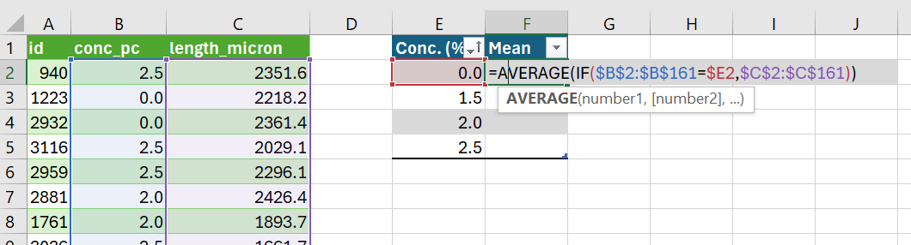
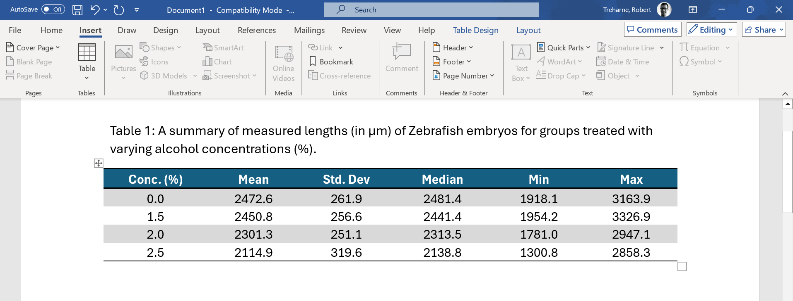

---
output:
  html_document: default
  pdf_document: default
---
\newpage

# Summarising Data and ANOVA in Excel

If you are currently participating in a timetabled BIOS103 QS workshop, please ensure that you cover **all of this section's content** and complete the [**formative and summative assessments**](#complete-your-weekly-assignments) on Canvas before 5 PM today.

In this section we will only be using Excel. No R today! You'll have to contain your excitement for a few more weeks yet.

Working on two important skills:
+ Summarising Data
+ Constructing and testing hypotheses

The ultimate aim is to gain insight and learn something new about the world from the data that we have painstaking measured in our well designed lab experiments. This is a cornerstone of what being a scientist is all about. This is what we are training you to become.

## Summarising Data

Raw data is beautiful, but messy. Showing another person your raw data and expecting them to immediately understand it, not matter how proud you are of the toil expended to generate the data, is an unrealistic expectation. You need to boil it down into something that another person can grasp instantaneously. 

Let's take a look at a Zebrafish dataset from an experiment that is uncannily similar to the one you generated in your lab practical this week.

### Download and Import the CSV File

1. **Download the CSV File:** 
   - Here is an [example dataset](https://www.canvaswizards.org.uk/dataspell/zebrafish/999999999). Download it to your local machine.

2. **Import into Excel:**
   - Open Excel (Use the desktop version - you won't be able to do this using the online version!).
   - Go to `Data > From Text/CSV` and select the downloaded CSV file.
   - When the import wizard appears, click `Load`.

You should now see something like that in Figure \@ref(fig:zebrafish-data-snap). There are 3 columns:
   - `ID` - A unique number to identify a measurement.
   - `conc_pc` - The ethanol concentration (%) that the each embryo was treated with.
   - `length_micron` - The measured lengths, in \( \mu m \) of the embryos.

```{r zebrafish-data-snap, echo=FALSE, fig.cap="Some Figure"}
knitr::include_graphics("img/02/figure_1.png")
```
We call this format, in which each row corresponds to a single measure mt, a **long** format.

### Generating a Summary Table

1. **Identify your Groups**
   - Click anywhere in your table.
   - Select the `Data` menu and click the `Advanced` icon in the `Sort & Filter` section. This will bring up a window called "Advanced Filter".
   - Select the `Copy to another location` action.
   - Your list range should already be set to `$B:$B`, but if not make it so.
   - Set the `Copy to` cell to `$E:$1`
   - Make sure the `Unique records only` check box is selected and click OK.
   - You should now see a complete list of your alcohol concentration groups in a column with a header `conc_pc`. Make this into a new table by clicking on any of the concentration values, and then `Insert > New table > OK`.
   
Nice. Now you're ready to start building out your summary table horizontally. Let's start with calculating the mean Zebrafish length for each group.

Right now, your spreadsheet should look roughly the same as the screenshot in figure \@ref(fig:zebrafish-snap-2)

```{r zebrafish-snap-2, echo=FALSE, fig.cap="Constructing a summary table", out.width="100%"}

```

2. **Calculating a Mean Column**
   - Create a new column in your summary table by typing the word `Mean` in cell `F1`.
   - Calculate the mean of the Zebrafish lengths for the control group (0% alcohol concentration) by entering the following formula into cell `F2`.
   ```excel
   =AVERAGE(IF($B1:$B161=$E2,$C1:$C161))
   ```
   
> **A Deeper Explanation**  
> 
> The formula `=AVERAGE(IF($B$2:$B$161=$E2,$C$2:$C$161))` is an array formula that calculates the average length of Zebrafish for a specific group based on the concentration of alcohol.
> 
> - **`$B$2:$B$161`**: The `$` symbols before both the column letter `B` and the row numbers `2` and `161` lock the entire range. This means that when you copy the formula to other cells, this range will not change; it will always refer to cells `B2` to `B161`.
> 
> - **`$E2`**: The `$` before the column letter `E` locks the column, but since there's no `$` before the row number `2`, the row number can change if the formula is dragged down across rows. This cell is used to compare each value in the range `$B$2:$B$161` to the specific concentration value in the corresponding row in column `E`.

> 
> - **`$C$2:$C$161`**: Similar to the range for column `B`, this locks the range of cells in column `C` from which the values will be averaged, conditional on the `IF` statement.
> 
> - **`AVERAGE(IF(...))`**: The `IF` function checks each row in the range `$B$2:$B$161` to see if it matches the value in the corresponding row in column `E`. If it matches, the corresponding value in column `$C$2:$C$161` is included in the average calculation. The `AVERAGE` function then calculates the mean of these filtered values.
> 
> This approach is particularly useful when you want to calculate conditional averages across a dataset, ensuring that the correct cells are referenced even when copying the formula to different parts of the spreadsheet.

3. **Calculating More Columns**
   - Create four more columns with headers:
     - Std. Dev.
     - Median
     - Min
     - Max
   - Drag the cell `F2` to `G2`. Change the word `AVERAGE` in the formula in `G2` to `STDEV`. This will calculate the standard deviation for the group and the remaining cells in the column should also auto complete.
    - Do the same for the median, min and max columns. Be sure to use the corresponding function.
   
> **A Deeper Explanation**  
> 
> When analysing data, it's important to understand the basic statistical measures that summarise the data's distribution. Here are some key terms:
> 
> - **Mean**: The mean, often referred to as the average, is the sum of all values in a dataset divided by the number of values. It provides a central value for the data. However, the mean can be influenced by outliers (extremely high or low values).
> 
> - **Standard Deviation**: The standard deviation measures the amount of variation or dispersion in a dataset. It is calculated as the square root of the variance, where variance is the average of the squared differences between each data point and the mean. A low standard deviation indicates that the data points tend to be close to the mean, while a high standard deviation indicates more spread out data.
> 
> - **Median**: The median is the middle value in a dataset when the values are arranged in ascending or descending order. If the dataset has an odd number of values, the median is the central value. If the dataset has an even number of values, the median is the average of the two central values. The median is less affected by outliers compared to the mean.
> 
> - **Min**: The minimum (min) value is the smallest value in the dataset. It provides a measure of the lower bound of the data.
> 
> - **Max**: The maximum (max) value is the largest value in the dataset. It provides a measure of the upper bound of the data.
> 
> These measures are fundamental for understanding the distribution of data. The mean and median give you central tendencies, while the standard deviation tells you how spread out the data is. The minimum and maximum values provide the range within which all the data points fall.

### Presenting Your Summary Table

At some point you may wish to include your Excel summary table in a Word document. There's a lot of wiggle room on how you choose to format your table but there are a few **unbreakable** rules:

+ The table **MUST** have a caption. 
+ The caption should be placed **ABOVE** the table (not below as for a figure or graph).
+ The caption should be numbered accordingly. For example, if this is the first table in your document the figure caption should start "**Figure 1: ...**".
+ The caption should be descriptive and unambiguous. The reader should be able to quickly interpret what is going on without having to read the body of the text.
+ The table headers should be sensible and unambiguous. Any symbols or variables or units should be defined in the caption.
+ The data should be formatted to a sensible number of decimal places (i.e. if you're measurements are made to 1 decimal place, your summary values should not be quoted to more than this).
  
Follow these rules and you can't go wrong. Break them and I **will** find you. Figure \@ref(fig:zebrafish-summary) shows how my summary table looks when copyied and pasted into Word. I like to make my tables span the entire width of my document using the `Auto-fit to window` command. I also like to center my columns. These are personal preferences, but you can't deny they look great!


```{r zebrafish-summary, echo=FALSE, fig.cap="Formatting a summary table in Microsoft Word.", out.width="100%"}

```


   
## Analysis of Variance (ANOVA)

Yay, let's do some ANOVA

## Complete your Weekly Assignments

In the BIOS103 Canvas course you will find this week's **formative** and **summative** assignments. You should complete both of these before the end of the online workshop that corresponds to this section's content. The assignments are identical in all but the following details:

   + You can attempt the **formative assignment** as many times as you like. It will not contribute to your overall score for this course. Make sure you practice this assignment until you're confident that you can get the correct answer on your own.
   + You can attempt the **summative** assignment **only once**. It will be identical to the formative assignment but will use different values and datasets. This assignment **will** contribute to your overall score for this course.
   + **Late submissions**. You have until 5pm on the day of the workshop for this week's content to submit your **summative** assignment. Late submissions will incur a 5% penalty for every part or full day beyond the deadline. Penalties will be capped at 40%.


