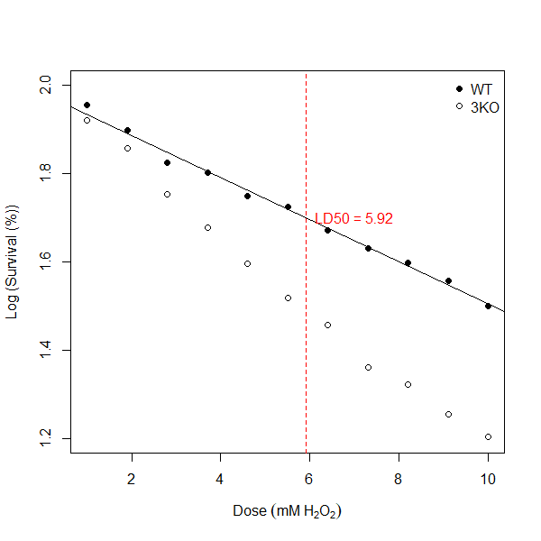

# Statistics in R: Part II

If you are currently participating in a timetabled BIOS103 QS workshop, please ensure that you cover **all of this section's content** and complete this week's **formative and summative assessments** in the BIOS103 Canvas Course.

We're going to revisit linear regression in this chapter. Our aim is to do what we were able to do with Excel in section \@ref(linear-regression), but with R. We'll also extend our knowledge by learning how to perform a multiple linear regression (MLR), i.e. regression involving more than one independent variables.

The **key objectives** for this chapter are as follows:

- Linearising data with logarithms.
- Performing a linear regression in R.
- Visualising linear relationships and adding trendlines in R.
- Predicting values using your regression models.
- Extending linear regression to multiple variables (MLR).

You should have a quick scroll through section \@ref(linear-regression) again before you continue Yes, I mean right now.

## Linear Regression in R

To keep this week's QS relevant to what you've been doing in the lab, I've contrived the following scenario:

Because of your **impressive data science and coding skills**, you’ve been invited to join a research team investigating how cells survive under stress. Your challenge is to uncover the survival secrets of two yeast strains: the wild-type (**WT**) and a genetically modified mutant strain (**3KO**).

In the lab, both strains were exposed to increasing doses of hydrogen peroxide (H₂O₂)—a chemical that causes oxidative stress by damaging DNA and other essential cellular components. Your task is to help the team figure out the **LD50** for each strain — the dose that reduces survival by 50%.

This isn’t just an academic exercise. Oxidative stress is a key factor in ageing and diseases like cancer, so understanding how cells respond to it could have far-reaching implications for science and medicine.

Here's your <a href="https://raw.githubusercontent.com/rtreharne/qs/refs/heads/main/data/09/yeast_999.csv" target="_blank">dataset</a> containing the results of a **dose-response assay**. It has the following headers:

- `dose` (mM of H₂O₂): The level of oxidative stress applied.
- `strain_type` (WT or 3KO): The two strains being tested.
- `counts_per_plate`: The number of surviving colonies at each dose.

Preliminary work has already established that at a **zero dose** (0 mM) of hydrogen peroxide, **both** yeast strains (WT and 3KO) have an average colony count of **300 colonies**.

Your challenge is to use linear regression in R to model the relationship between H₂O₂ dose and survival. By calculating and comparing the LD50 values for each strain, you’ll help the team uncover how genetic differences impact a cell’s ability to withstand damage.

So, let’s put your QS skills to work!

### Reading the data and calculating a survival column

Create a new R project and start a new script file. Read your data to a new variable called `yeast_data`. Use the `head()` function on your data to have a sneak peak. This is what you should see.

```{r eval=TRUE, echo=FALSE}
yeast_data = read.csv("https://raw.githubusercontent.com/rtreharne/qs/refs/heads/main/data/09/yeast_999.csv")

head(yeast_data)
```

I'd like to calculate another column containing the survival as a percentage for each row. Remember, the zero dose colony counts for both WT and 3KO strains was **300**. I'm going to let you think about how do do this, but here's what your head values should look like:

```{r eval=TRUE, echo=FALSE}
zero_dose_counts <- 300
yeast_data$survival <- yeast_data$counts_per_plate * 100 /zero_dose_counts

head(yeast_data)
```
### Visualising the data

As ever, before deciding how to proceed with any further statistical analysis, it is good practice to visualise your data. Use the code below to generate a scatterplot that shows the dose-survival response for both yeast strains. You should see something similar to what is shown in figure \@ref(fig:scatterplot-1).

```{R eval=FALSE}

# Extend your existing code with the following:


# Plot Dose vs Survival for Wild Type First
plot(yeast_data$dose[yeast_data$strain_type == "WT"], 
     yeast_data$survival[yeast_data$strain_type == "WT"], 
     type = "p",  # 'p' for points only
     pch = 16,
     xlab = expression(Dose~(mM~H[2]*O[2])), 
     ylab = "Survival (%)",
     ylim = c(0, 100)
)

# Add points for Mutant Strain
points(yeast_data$dose[yeast_data$strain_type == "3KO"], 
       yeast_data$survival[yeast_data$strain_type == "3KO"], 
       pch = 1)  # Color for 3KO strain

# Add the legend
legend("topright", legend = c("WT", "3KO"), pch = c(16, 1), bty = "n")

```

```{r scatterplot-1, echo=FALSE, fig.cap="Dose response curves for wilt type (WT) and mutant (3KO) yeast strains.", out.width="100%"}
knitr::include_graphics("img/09/scatterplot_1.png")
```
What **general observations** can we make from \@ref(fig:scatterplot-1)?

- **1. General Trend:**
  - As the dose of H<sub>2</sub>O<sub>2</sub>. increases, the survival percentage decreases for both strians, indicating a negative effect of increasing oxidative stress on yeast survival.
- **2. Comparison of Strains:**
  - The **WT** strain consistently shows higher survival percentages than the **3KO** strain at all doses, suggesting that the WT strain is more resistant to oxidative stress caused by H<sub>2</sub>O<sub>2</sub>.
- **Dose-Specific Patterns**:
  - At lower doses (e.g., 2mM), both strains have relatively high survival percentages, but the WT strain has a clear advantage.
  - At higher doses (e.g., 8-10 mM), the surviavl percentages drop significancly for both strains, with the 3KO strain showing a much steeper decline.
  
The key implication of these observations is that compared to the WT strain, the 3KO strain's survival is less robust to oxidative stress, potentially due to a lack of key genes.

### Linearising the data

Look closely at figure \@ref(fig:scatterplot-1) again. Is the relationship between survival percentage and dose linear? I don't think so. For both yeast strains (especially the 3KO strian), my brain is trying to draw a curved line through the data points. Applying a linear model (regression) to this data would likely result in misleading predictions, such as survival percentages below 0% or above 100%. It would also likely over or under-estimate my LD50 values for each strain. I'd say that the data demonstrates a <a href="#non-linear">**non-linear decay**</a>.

To apply linear regression appropriately, the data should first be **linearised**. Linearisation involves transforming the non-linear relationship into a linear one that satisfies the assumptions of linear regression. This will allow us to achieve a better model fit and to make more accurate predictions.

In our case we're going to apply a **logarithmic transformation**. Don’t worry – I’m not expecting you to develop a deep understanding of logarithms here. In short, we use logarithmic transformations to simplify data, especially when dealing with non-linear relationships. This helps make patterns more linear and easier to interpret, without the need for complex maths (and non-linear models).

Let's add the following line to our script file:

```{R eval=TRUE}
# Extend your existing code with the following:

# Calculate a log_survival column
yeast_data$log_survival <- log10(yeast_data$survival)

```
This code creates a new variable called `log_survival` in the `yeast_data` dataset by applying the `log10()` function (a base-10 logarithm) to each value in the `survival` column.

Let's re-visualise the data, but now for the `log_survival` column.

```{R eval=TRUE, fig.show="hide"}

# Extend your existing code with the following:

# Plot Dose vs Survival for Wild Type First
plot(yeast_data$dose[yeast_data$strain_type == "WT"], 
     yeast_data$log_survival[yeast_data$strain_type == "WT"], 
     type = "p",  # 'p' for points only
     pch = 16,
     xlab = expression(Dose~(mM~H[2]*O[2])), 
     ylab = "Log (Survival (%))",
     ylim = c(1.2, 2)
)

# Add points for Mutant Strain
points(yeast_data$dose[yeast_data$strain_type == "3KO"], 
       yeast_data$log_survival[yeast_data$strain_type == "3KO"], 
       pch = 1)  # Color for 3KO strain

# Add the legend
legend("topright", legend = c("WT", "3KO"), pch = c(16, 1), bty = "n")
```
```{r scatterplot-2, echo=FALSE, fig.cap="Log (Survival (5) vs Dose response curves for wild type (WT) and mutant (3KO) yeast strains.", out.width="100%"}
knitr::include_graphics("img/09/scatterplot_2.png")
```

In the code above I've simply replaced any instance of `yeast_data$survival` with `yeast_data$log_survival`. I've also re-scaled my y-axis to values between 1.2 - 2 and updated my y-axis label to "Log (Survival (%))". You should see a result that looks like figure \@ref(fig:scatterplot-2). Now, my brain would be quite happy to try and draw straight lines through both the WT and 3KO series - and you know what that means, right? You got it, it's **linear regression** time!

><h3 id="non-linear">Non-linear Decay in Nature</h3>
>
>Non-linear decay is a common phenomenon in nature, where processes don't follow a straight-line pattern but instead curve as they progress. Two notable types of non-linear decay are **exponential decay** and **sigmoidal decay**.
>
>1. **Exponential Decay**
>This occurs when a quantity decreases at a constant rate. A biological example is the decline of a population in a resource-limited environment, where individuals die off at a rate proportional to the current population size, like in certain bacteria or viruses under unfavourable conditions.
>2. **Sigmoidal Decay**
>This "S" shaped curve starts slowly, then declines rapidly, and levels off at a minimum. It's seen in biological processes like drug responses, where cells show little change at first, then quickly drop in survival, before stabilizing at low levels.


### Performing a Linear Regression in R

```{r, results='asis', echo=FALSE}
if (knitr::is_html_output()) {
  cat('<iframe width="100%" height="400" src="https://www.youtube.com/embed/3esibWcbz34?si=ScwovXn2AiKsVNdj" title="YouTube video player" frameborder="0" allow="accelerometer; autoplay; clipboard-write; encrypted-media; gyroscope; picture-in-picture; web-share" referrerpolicy="strict-origin-when-cross-origin" allowfullscreen></iframe>')
}
```
<br>

For the WT strain here's how I'd do a linear regression in R:

```{R eval=TRUE}
# Extend your existing code with the following:

# Create a linear model for the WT data
lm_WT <- lm(log_survival ~ dose, data = yeast_data[yeast_data$strain_type == "WT", ])

# View summary
summary(lm_WT)
```
Let's unpack these two lines and interpret the summary output:

1. **Create a linear model**:

- `lm_WT <-`: This assigns the output of the linear regression model to a new object lamed `lm_WT`. You can then refer to `lm_WT` to examine the results of the model, or make predictions, later.
- `lm(log_survival ~ dose, ...)`: The `lm()` function fits a linear regression model. Here, the dependent variable (`log_survival`) is being predicted based on the independent variable (`dose`). This means the model will examine how changes in `dose` are associated with changes in `log_survival`.
- `data = yeast_data[yeast_data$strain_type == "WT", ]`: The `data` argument specifies the dataset to use. In this case, it's a subset of the `yeast_data` dataset. The subset is created by selecting only the rows where `strain_type` is equal to "WT". This means the linear model is being applied **only to the data for the wilt type (WT) strain**.

2. **View summary**:

- `summary(lm_WT)`: This command generates a summary of the linear regression model stored in the `lm_WT` object.

<h3>**Intepreting the Linear Regression Summary**</h3>

The output from the `summary(lm_WT)` line indicates a strong, significantly negative relationship between `dose` and `log_survival` for the WT strain. A low residual standard error value of 0.0127 indicates that predictions are very close to observed values. An R-squared value of 0.993 indicates that **99.3%** of the variation in `log_survival` is explained by the `dose`. Both the intercept and slope values from the linear fit (0.9815 and -0.0478 respectively) have associated p-values < 0.001 indicating that each of these coefficients are extremely significant. Overall, the model strongly supports that increasing the dose reduces survival on a logarithmic scale. It provides an excellent fit to the data with minimal residuals.

### Calculating LD50

The last thing to do then is to use our model to calculate the **LD50**. Remember, this is a standard measure used to indicate the dose of a substance required to kill 50% of a test population. In the code below I extract the coefficients from my linear model and substitute a y-value of log(50) (~1.70) into my formula to predict the dose value:

```{R eval=TRUE}
#  Extend your existing code with the following:

# Get your model coefficients
intercept_WT <- lm_WT$coeff[1] # Extract the intercept
slope_WT <- lm_WT$coeff[2] # Extract the slope

# Calculate the dose predicted at a log_survival of log(50)
ld50_WT <- (log10(50) - intercept_WT)/slope_WT

# print ld50_WT
print(ld50_WT)

```
And there you have it! My **LD50** value for my **wild type** (WT) strain is 5.92 mM (2 d.p). I can update my figure \@ref(fig:scatterplot-2) to show my line of best fit generated by my linear model and annotate the line with my LD50 value for WT using the following code: 

```{R eval=FALSE}
#  Extend your existing code with the following:

# Add regression line
abline(lm_WT)

# Annotate the plot with the WT LD50
abline(v = ld50_WT, lty = 2, col = "red")  # Vertical dotted line at LD50
text(ld50_WT, log50, labels = paste("LD50 =", round(ld50_WT, 2)), pos = 4, col = "red")
```
```{r scatterplot-3, echo=FALSE, fig.cap="Log (Survival (%) vs Dose response curves for wild type (WT) and mutant (3KO) yeast strains. Straight black line indicates result of linear regression model for WT. Vertical dotted red line indicates LD50 value for WT.", out.width="100%"}

```
Can you do the same for the **3KO** mutant strain? **You'll need to if you want to complete this week's summative test**.

```{r, results='asis', echo=FALSE}
if (knitr::is_html_output()) {
  cat('<iframe src="https://canvaswizards.org.uk/likertysplit/qs/" width="400" style="max-width: 100%" height="600"></iframe>')
}
```

## Multiple Linear Regression (MLR) in R.

We can extend our knowledge of regression by exploring **Multiple Linear Regression (MLR)**. Unlike simple linear regression, which focuses on a single predictor, MLR enables us to account for the effects of multiple factors **simultaneously**, making it ideal for more complex real-world problems.

As an example, let's revisit our **MegaMush** scenario from Chapter 5. We explored how the dependent variable, **Viable Counts** (VC), is influenced by independent variables, temperature and moisture. I finished the chapter with figure \@ref(fig:plotly), a 3D scatterplot showing that all the data aligns with a flat plane rather than a single line of best fit between any pair of variables. We can use MLR to determine the equation of that flat plane and then predict **VC** for any combination of temperature and moisture within the measured range. Such an analysis would be extremely powerful for anyone wanting to fine-tune processes to finely control the resultant the **VC**.

### Performing an MLR in R

```{r, results='asis', echo=FALSE}
if (knitr::is_html_output()) {
  cat('<iframe width="100%" height="400" src="https://www.youtube.com/embed/KdLIXQMQZ_c?si=KRms0Xmu54eoYmAw" title="YouTube video player" frameborder="0" allow="accelerometer; autoplay; clipboard-write; encrypted-media; gyroscope; picture-in-picture; web-share" referrerpolicy="strict-origin-when-cross-origin" allowfullscreen></iframe>')
}
```
<br>

Let's do it! Start a new script file in your project for this week and run the following code:

```{R eval=TRUE}
# Read the data from a URL
compost_data <- read.csv("https://raw.githubusercontent.com/rtreharne/qs/refs/heads/main/data/05/compost_999.csv")

# Create an MLR model
lm_compost <- lm(Viable.counts ~ Temperature * Moisture, data = compost_data)

# Inspect the result of the model
summary(lm_compost)
```

Wow. That was easy! You'll notice that the only real difference was in the formula argument of the `lm()` function. You've incorporated both independent variables using `Viable.counts ~ Temperature * Moisture`. This is reminiscent of your two-way ANOVA from last week. Let's interpret the interesting bits of the summary output:

- **Temperature**: For every 1-unit increase in **Temperature**, **VC** decreases by 1.38 units (highly significant, p < 2e-16!).
- **Moisture**: For every 1-unit increase in **Moisture**, **VC** increases by 0.89 units (highly significant, p < 2e-16!).
- **Temperature:Moisture interaction**: Just like with out two-way ANOVA we get a line in our summary that tells us if there is any significant interaction between our independent variables. Interestingly, in this case the interaction effect is small and not statistically significant (p = 0.36).
- **Model Fit**:
  - Residual standard error: 0.58 (very low!)
  - Adjusted R<sup>2</sup>: 0.9941 - The model can explain 99.41% of the variance in the dataset.
  - Overall model significance: p < 2.2e-16
  
In conclusion, the multi-linear regression model provides a strong fit to the data. Both **Temperature** and **Moisture** significantly impact the **Viable Counts**, but their interaction is not statistically significant.

### Predicting values for Viable Counts

You can now proceed to make a prediction for VC values by inputting any combination of Temperature and Moisture co-ordinates from the measured range of data. It would be a bad idea to try and predict VC for any temperatures/moisture from outside the range because you really don't know if the behavior outside of this range will remain linear.

You can use your model object `lm_compost` to predict VC using few lines of R code. I am going to be a bit mean here and let you figure out the best way to do this yourselves (there will be more than one way to do it!). I don't care how you go about this - Google, ChatGPT etc - do whatever it takes. Remember to make use of this week's formative test to check your results first before attempting the summative test. **If you've cracked it then I encourage you to share your solutions in the Workshop channel in Microsoft Teams**. 