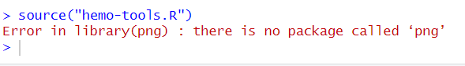
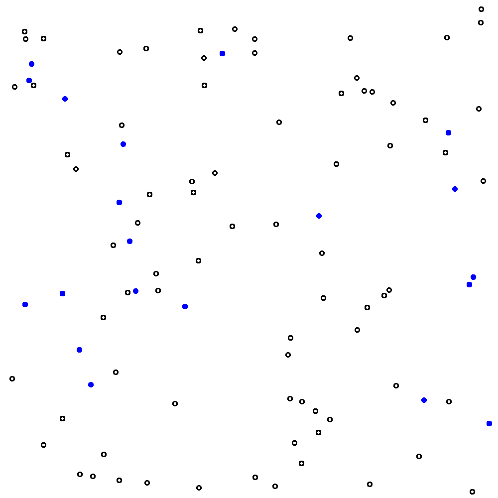

# Image Analysis in R

If you are currently participating in a timetabled BIOS103 QS workshop, please ensure that you cover **all of this section's content** and complete this week's **formative and summative assessments** in the BIOS103 Canvas Course. 


In the last chapter, we explored how to use R for parsing FASTA files and performing some basic bioinformatics tasks. This chapter builds on that foundation by focusing on the power of R to automate repetitive tasks - a skill that is invaluable when working with large datasets or time-consuming processes.

You've already had some experience with repetitive tasks in your lab work. For example, counting cells using a hemocytometer. While that exercise gave you a hands-on understanding of the process, imagine needing to count hundreds, or even thousands of hemocytometer grids. Doing it manually would take hours, if not days. This week, we'll tackle that challenge by using R to automate the process.

The **key learning objectives** for this chapter are:

1. Learn how to install and use R packages to extend your capabilities.
2. Work with pre-written functions in an R script and apply them to real-world tasks.
3. Manage .zip files by extracting their contents and applying functions in a loop.

All of the above will be delivered using the following, highly contrived (and very tongue in cheek) scenario.


## The Doomscroller Virus Pandemic: Scenario

A new virus, dubbed the *Doomscroller* virus, is affecting young people worldwide, resulting in a drastic drop in productivity. One of the key symptoms of this virus is a reduction in viable red blood cell counts. Labs across the country are overwhelmed and short on costly autocounting equipment. Fortunately, they still have large supplies of hemocytometer slides and digital microscopes for manual cell counting.

You've recently been hired as an expert bio-analyst to help solve this bottleneck. Your team has developed a short script called <a href="#hemo-tools">hemo-tools.R"</a> that can analyse digital images of hemocytometer slides and automatically count viable red blood cells.

To prove the viability of this solution, you are given a zip file containing 100 hemocytometer images: <a href="https://github.com/rtreharne/qs/raw/refs/heads/main/data/11/hemo_100.zip" target="_blank">hemo_100.zip</a>. Each file in the zip file represents a slide prepared from suspected infected blood samples. 

**Your initial task is to run the script on each image and calculate the average number of viable cells across all 100 images**.


### Performing a Manual Count

Before we dive into the code let's make sure we're still capable of doing things the old fashioned way. Figure \@ref(fig:hemo-grid) shows a single example of the kind of images that we're dealing with here. Each empty circle (no colour) in the image represents a **viable** blood cell, whereas every blue-filled circle represents a non-viable cell. 

Watch the following video to understand why the non-viable cells are blue and to remind yourself how to manually estimate the number of viable cells in figure \@ref(fig:hemo-grid).

```{r, results='asis', echo=FALSE}
if (knitr::is_html_output()) {
  cat('<iframe width="100%" height="400" src="https://www.youtube.com/embed/pP0xERLUhyc?si=gt6Y3rTbXxzSKgeE" title="YouTube video player" frameborder="0" allow="accelerometer; autoplay; clipboard-write; encrypted-media; gyroscope; picture-in-picture; web-share" referrerpolicy="strict-origin-when-cross-origin" allowfullscreen></iframe>')
}
```


```{r hemo-grid, echo=FALSE, fig.cap="Example of a single hemocytometer image taken using a digital microscope. Each large square (there are 9 in total) represents a volume of 1e-4 mL.", out.width="100%"}
knitr::include_graphics("img/11/hemo_grid.png")
```
By applying the methodology in the video, I hope we can agree on the set of counts shown in table 9.1.
```{r count-table, include=FALSE}
# Load necessary libraries
library(knitr)
```

Table 9.1: Manual counts of viable and non-viable cells for figure \@ref(fig:hemo-grid).
```{R eval=TRUE, echo=FALSE}
# Create a data frame
data <- data.frame(
  Square = c("Top-left", "Top-right", "Middle", "Bottom-left", "Bottom-right"),
  `Viable Cells` = c(9, 13, 8, 9, 7),
  `Non-Viable Cells` = c(4, 1, 2, 2, 2)
)

# Rename the columns to include spaces
#colnames(data) <- c("Square", "Viable Cells", "Non-Viable Cells")

# Create a table
kable(data, caption = NULL)  # No inline caption; we place the caption above manually
```

Our manual count allows us to calculate an estimate of **9.2** cells per big square (i.e. (9 + 13 + 8 + 9 + 7) / 5). 

I could go further and calculate the concentration of cells in my starting solution as follows:

\[
\text{Cell concentration} = (\text{count}) \times (\text{dilution factor}) \times \frac{1}{\text{volume of one large square}}
\]

where:

- The **count** is the average number of cells counted in the large squares (in this case, 9.2).
- The **dilution factor** accounts for the 2-fold dilution of the starting solution with Trypan blue (hence, multiply by 2).
- The **volume of one large square** is \(1 \times 10^{-4} \) mL. To express the concentration in units of cells/mL, we divide by this volume, which is equivalent to multiplying by \(10,000\).

Substituting the values:  

\[
\text{Cell concentration} = 9.2 \times 2 \times 10,000 = 1.85 \times 10^5 \, \text{cells/mL}.
\]

OK. Now lets see if we can automate the counting of cells using R.

### Installing Packages and Setting Up

```{r, results='asis', echo=FALSE}
if (knitr::is_html_output()) {
  cat('<iframe width="100%" height="400" src="https://www.youtube.com/embed/BdHY-B3BXis?si=vd-J48dJvm_Vr6ux" title="YouTube video player" frameborder="0" allow="accelerometer; autoplay; clipboard-write; encrypted-media; gyroscope; picture-in-picture; web-share" referrerpolicy="strict-origin-when-cross-origin" allowfullscreen></iframe>')
}
```
>**Posit Cloud Alternative**
>
>For anyone experiencing difficulty when installing packages I recommend the following altenative: <a href="https://youtu.be/TyIwbsyf1wg?si=bfWA7bRz_vIf1NI8" target="_blank">https://youtu.be/TyIwbsyf1wg?si=bfWA7bRz_vIf1NI8</a>.

So far, in this course, we’ve relied exclusively on **native R functionality** — that is, everything pre-loaded into our environment when we start RStudio. Native R is powerful, but one of the reasons R is so widely used in science, data analysis, and beyond is its **vast ecosystem of additional packages**.

In order to use our `hemo-tools.R` script we need to install a few additional packages. Most of you should be able to install the necessary packages by following the guidance below. However, some of you (especially those using Macs) may run into some trouble here. If you can't install the necessary packages to proceed then use a University machine or <a href="https://posit.cloud" target="_blank">posit.cloud</a>.


**Step 1: Create a New R Project**

Start by creating a new R project. Inside this project, create two new script files:

- `main.R`: Leave this file blank for now.
- `hemo-tools.R`: Copy and paste the script from section \@ref(hemo-tools) into this file.

**Step 2: Load Your hemo-tools.R Script**

Update your `main.R` file with the following code and source the file to load the functions from your `hemo-tools.R` script into your environment:
```{R eval=FALSE}
# File: main.R

# Load the hemo-tools.R script
source("hemo-tools.R")
```

You should get the error shown in figure \@ref(fig:error-1). That's expected.
```{R error-1, echo=FALSE, fig.cap="You'll probably see this error in your console when trying to run `source('hemo-tools.R')` for the first time.", out.width="100%"}

```

**Step 3: Install Additional Packages**

Input the following line **directly into your console** and hit enter.
```{R eval=FALSE}
install.packages("png")
```

Once the `png` package has successfully installed (it takes a few seconds) hit the source button on your `main.R` script again. You should see another error, this time telling your that the `EBImage` package is not installed.

Installing the `EBImage` package is a bit more complicated. Enter the following lines, one-by-one, into your console.

```{R eval=FALSE}
install.packages("BiocManager")
```

```{R eval=FALSE}
BiocManager::install("EBImage")
```

That should do the trick. Now, when you run your `main.R` file again you shouldn't see any errors and you should notice that your environment has been updated with three new functions:

- `count_viable`
- `count_nonviable`
- `calculate_proportion_nonviable`

We are now ready to automate! Huzzah! 

### Automating The Count

Let's update our `main.R` script to count the viable cells in our image. Actually I'm going to cheat a bit here and give you a new image without the gridlines. See figure \@ref(fig:hemo). Save this new figure to your project directory and call it `hemo.png`.

```{R eval=TRUE}
# Load my hemo-tools.R script
source("hemo-tools.R")

# Count the number of viable cells in the image
count <- count_viable("hemo.png")

# Calculate cell count per big square
cells_per_square <- count  / 9

# Output the Viable Cell Count
print(paste(
  "Total viable cell count: ", count,
  "; Viable cells per big square: ", sprintf("%.2f", cells_per_square)
))
```
```{r hemo, echo=FALSE, fig.cap="The same image as in figure 9.1 but without the grid lines. This is a bit of a cheat - I've removed the grid lines from my images because my they interfere with my script's ability to automatically count viable cells. Please suspend your disbelief.", out.width="100%"}

```


<h3>Comparing the Manual and Automated Count Methods</h3>

The automated count method yields a value of **8.67** for the viable cell count.

How does this compare with your manual estimate of 9.2? It's a bit lower, but because the script has counted **all** viable cells in the image and then divided by 9 (instead of counting viable cells in 5 big squares and then dividing by 5) the value of 8.67 can be considered more accurate.

I hope you'll also agree that this method is also a heck of a lot faster than the manual count?!

### Looping Over All Files in a .zip

Here's the fun bit. Now we can count the number of viable cells in a single file we can write a few extra lines of code to do the same for lots (hundreds!) of files.

On this occasion, I've bundled 100 hemocytometer images into a single .zip file: <a href="https://github.com/rtreharne/qs/raw/refs/heads/main/data/11/hemo_100.zip" target="_blank">hemo_100.zip</a>. Download the zip file to your project directory. Update your `main.R` script file with the following code and then click `Source` to compile everything.

```{R eval=TRUE}
# Load my existing hemo-tools.R script
source("hemo-tools.R")

# Extract all images from hemo.zip to a new directory
unzip("hemo_100.zip", exdir = "image_files")

# Get a list of all image files in the new directory
image_files <- list.files("image_files", pattern = ".png", full.names = TRUE)

# Loop through all image files and count the number of cells in each
results <- c()

# Loop over every file and count viable cells in each
for (i in 1:length(image_files)) {
  results[i] <- count_viable(image_files[i])
}

# Clean up: delete the "image_files" directory and its contents
unlink("image_files", recursive = TRUE)


# Output mean number of counts over all images
print(paste("Mean number of viable counts in each image: ", 
    sprintf("%.2f", mean(results)), " viable cells."))
```

If all goes well, this script should output the average viable cell count into your console. Just stop for a second to consider what you've just done. You've effectively looked at every image (all 100 of them!) and every single viable cell with 100% accuracy in less than 20 seconds. Mind-blowing. How awesome are you?

Here's a detailed explanation of the code:

**1. Loading the Predefined Tools**

- The `source("hemo-tools.R")` command loads a script containing the `count_viable` function, which is responsible for processing each image and counting viable cells.

**2. Extracting the Files**

- The `unzip("hemo_100.zip", exdir = "image_files")` line extracts all images from the `hemo_100.zip` archive into a temporary directory named `image_files`. You should see the `image_files` pop-up in our files area in Rstudio.

**3. Getting the List of Images**

- `list.files("image_files", pattern = ".png", full.names = TRUE)` creates a list of the file paths for all `.png` images in the `image_files` directory.
- The `full.names = TRUE` argument ensures the file paths include the directory for accurate referencing when using the paths in further functions.

**4. Initialising the Results Storage**

- `results <- c()` creates an empty vector to store the viable cell counts for each image.

**5. Processing Each Image**

- A `for` loop (`for (i in 1:length(image_files))`) iterates over the list of images.
- Within the loop, `count_viable(image_files[i]) processes the current image and calculates the viable cell count, storing the result in `results[i]`.

**6. Cleaning Up Temporary Files**

- `unlink("image_files", recursive = TRUE)` deletes the `image_files` directory and its contents after processing is complete. 
- The `recursive = TRUE` argument ensures the directory and all its sub-contents are removed.
- Removing files after extracting and processing them is good practice as it prevents your computer's memory getting full when processing many files.

**7. Calculating and Displaying the Mean**

- The mean of all cell counts is calculated using `mean(results)` and formatted to two decimal places with `sprintf("%.2f", ...)`.
- The final result is printed to the console with `print(paste("Mean number of viable counts ..."))`.


## Scenario Extension

New evidence has come to light that the viable red blood cell count is less important than the proportion of non-viable cells. In fact, any sample in which there are more than 20% non-viable cells can be interpreted as a positive test for the virus.

Your new task is to **count the number of positive results identified by non-viable cell proportions greater than 20%**.

See if you can complete this task independently before watching my video guide below. 

```{r, results='asis', echo=FALSE}
if (knitr::is_html_output()) {
  cat('<iframe width="100%" height="400" src="https://www.youtube.com/embed/4j--m5SMxBE?si=KW--_xjH8fzlMU9i" title="YouTube video player" frameborder="0" allow="accelerometer; autoplay; clipboard-write; encrypted-media; gyroscope; picture-in-picture; web-share" referrerpolicy="strict-origin-when-cross-origin" allowfullscreen></iframe>')
}
```
>**Posit Cloud Alternative**
>
>For anyone experiencing difficulty when installing packages I recommend the following altenative: <a href="https://youtu.be/TyIwbsyf1wg?si=bfWA7bRz_vIf1NI8" target="_blank">https://youtu.be/TyIwbsyf1wg?si=ttaEfdOLkfbsBn5C&t=662</a>.


## `hemo-tools.R` {#hemo-tools}

```{R eval=FALSE}
# This script file was created by R. Treharne on 6/11/2024

# Load necessary libraries
library(png)
library(EBImage)

# Function to count the number of objects in an image
count_viable <- function(image_path, threshold = 0.5) {
  # Read the image
  img <- readPNG(image_path)
  
  # Convert the image to grayscale
  gray_img <- channel(img, "gray")
  
  # Apply thresholding to create a binary image
  binary_img <- gray_img > threshold
  
  # Find connected components
  cc <- bwlabel(binary_img)
  
  # Count the number of objects
  num_objects <- max(cc) - 1
  
  return(num_objects)
}

count_nonviable <- function(image_path, blue_threshold = 0.5) {
  # Read the image
  img <- readPNG(image_path)
  
  # Split the image into R, G, B channels
  red_channel <- img[,,1]
  green_channel <- img[,,2]
  blue_channel <- img[,,3]
  
  # Create a binary mask for blue regions
  # Only pixels where the blue channel is strong and dominates red and green will be counted
  blue_mask <- (blue_channel > blue_threshold) & (blue_channel > red_channel) & (blue_channel > green_channel)
  
  # Find connected components in the blue mask
  cc <- bwlabel(blue_mask)
  
  # Count the number of blue objects
  num_blue_objects <- max(cc)
  
  return(num_blue_objects)
}

proportion_nonviable <- function(image_path) {
  viable <- count_viable(image_path)
  nonviable <- count_nonviable(image_path)
  return(nonviable * 100 / (viable + nonviable))
}
```