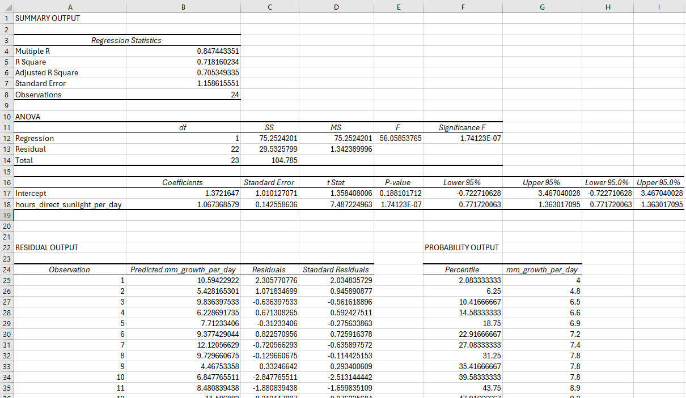
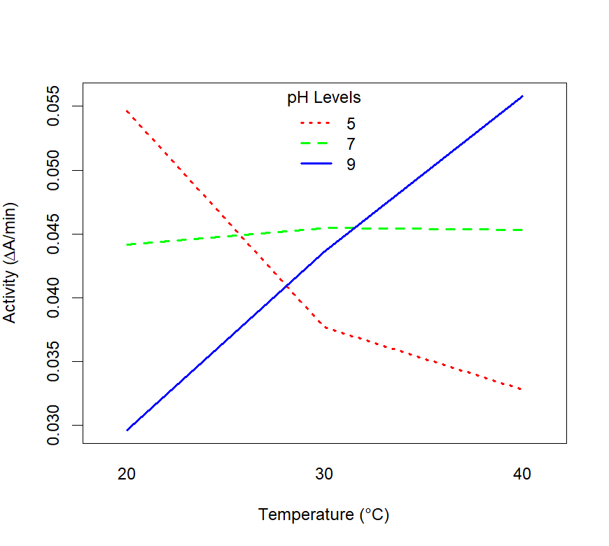

```{r setup, echo=FALSE, include=TRUE}
knitr::opts_chunk$set(echo = TRUE)

```

# Cover{.unnumbered .ignore}


```{r, echo=FALSE}
knitr::include_graphics("img/front/coverart.png")
```

# Introduction {.unnumbered}

This book accompanies the Quantitative Skills (QS) component of the **BIOS103 - Introductory Practical Skills in Biosciences I** course.

If you are participating in the weekly timetabled QS workshops associated with this course then be sure to submit your weekly summative QS assignments via Canvas by the deadline specified for each workshop.

All QS workshops will be delivered online via Teams. Access the meeting link from the BIOS103 Canvas course.

```{r, results='asis', echo=FALSE}
if (knitr::is_html_output()) {
  cat('<iframe width="100%" height="400" src="https://www.youtube.com/embed/2Igdytf8zW4?si=jg2-CgvI-EK2ejWJ" title="YouTube video player" frameborder="0" allow="accelerometer; autoplay; clipboard-write; encrypted-media; gyroscope; picture-in-picture; web-share" referrerpolicy="strict-origin-when-cross-origin" allowfullscreen></iframe>')
}
```

<!--chapter:end:index.Rmd-->

---
output:
  pdf_document: default
  html_document: default
  

  
---
\newpage

# Introduction to Excel and R

If you are currently participating in a timetabled BIOS103 QS workshop, please ensure that you cover **all of this section's content** and complete this week's [**formative and summative assessments**](#complete-your-weekly-assignments-01) in the BIOS103 Canvas Course.

## Estimating the Volume of a Snail

In this section, you will learn how to import data from a CSV file into Excel, perform basic calculations, create a scatterplot including a linear trendline to make predictions. The primary objective is to estimate the volume of a snail based on its mass using a provided dataset.

```{r, results='asis', echo=FALSE}
if (knitr::is_html_output()) {
  cat('<iframe width="100%" height="400" src="https://www.youtube.com/embed/0ShVZvl1sG0?si=q1Ve8aptT5m-1H21" title="YouTube video player" frameborder="0" allow="accelerometer; autoplay; clipboard-write; encrypted-media; gyroscope; picture-in-picture; web-share" referrerpolicy="strict-origin-when-cross-origin" allowfullscreen></iframe>')
}
```
>**Google Sheets Alternative**
>
>If you like, you can do everything in the above video using Google Sheets instead! Here's my [alternate video](https://youtu.be/D-URR3a7mmQ?si=mgHlelXssWuSO0SU) just for Google Sheets. 

### Download and Import the CSV File

1. **Download the CSV File:** 
   - Here is an [example dataset](https://canvaswizards.org.uk/dataspell/snails/301). Download it to your local machine.
   - If that link doesn't you can get the dataset in your browser [here](https://raw.githubusercontent.com/rtreharne/qs/refs/heads/main/data/01/snails_301.csv). Right click and Save as.

2. **Import into Excel:**
   - Open Excel (Use the desktop version - you won't be able to do this using the online version!).
   - Go to **Data > From Text/CSV** and select the downloaded CSV file.
   - When the import wizard appears, click **Load**.

### Calculate Volume \( V \) in Excel

We will estimate the volume \( V \) of our snails using the formula for the volume of a sphere:
\[ V = \frac{4}{3} \pi r^3 \]

where \( r \) is the radius, which we assume is equal to half the `Height L (mm)` column.

1. **Add a New Column for Volume \( V \):**
   - In the third column, label it as **Volume V (mm^3)**.
   - In the first cell of this column, use the formula:
     ```excel
     = (4/3) * PI() * ((B2/2)^3)
     ```
   - Drag the formula down to apply it to all rows.

### Add a Linear Trendline and Equation

1. **Create a Scatter Plot:**
   - Select the **Mass M (g)** and **Volume V (mm^3)** columns.
   - Go to the **Insert** tab and select **Scatter Plot**.

2. **Add Trendline:**
   - Click on the plot
   - Click the green **+** icon that appears at the top right of the plot.
   - Click the **>** symbol on the **Trendline** option and click **More options...**
   - From the trendline options menu that appears on the right, select the **Linear** trendline and check the box **isplay Equation on chart**.
   - Right-click on a data point in the scatter plot.

3. **Interpret the Equation:**
   - The trendline equation will appear on the chart in the form of \( y = ax + b \), where:
     - \( y \) is the volume.
     - \( x \) is the mass.
     - \( a \) and \( b \) are coefficients.
   - For the Example dataset:
     - a = 1341.7 \( mm^3.g^{-1} \)
     - b = 1140.2 \( mm^3 \)

### Estimation of Volume for a Snail with Mass 10g


1. **Use the Trendline Equation:**
   - Substitute \( x = 10 \) into the trendline equation to calculate the estimated volume \( V \).
   - Express the volume in \( cm^3 \) to one decimal place (Note: \( 1 cm^3 = 1000 mm^3 \)).
2. **For the example dataset:**
   - The estimated volume of a snail that is \( 10 g \) is **\( 14.6 cm^3 \)**.
   
## Getting Ready for R {#getting-ready-for-R}

Over the next couple of weeks you will continue to use Excel to load, manipulate, analyse and visualise data. Beyond this you will be using the coding language R exclusively. To prepare for this, you need to download, install and configure R and RStudio today. 

>**Chromebook Users**
>
>I love a chromebook. Sadly, installing R and RStudio on one involves a bit of extra work compared to Windows and Mac.
>This YouTube video seems to have all the bases covered: ["How to Install RStudio on a Chromebook"](https://youtu.be/km4rQu6SoC0?si=YOflmxVUleCNI8kJ)

### Download and Install (Windows and Mac only)

**R** and **RStudio** are actually separate things, although they are often mentioned together. 

**R** is a programming language and software environment specifically designed for statistical computing and data visualisation. Other examples of programming languages include Python, Java and Ruby. 

**RStudio** is the integrated development environment (IDE) for R. It provides a user-friendy interface that will allow you to write all your R scripts and compile them to do stuff. I'm using it to write this handbook right now!

Despite their differences, you might hear the terms **R** and **RStudio** used interchangeably, as RStudio serves as the primary interface through which users interact with the R programming language.

**You need to download and install both R and Rstudio.**

   - Install R first from the [Comprehensive R Archive Network (CRAN)](https://cran.r-project.org/)
   - Then install RStudio from the [RStudio website](https://posit.co/download/rstudio-desktop/)
   
Once both are installed, [open up RStudio](https://youtu.be/tQ227sB8YeA) and get ready to create your first **R Project**.

**All University of Liverpool MWS machines already have R and RStudio installed and ready to use.**


### Creating Your First R Project in RStudio

Follow these steps to set up and manage your first R project in RStudio:

```{r, results='asis', echo=FALSE}
if (knitr::is_html_output()) {
  cat('<iframe width="100%" height="400" src="https://www.youtube.com/embed/mzPEVgnz3GY?si=a1cjJaMrhzNgMoiZ1" title="YouTube video player" frameborder="0" allow="accelerometer; autoplay; clipboard-write; encrypted-media; gyroscope; picture-in-picture; web-share" referrerpolicy="strict-origin-when-cross-origin" allowfullscreen></iframe>')
}
```

1. **Open RStudio**

- Launch RStudio from your applications menu.

2. **Start a New Project**

- Click on the **File** menu at the top of the RStudio window.
- Select **New Project...** from the dropdown menu.

3. **Choose Project Type**

You will be prompted with three options:

- **New Directory**: Create a new project in a new directory.
- **Existing Directory**: Use an existing directory as the project's folder.
- **Version Control**: Clone a project from a version control repository (e.g., GitHub).

For your first project, select **New Directory**.

4. **Select Project Template**

- Choose **Empty Project**. 
- Click **Next**.

5. **Set Up Project Directory**

- **Directory name**: Enter a name for your project folder. This will be the name of the directory created for your project.
- **Subdirectory of**: Choose the parent directory where the new project folder will be created. You can navigate to the desired location using the file browser.
- Click **Create Project**.

6. **RStudio Project Interface**

Once the project is created, you will see a new RStudio window or tab with the following components:

- **Files pane**: Displays the files and folders in your project directory.
- **Script editor**: Where you write and edit your R scripts.
- **Console**: Where you can directly enter and execute R commands.
- **Environment/History**: Shows your workspace objects and command history.
- **Plots/Packages/Help/Viewer**: Various tabs for viewing plots, managing packages, accessing help documentation, and viewing other outputs.

7. **Create and Save an R Script**

- Click **File > New File > R Script**.
- Write some R code in the script editor. For example:

To run your print command, click on the line and click the `Run` button at the top right of your script editor window or press **Ctrl + ENTER** (Cmd + Enter on Mac).

You will see the following output in your console window:
```{r echo=FALSE}
# my first line of code. this is a comment!
print("Hello World!")

```
And there it is! You've just successfully compiled your first line of R. Congratulations!

### Something More Complicated

As you delve deeper into R programming, you'll find that your scripts become more sophisticated than the "Hello World" example above. In the following example, I'll walk you through a script to create a random number generator. Here's the script in its entirety:

```{r eval=FALSE}
# create a variable called "seed"
seed <- 999

# set the seed
set.seed(seed)

# generate a random number
random_number <- runif(1)

# print the random number
print(random_number)
```
Cut and paste these lines into the script file we were working on earlier (overwrite the "Hello World" example).

Now, you can run each line in turn as before (using **Ctrl + ENTER**) or you can run everything by clicking the **Source** button. You should see the following number appear in your console:

Let's break down each line of the script to understand its purpose and functionality.

1. **Creating a Variable Called "seed"**
```{r eval=FALSE}
# create a variable called "seed"
seed <- 123
```

   - `seed <- 123`: Here, we are using the `<-` operator to assign the value 123 to the variable named seed. In R, variables are used to store data that can be reused or manipulated later in the script. The number 123 is arbitrary in this case, but we use it to illustrate how to set a seed for random number generation.
   
2. **Setting the Seed**
```{r eval=FALSE}
# set the seed
set.seed(seed)
```
   - The `set.seed()` function initializes the R environment's build in random number generator with the value stored in seed. Setting a seed is essential for reproducibility, meaning that if someone else runs this code with the same seed, they will get the same random number output in their console. This is particularly useful in simulations and randomised experiments where consistent results are needed.
   
3. **Generating a Random Number**
```{r eval=FALSE}
# generate a random number
random_number <- runif(1)
```

   - `random_number <- runif(1)`: This line generates a single random number between 0 and 1. The function runif() generates random numbers from a uniform distribution, which means that each number within the specified range has an equal probability of being selected. The 1 inside the parentheses specifies that only one random number should be generated. The resulting number is then assigned to the variable called `random_number`.

4. **Printing the Random Number**
```{r eval=FALSE}
# print the random number
print(random_number)
```

   - `print(random_number)`: The print() function outputs the value stored in `random_number` to the console. This is useful for verifying the output of your code and ensuring that the operations have been executed correctly.

**Summary**

This example script demonstrates a more complex task than the basic "Hello World" script. It introduces key concepts like variable assignment with <-, setting a seed for reproducibility using set.seed(), generating random numbers with runif(), and printing results using print(). As you continue learning R, these foundational concepts will become increasingly important, enabling you to build more advanced and meaningful analyses. Remember, comments (#) are your friends! They help explain what each part of your code does, making it easier for you and others to understand and maintain your scripts. Be liberal with your comments. You'll thank yourself later (trust me).

**Give me feedback**

I really value your feedback on these materials for quantitative skills. Please rate them below and then leave some feedback. It's completely anonymous and will help me improve things if necessary. Say what you like, I have a thick skin - but feel free to leave positive comments as well as negative ones. Thank you.

```{r, results='asis', echo=FALSE}
if (knitr::is_html_output()) {
  cat('<iframe src="https://canvaswizards.org.uk/likertysplit/qs/" width="400" style="max-width: 100%" height="600"></iframe>')
}
```

## Complete your Weekly Assignments {.complete-your-weekly-assignments-01}

In the BIOS103 Canvas course you will find this week's **formative** and **summative** QS assignments. You should aim to complete both of these before the end of the online workshop that corresponds to this section's content. The assignments are identical in all but the following details:

   + You can attempt the **formative assignment** as many times as you like. It will not contribute to your overall score for this course. You will receive immediate feedback after submitting formative assignments. Make sure you practice this assignment until you're confident that you can get the correct answer on your own.
   + You can attempt the **summative** assignment **only once**. It will be identical to the formative assignment but will use different values and datasets. This assignment **will** contribute to your overall score for this course. Failure to complete a summative test before the stated deadline will result in a zero score. You will not receive immediate feedback after submitting summative assignments. Typically, your scores will be posted within 7 days.
   
In **ALL** cases, when you click the button to "begin" a test you will have two hours to complete and submit the questions. If the test times out it will automatically submit.


<!--chapter:end:01.Rmd-->

---
output:
  html_document: default
  pdf_document: default

  bookdown::gitbook:
    toc: true
    number_sections: true
---
\newpage

# Summarising Data and ANOVA in Excel

If you are currently participating in a timetabled BIOS103 QS workshop, please ensure that you cover **all of this section's content** and complete this week's [**formative and summative assessments**](#complete-your-weekly-assignments-02) in the BIOS103 Canvas Course.

In this section we will only be using Excel. No R today! Specifically, you will be developing two important skills:

1. **Summarising Data.**
2. **Constructing and testing hypotheses.**

The ultimate aim is to gain insight and learn something new about the world from the data that we have painstaking measured in our well designed lab experiments. This is a cornerstone of what being a scientist is all about.

## Summarising Data

Raw data is beautiful, but messy. Showing another person your raw data and expecting them to immediately understand it, no matter how proud you are of the toil expended to generate the data, is an unrealistic expectation. You need to boil your data down into something that another person can grasp instantaneously. 

Let's take a look at a Zebrafish dataset from an experiment that is uncannily similar to the one you performed in your lab practical this week.

### Download and Import the CSV File

1. **Download the CSV File:** 
   - Here is an [example dataset](https://canvaswizards.org.uk/dataspell/zebrafish/999999999). Download it to your local machine.

2. **Import into Excel:**
   - Open Excel (Use the desktop version - you won't be able to do this using the online version!).
   - Go to **Data > From Text/CSV** and select the downloaded CSV file.
   - When the import wizard appears, click **Load**.

You should now see something like that in Figure \@ref(fig:zebrafish-data-snap). There are 3 columns:

   - **ID** - A unique number to identify a measurement.
   - **conc_pc** - The ethanol concentration (%) that the each embryo was treated with.
   - **length_micron** - The measured lengths, in \( \mu m \) of the embryos.
   
 We call this format, in which each row corresponds to a single measurement, a **long** format.

```{r zebrafish-data-snap, echo=FALSE, fig.cap="You should see this (or something like it) after you have imported your date into Excel."}
knitr::include_graphics("img/02/figure_1.png")
```


### Generating a Summary Table

```{r, results='asis', echo=FALSE}
if (knitr::is_html_output()) {
  cat('<iframe width="100%" height="400" src="https://www.youtube.com/embed/wji1rnZbe08?si=U7-r_s3RjNafU71v" title="YouTube video player" frameborder="0" allow="accelerometer; autoplay; clipboard-write; encrypted-media; gyroscope; picture-in-picture; web-share" referrerpolicy="strict-origin-when-cross-origin" allowfullscreen></iframe>')
}
```
>**Excel Alternative**
>
>If you are having trouble accessing the Desktop version of Excel then here is an alternative video.
>["Summary Table with Google Sheets"](https://youtu.be/8k7xW01jxJo)


1. **Identify your Groups**
   - Click anywhere in your table.
   - Select the **Data** menu and click the **Advanced** icon in the **Sort & Filter** section. This will bring up a window called "Advanced Filter".
   - Select the **Copy to another location** action.
   - Your list range should already be set to **\$B:\$B**, but if not make it so.
   - Set the **Copy to** cell to **E1**
   - Make sure the **Unique records only** check box is selected and click OK.
   - You should now see a complete list of your alcohol concentration groups in a column with a header **conc_pc**. Make this into a new table by clicking on any of the concentration values, and then **Insert > New table > OK**.
   
Nice. Now you're ready to start building out your summary table horizontally. Let's start with calculating the mean Zebrafish length for each group.

Right now, your spreadsheet should look roughly the same as the screenshot in figure \@ref(fig:zebrafish-snap-2)

```{r zebrafish-snap-2, echo=FALSE, fig.cap="Constructing a summary table", out.width="100%"}
knitr::include_graphics("img/02/figure_2.png")
```

2. **Calculating a Mean Column**
   - Create a new column in your summary table by typing the word **Mean** in cell **F1**.
   - Calculate the mean of the Zebrafish lengths for the control group (0% alcohol concentration) by entering the following formula into cell **F2**.
   ```excel
   =AVERAGE(IF($B1:$B$161=$E2,$C1:$C$161))
   ```
   
> **A Deeper Explanation**  
> 
> The formula `=AVERAGE(IF($B$2:$B$161=$E2,$C$2:$C$161))` is an array formula that calculates the average length of Zebrafish for a specific group based on the concentration of alcohol. It's a bit of a beast isn't it? Let's break it down.
> 
> - **\$B$2:\$B$161**: The **\$** symbols before both the column letter **B** and the row numbers **2** and **161** lock the entire range. This means that when you copy the formula to other cells, this range will not change; it will always refer to cells **B2** to **B161**.
> 
> - **\$E2**: The **\$** before the column letter **E** locks the column, but since there's no **\$** before the row number **2**, the row number can change if the formula is dragged down across rows. This cell is used to compare each value in the range **\$B$2:\$B$161** to the specific concentration value in the corresponding row in column **E**.

> 
> - **\$C$2:\$C$161**: Similar to the range for column **B**, this locks the range of cells in column **C** from which the values will be averaged, conditional on the **IF** statement.
> 
> - **AVERAGE(IF(...))**: The **IF** function checks each row in the range **\$B$2:\$B$161** to see if it matches the value in the corresponding row in column **E**. If it matches, the corresponding value in column **\$C$2:\$C$161** is included in the average calculation. The **AVERAGE** function then calculates the mean of these filtered values.
> 
> This approach is particularly useful when you want to calculate conditional averages across a dataset, ensuring that the correct cells are referenced even when copying the formula to different parts of the spreadsheet.

3. **Calculating More Columns**
   - Create four more columns with headers:
     - Std. Dev.
     - Median
     - Min
     - Max
   - Drag the cell **F2** to **G2**. Change the word **AVERAGE** in the formula in **G2** to **STDEV**. This will calculate the standard deviation for the group and the remaining cells in the column should also auto complete.
    - Do the same for the median, min and max columns. Be sure to use the corresponding function.
   
> **A Deeper Explanation**  
> 
> When analysing data, it's important to understand the basic statistical measures that summarise the data's distribution. Here are some key terms:
> 
> - **Mean**: The mean, often referred to as the average, is the sum of all values in a dataset divided by the number of values. It provides a central value for the data. However, the mean can be influenced by outliers (extremely high or low values).
> 
> - **Standard Deviation**: The standard deviation measures the amount of variation or dispersion in a dataset. It is calculated as the square root of the variance, where variance is the average of the squared differences between each data point and the mean. A low standard deviation indicates that the data points tend to be close to the mean, while a high standard deviation indicates more spread out data.
> 
> - **Median**: The median is the middle value in a dataset when the values are arranged in ascending or descending order. If the dataset has an odd number of values, the median is the central value. If the dataset has an even number of values, the median is the average of the two central values. The median is less affected by outliers compared to the mean.
> 
> - **Min**: The minimum (min) value is the smallest value in the dataset. It provides a measure of the lower bound of the data.
> 
> - **Max**: The maximum (max) value is the largest value in the dataset. It provides a measure of the upper bound of the data.
> 
> These measures are fundamental for understanding the distribution of data. The mean and median give you central tendencies, while the standard deviation tells you how spread out the data is. The minimum and maximum values provide the range within which all the data points fall.

### Presenting Your Summary Table

At some point you may wish to include your Excel summary table in a Word document. There's a lot of wiggle room on how you choose to format your table but there are a few **unbreakable** rules:

+ The table **MUST** have a caption. 
+ The caption should be placed **ABOVE** the table (not below as for a figure or graph).
+ The caption should be numbered accordingly. For example, if this is the first table in your document the figure caption should start "**Figure 1: ...**".
+ The caption should be descriptive and unambiguous. The reader should be able to quickly interpret what is going on without having to read the body of the text. Any symbols or variables or units should be defined in the caption.
+ The data should be formatted to a sensible number of decimal places (i.e. if you're measurements are made to 1 decimal place, your summary values should not be quoted to more than this).
  
Follow these rules and you can't go wrong. Figure \@ref(fig:zebrafish-summary) shows how my summary table looks when copied and pasted into Word. I like to make my tables span the entire width of my document using the **Auto-fit to window** command. I also like to center my columns. These are personal preferences, but you can't deny they look great!


```{r zebrafish-summary, echo=FALSE, fig.cap="Formatting a summary table in Microsoft Word.", out.width="100%"}
knitr::include_graphics("img/02/figure_3.png")
```


   
## Analysis of Variance (ANOVA) {#anova}

You're about to learn a **critical skill** that is important for becoming a scientist: formulating hypotheses and testing them. This is a cornerstone of scientific inquiry.

You've already summarised your data using descriptive statistics. Now, we'll move on to another branch of statistics called inferential statistics. This involves using an appropriate statistical test to determine whether specific hypotheses that we construct should be accepted or rejected.

Knowing which statistical test to use depends on the data and context. It takes time and lots of practice to become proficient at this, and it's completely normal to forget which test you need or how to interpret the result.

We'll stick with out Zebrafish dataset and perform an Analysis of Variance (ANOVA) to determine whether there is something we can learn from our data. We'll formulate a hypothesis and use Excel to perform the ANOVA. Then we'll interpret the results.

But before we dive into this, let's create a boxplot to visually inspect the data and see if we can generate some gut intuition as to what might be going on.

### Grouped Boxplots in Excel

You might not have seen a grouped boxplot before. That's OK. I'm confident that you'll have a good intuition for what they show. However, for more information the key components of a boxplot read the text in the [Anatomy of a Boxplot](#understanding-boxplots) section. Let's dive straight in for now though.


#### Create the Boxplot {.unnumbered}

```{r, results='asis', echo=FALSE}
if (knitr::is_html_output()) {
  cat('<iframe width="100%" height="400" src="https://www.youtube.com/embed/c9jp3nHwutY?si=qIJMDTbjIb4xcLRf" title="YouTube video player" frameborder="0" allow="accelerometer; autoplay; clipboard-write; encrypted-media; gyroscope; picture-in-picture; web-share" referrerpolicy="strict-origin-when-cross-origin" allowfullscreen></iframe>')
}
```
>**Excel Alternative**
>
>If you are having trouble accessing the Desktop version of Excel then here is an alternative video.
>["Boxplots with Excel Online"](https://youtu.be/v2-WdO4w5BA)


1. **Insert a Boxplot**: 
   - Select your data.
   - Go to the **Insert** tab, click on **Insert Statistical Chart**, and choose **Box and Whisker**.

2. **Select Data**: 
   - Your plot will look a bit weird. That's because we need to configure the groupings properly.
   - Click the **Select data** button.
   - Remove the **conc_pc** series from the left-hand list.
   - Click the **Edit** button on the (currently empty) right-hand list.
3. **Boxplots in the wrong order?**
   - Sort the **conc_pc** column from smallest to largest.
4. **Re-scale y-axis**:
   - It's best to re-scale the y-axis to maximise the space used by the boxplots. This will make any effect easier to see.
   - Double-click on the numbers in the y-axis. Set the **Bounds > Minimum**: to 1000.
5. **Add Axis Labels**:
    - Click the green **+** icon in the top-right of your graph.
    - Check the **Axes titles** box.
    - Double-click on each label in turn and update with appropriate labels:
      - X-axis: "Alcohol Conc. (%)"
      - Y-axis: "Embryo Length (\(\mu m\))
    - Note: To use the **\(\mu\)** symbol click **Insert > Symbols > Symbol**. Find the symbol in the list and click **Insert**.
6. **Get Rid of Chart Title**:
    - If you're going to be presenting this figure in a report or poster then it should not have a title above the axes.
    - Instead you should include a figure caption **below** the plot.
    - The same **unbreakable** rules for your caption are the same as those described above for table captions. Just make sure your caption is below the figure instead of above.
7. **Export Your Figure**:
    - Right click on your figure anywhere outside the plot area and you should see the option to **Save as picture**.
    - Save it somewhere sensible as a .png file and then insert it into a Word document with a sensible caption.
    
```{r zebrafish-boxplot, echo=FALSE, fig.cap="Distribution of Zebrafish embryo lengths organised by Alcohol treatments.", out.width="100%"}
knitr::include_graphics("img/02/figure_4.png")
```

#### Interpret the Boxplot {.unnumbered}

Figure \@ref(fig:zebrafish-boxplot) shows our finished boxplot. 

- **Alcohol Concentration 0%**: 
  - The median embryo length is approximately 2500 µm, with the mean slightly above the median.
  - The data is relatively spread out, as shown by the wide box and long whiskers.
  - There are no outliers in this group.

- **Alcohol Concentration 1.5%**:
  - The median length is slightly lower than the 0% group, but the mean is still fairly close.
  - The box and whiskers are narrower than in the 0% group, indicating less variability in embryo length.
  - One outlier is present above the whisker, indicating a particularly large embryo in this concentration or possibly, a random measurement error.

- **Alcohol Concentration 2%**:
  - The median and mean have both decreased, showing a reduction in embryo length as alcohol concentration increases.
  - The box is narrower, indicating less variability, but there are several outliers both above and below the whiskers, suggesting that while most embryos were of a similar size, a few were much larger or smaller.

- **Alcohol Concentration 2.5%**:
  - The median and mean lengths have further decreased, indicating a continued negative effect of alcohol concentration on embryo length.
  - The box is of similar size to the 2% group, but with longer whiskers, indicating more variability in the data.
  - There is one outlier below the whisker, indicating a particularly small embryo in this concentration.

In summary, As alcohol concentration increases, the median and mean embryo lengths decrease, indicating a negative correlation between alcohol concentration and embryo length. Variability in embryo length decreases slightly up to 2% concentration but then increases again at 2.5%, as evidenced by the longer whiskers. The presence of outliers, particularly at higher concentrations, suggests that while most embryos are affected similarly, some experience more extreme changes in size.

However, visual patterns alone cannot confirm the existence of a true relationship between alcohol concentration and embryo length. To rigorously explore whether the observed trends are **statistically significant** or merely due to chance, we must construct testable hypotheses. This process will allow us to formalise our observations and set the stage for appropriate statistical analysis.


><h4 id="understanding-boxplots">Anatomy of a Boxplot</h4>
> A boxplot is a standardised way of displaying the distribution of data based on a five-number summary: minimum, first quartile (Q1), median, third quartile (Q3), and maximum. The box in the boxplot represents the interquartile range (IQR), which is the range between Q1 and Q3. The central line within the box indicates the median, which is the middle value of the dataset.
> 
> Sometimes, an "X" symbol is also included within the box, representing the mean of the dataset. However, it is important to note that the mean is not always shown in a boxplot.
> 
> The "whiskers" of the boxplot extend from the box to the smallest and largest values within 1.5 times the IQR from the first and third quartiles, respectively. These whiskers help to indicate the spread of the majority of the data.
> 
> Outliers are data points that fall outside the range defined by the whiskers. These are typically plotted as individual points beyond the ends of the whiskers, highlighting data points that are unusually high or low compared to the rest of the dataset.
> 
> To determine whether a data point is an outlier, you compare it to the thresholds defined by the IQR:
> 
> - Any data point below Q1 - 1.5 * IQR is considered a lower outlier.
> - Any data point above Q3 + 1.5 * IQR is considered an upper outlier.
> 
> **Summary:**
> 
> - **Box**: Represents the interquartile range (IQR), the middle 50% of the data.
> - **Central Line**: Indicates the median value.
> - **X (if shown)**: Indicates the mean value.
> - **Whiskers**: Extend to the smallest and largest values within 1.5 times the IQR from the quartiles.
> - **Outliers**: Data points that lie outside the whiskers, typically displayed as individual points.


### Constructing Testable Hypotheses

Given the patterns observed in the boxplot, where higher alcohol concentrations appear to be associated with shorter embryo lengths, it is essential to move from visual interpretation to a more rigorous statistical approach. This involves constructing and testing hypotheses to determine whether the observed trends are statistically significant.

#### Formulating the Hypotheses {.unnumbered}

In the context of your data, the primary goal is to determine whether different alcohol concentrations have a statistically significant effect on embryo length. To do this, we formulate a null hypothesis (\(H_{0}\)) and an alternative hypothesis (\(H_{1}\)):

- **Null Hypothesis (\(H_{0}\)):** There is no statistically significant difference in the mean embryo lengths between the different alcohol concentration groups. Any observed differences are attributed to random variation rather than an effect of alcohol concentration.

  \[
  H_0: \bar{x}_0 = \bar{x}_{1.5} = \bar{x}_2 = \bar{x}_{2.5}
  \]

  Here, \(\bar{x}_0\), \(\bar{x}_{1.5}\), \(\bar{x}_2\), and \(\bar{x}_{2.5}\) represent the mean embryo lengths at 0%, 1.5%, 2%, and 2.5% alcohol concentrations, respectively.

- **Alternative Hypothesis (\(H_{1}\)):** At least one of the mean embryo lengths differs significantly from the others, suggesting that alcohol concentration has a measurable impact on embryo length.

  \[
  H_1: \text{At least one } \bar{x} \text{ is different}
  \]
  
><h4 id="origin-of-hypothesis-testing">The Origin of Hypothesis Testing</h4> 
> Hypothesis testing emerged in the early 20th century through the work of statisticians like Ronald A. Fisher, who applied these methods to agricultural experiments, leading to significant advancements in statistical methodology. However, Fisher's legacy is also marred by his support for eugenics, reflecting the darker intersections of early statistical science with discriminatory ideologies.
>
> While hypothesis testing remains central to scientific research, the use of **p-values** has faced criticism. P-values, often misinterpreted, simply measure data compatibility with the null hypothesis, not the truth of the hypothesis itself. The conventional threshold (p < 0.05) can lead to arbitrary decisions, and practices like p-hacking undermine the validity of results.
>
> Alternatives and complements to p-values include **confidence intervals** (which offer a range of likely values for parameters), **Bayesian methods** (which incorporate prior knowledge into probability assessments), and **effect sizes** (which quantify the magnitude of an effect). 
>
> Understanding these tools and their limitations enables researchers to draw more nuanced and reliable conclusions from their data.

#### Getting Ready to Test {.unnumbered}

A **One-way ANOVA** is a statistical test used to determine whether there are significant differences between the means of three or more independent (unrelated) groups. In this case, the groups are the different levels of alcohol concentration (0%, 1.5%, 2%, and 2.5%).

The term "one-way" refers to the fact that we are analysing the effect of a single factor (alcohol concentration) on the dependent variable (embryo length). If we were interested in analysing the impact of an additional dependent variables (e.g. incubation temperature), as well as any interaction effects with alcohol concentration, we would likely want to perform a "two-way" ANOVA.

We are using ANOVA in this context because:

- **Multiple Group Comparisons**: We have more than two groups (four alcohol concentration levels), and ANOVA is designed to handle comparisons across multiple groups simultaneously. This is more efficient and statistically sound than performing multiple t-tests, which would increase the likelihood of Type I errors (false positives).

- **Assessing Variability**: ANOVA compares the variability within each group (i.e., how much embryo lengths vary within each alcohol concentration) to the variability between groups (i.e., how much the group means differ from each other). This helps us determine if the observed differences in means are greater than what we would expect by chance alone.

#### Assumptions of ANOVA {.unnumbered}

For ANOVA to be valid, certain assumptions must be met:

1. **Independence of Observations**: The data points in each group are independent of each other. In other words, each data point corresponds to a unique embryo.
2. **Normality**: The distribution of the residuals (differences between observed and predicted values) should be approximately **normal**.
3. **Homogeneity of Variances**: The variances within each group should be **roughly** equal.

In this case, I have engineered the dataset so that these assumptions are met. However, in practice, when working with real data, it is crucial to check whether these assumptions hold before applying ANOVA. If the assumptions are violated, the results of the ANOVA may not be reliable, and alternative methods may be necessary. I'll show you how to check that the assumptions for a statistical test are met in Chapter 5 and the available alternative tests for cases where the assumptions are not met.

### Performing a One-Way Anova in Excel

```{r, results='asis', echo=FALSE}
if (knitr::is_html_output()) {
  cat('<iframe width="100%" height="400" src="https://www.youtube.com/embed/tMEJjeNG998?si=zJiqgP57PZDCQMvg" title="YouTube video player" frameborder="0" allow="accelerometer; autoplay; clipboard-write; encrypted-media; gyroscope; picture-in-picture; web-share" referrerpolicy="strict-origin-when-cross-origin" allowfullscreen></iframe>')
}
```
>**Excel Alternative**
>
>If you are having trouble accessing the Desktop version of Excel then here is an alternative video.
>["ANOVA with Google Sheets"](https://youtu.be/llk_wWySMTA)


Please be reminded that the guidance in the video above, and in the text below, is only relevant if you are using the desktop version of Excel on a Windows machine. It might work on a Mac - there's no guarantee, and it won't be relevant if you are using Google Sheets. **If you can't do the following with your personal device then please use one of the University machines**.

**Step 1**: Install and Activate the Data Analysis ToolPak

To perform a One-Way ANOVA in Excel, you need to install and activate the Analysis ToolPak add-on.

1. Open Excel and go to **File > Options**.
2. In the Options menu, select **Add-ins**.
3. At the bottom, next to "Manage", ensure **Excel Add-ins** is selected and click **Go**.
4. In the Add-Ins box, check the **Analysis ToolPak** option and click **OK**.
5. You should now see a **Data Analysis** button in the **Data** ribbon.

**Step 2**: Create a Pivot Table to Reshape Data

Before performing the ANOVA, you need to reshape your long data into a wide format using a pivot table. Here’s how to do it:

1. Select your dataset (including headers).
2. Go to the **Insert** tab and click on **PivotTable**.
3. In the Create PivotTable dialog box, select where you want the PivotTable to be placed (e.g., New Worksheet).
4. In the PivotTable Fields pane:
   - Drag **conc_pc** to the **Columns** area.
   - Drag **id** to the **Rows** area.
   - Drag **length_micron** to the **Values** area.
5. The resulting pivot table will have the concentration levels as columns and the measurements as rows, which is the required format for One-Way ANOVA.

**Step 3**: Perform the One-Way ANOVA

1. Click on the **Data** ribbon and select **Data Analysis**.
2. In the Data Analysis dialog, select **ANOVA: Single Factor** and click **OK**.
3. In the **ANOVA: Single Factor** dialog box:
   - **Input Range**: Select the range of your reshaped data (including the labels).
   - **Grouped By**: Choose **Columns** (since each group is in a separate column).
   - **Labels in First Row**: Check this option if you included labels.
   - **Alpha**: Set this to 0.05 (the default significance level).
   - **Output Options**: Choose where you want to display the results (e.g., New Worksheet Ply). You can name the new sheet "Results".

4. Click **OK** to run the analysis. You should see a new sheet that looks identical to that shown in \@ref(fig:anova).

```{r anova, echo=FALSE, fig.cap="Results tables of one-way ANOVA in Excel", out.width="100%"}
knitr::include_graphics("img/02/figure_5.png")
```

**Step 4**: Interpret the Results

Excel will generate a new worksheet with the ANOVA results. The output includes two tables:

1. **Summary Table**:
   - **Count**: Number of observations in each group.
   - **Sum**: Sum of all values in each group.
   - **Average**: Mean value of each group.
   - **Variance**: Variability within each group.

2. **ANOVA Table**:
   - **Source of Variation**:
     - *Between Groups*: Variability between the groups.
     - *Within Groups*: Variability within each group.
   - **SS (Sum of Squares)**: Measure of the total variation.
   - **df (Degrees of Freedom)**: Calculated as the number of groups minus 1 for between groups, and total observations minus the number of groups for within groups.
   - **MS (Mean Square)**: SS divided by df.
   - **F (F-Statistic)**: Ratio of MS between groups to MS within groups.
   - **P-Value**: Indicates if the results are statistically significant.
   - **F crit**: Critical value of F for the given alpha level.

**Step 5**: Make a Conclusion

- Compare the **P-Value** to the alpha level (0.05):
  - If **P-Value ≤ 0.05**, reject the null hypothesis and conclude that there is a significant difference between the groups.
  - If **P-Value > 0.05**, fail to reject the null hypothesis and conclude that there is no significant difference between the groups.
  
In your ANOVA result, a p-value of **2.48E-08** means that the probability of observing the differences between your group means by random chance is exceedingly low (just 0.0000000248). Since this p-value is far below the common threshold of 0.05, we can reject the null hypothesis ($H_0$), and conclude that **there are statistically significant differences between the groups**.

While the one-way ANOVA tells us that there are significant differences between the groups, it does not specify which groups differ from each other. To determine where these differences lie, additional testing, known as **post-hoc** testing, is required. Post-hoc tests, allow us to compare the group means directly and identify which specific groups are significantly different. Although post-hoc testing requires a bit more work, it can significantly enhance our understanding of the data and provide deeper insights into the relationships between groups.

#### Understanding Exponent Notation {.unnumbered #exponent-notation}
> In statistical analysis, particularly when working with software like Excel or R, you might values expressed in scientific notation, often using the letter "E" followed by a number. For example, the p-value **2.48E-08** appears in your ANOVA results.
>
> #### What Does **2.48E-08** Mean?
>
> The notation **2.48E-08** is Excel's way of representing the number 2.48 × 10⁻⁸. Here's how to break it down:
>
> - **2.48**: This is the base number.
> - **E-08**: This indicates that the base number (2.48) should be multiplied by 10 raised to the power of -8.
>
> So, **2.48E-08** is mathematically equivalent to:
>
> \[
> 2.48 \times 10^{-8} = 0.0000000248
> \]
>
> This value is extremely small, which is typical for p-values when the test results are highly significant.
>
> #### Why Use Scientific Notation?
>
> Scientific notation is used to conveniently express very large or very small numbers that would otherwise be cumbersome to write out in full. In the case of p-values, this format is particularly useful because significant results often involve very small numbers. Instead of writing 0.0000000248, which can be error-prone and hard to read, Excel uses **2.48E-08** to convey the same information succinctly.
>

### Performing Post-hoc Tests in Excel {#post-hoc-tests}

Following a significant ANOVA, we need to perform additional tests to determine where the differences between the groups lie. These are called **Post-hoc** tests.


```{r, results='asis', echo=FALSE}
if (knitr::is_html_output()) {
  cat('<iframe width="100%" height="400" src="https://www.youtube.com/embed/EHwZFRx0hr0?si=x0E9QGjAmGeoBUhY" title="YouTube video player" frameborder="0" allow="accelerometer; autoplay; clipboard-write; encrypted-media; gyroscope; picture-in-picture; web-share" referrerpolicy="strict-origin-when-cross-origin" allowfullscreen></iframe>')
}
```

**Step 1: Create a new table to list group comparisons**

 - In cell **A19**, underneath your ANOVA result table, Create a new column label called **Groups**.
 - List all the possible ways two groups can be compared to each other (there are six ways in total):
   - 0% v 1.5%
   - 0% v 2.0%
   - 0% v 2.5%
   - 1.5% v 2.0%
   - 1.5% v 2.5%
   - 2.0% v 2.5%
 - Create additional column headers **P-value** and **Significant?** in cells **B19** and **C19** respectively.
   
**Step 2: Perform T-tests for each group comparison**

   - Starting in cell **B20** type:
   ```excel
   =TTEST(wide!B$4:B$164, wide!C$4:C$164, 2, 2)
   ```
   - Copy the cell down for the remaining rows and update the columns in the formula to correspond with the respective groups that are being compared.
   
#### What is a T-test? {.unnumbered #ttest}

> **Unlike ANOVA**, which compares multiple groups simultaneously to see if there are any significant differences in the means of the groups, a T-test can only compare two groups at a time.
>
>The assumptions for a T-test are similar to those for ANOVA: the data should be normally distributed, the samples should be independent, and the variances of the two groups should be equal if using a two-sample T-test assuming equal variances.
>
**Like ANOVA**, the key output of a T-test is the **p-value**.
>
>**In Excel** you perform a T-test like this:
>```excel
>=T.TEST(list1, list2, tails, type)
>```
>where:
>
> - **list1**: Corresponds to the list of values in your first group.
> - **list2**: Corresponds to the list of values in your second group.
> - **tails**: Requires a value of 1 or 2 indicating whether the test is one-tailed or two-tailed respectively.
>   - A one-tailed T-test tests for a difference in a specific direction (greater or less), while a two-tailed T-test tests for any difference regardless of direction.
> - **type**: Requires a value of 1, 2, or 3 indicating:
>   - **1**: A paired t-test (i.e., groups are not independent).
>   - **2**: An independent t-test with equal variances between groups.
>   - **3**: An independent t-test with unequal variances between groups (also known as a Welch test).
>
> **T-tests are powerful for pairwise comparisons** but need to be used in conjunction with corrections like Bonferroni when multiple T-tests are conducted, as performing multiple tests increases the risk of Type I errors (false positives).

Let's create a new table underneath my ANOVA table in Excel, say starting in cell **A19**

**Step 3: Calculate Bonferroni Corrected Alpha Level**
   - To calculate the Bonferroni corrected alpha level divide the initial threshold value of 0.05 by the number of t-tests you are performing, i.e. 6.
   - Use the corrected value by comparing it to the p-value of each of the t-tests to determine if the difference in the means of groups is significant.
   
**Step 4: Extend Your Conclusions**

The post-hoc tests indicate that there are significant differences in embryo lengths were found between the following pairs of alcohol concentrations:

- **0% vs. 2%**
- **0% vs. 2.5%**
- **1.5% vs. 2%**
- **1.5% vs. 2.5%**

These findings suggest that increases in alcohol concentration from 0% to 2%, and from 1.5% to 2.5%, lead to significant changes in embryo length. 

<h3>Feedback Please.</h3>

I really value your feedback on these materials for quantitative skills. Please rate them below and then leave some feedback. It's completely anonymous and will help me improve things if necessary. Say what you like, I have a thick skin - but feel free to leave positive comments as well as negative ones. Thank you.

```{r, results='asis', echo=FALSE}
if (knitr::is_html_output()) {
  cat('<iframe src="https://canvaswizards.org.uk/likertysplit/qs/" width="400" style="max-width: 100%" height="600"></iframe>')
}
```

## Complete your Weekly Assignments

In the BIOS103 Canvas course you will find this week's **formative** and **summative** QS assignments. You should aim to complete both of these before the end of the online workshop that corresponds to this section's content. The assignments are identical in all but the following details:

   + You can attempt the **formative assignment** as many times as you like. It will not contribute to your overall score for this course. You will receive immediate feedback after submitting formative assignments. Make sure you practice this assignment until you're confident that you can get the correct answer on your own.
   + You can attempt the **summative** assignment **only once**. It will be identical to the formative assignment but will use different values and datasets. This assignment **will** contribute to your overall score for this course. Failure to complete a summative test before the stated deadline will result in a zero score. You will not receive immediate feedback after submitting summative assignments. Typically, your scores will be posted within 7 days.
   
In **ALL** cases, when you click the button to "begin" a test you will have two hours to complete and submit the questions. If the test times out it will automatically submit.


<!--chapter:end:02.Rmd-->

---
output:
  pdf_document: default
  html_document: default
---
\newpage

# Calibration Curves and Linear Regression in Excel 

If you are currently participating in a timetabled BIOS103 QS workshop, please ensure that you cover **all of this section's content** and complete this week's [**formative and summative assessments**](#chapter-3-assignments) in the BIOS103 Canvas Course.

In this section we'll be re-visiting linear trendlines in Excel in the context of calibration curves and extending our knowledge by going deeper into the world of linear regression.

We will be working on two important skills:

- Manipulating data (transposing)
- Making predictions from linear models.

## Calibration Curves {.calibration-curves}

A **calibration curve** is a plot of a measurable quantity (in our case absorbance, as determined by spectrophotometry) against the concentration of known standards. This relationship, typically linear, allows for the determination of the concentration of unknown samples by interpolation.

The Beer-Lambert Law provides the foundation for generating calibration curves in spectrophotometry. It describes the relationship between absorbance (A) and the concentration (C) of a substance in solution. The law is given by the equation:

\[
A = m \cdot C
\]

Where:

- **A** is the absorbance (a dimensionless quantity, i.e. no units!).
- **m** is the slope (related to molar absorptivity and path length).
- **C** is the protein concentration (in mg/mL).

There are a few **key considerations** to make when using this law to determine the concentrations of unknown solutions:

- **Linear range**: the calibration curve is only valid within a certain concentration range. At very high concentrations, the relationship may no longer be linear (due to factors like light scattering). Extrapolating concentrations from our calibration curves that are beyond those of our known standards is very, very naughty. Don't do it!
- **Reproducibility**: It is critical that the same instrument (including scan settings and wavelength) be use for both the standards and unknowns.


Let's take a look at an example dataset from an experiment designed to generate a calibration curve for hemoglobin. Assume that starting from a stock solution of concentration 1.5 mg/mL a set of seven protein solutions have been created using a 1:1 serial dilution and that the absorbance of each solution has been measured at a wavelength of 560nm (yellow-green light).

```{r, results='asis', echo=FALSE}
if (knitr::is_html_output()) {
  cat('<iframe width="100%" height="400" src="https://www.youtube.com/embed/Dy6FmCDB2NQ?si=s9CWD0uGE14Fa1iP" title="YouTube video player" frameborder="0" allow="accelerometer; autoplay; clipboard-write; encrypted-media; gyroscope; picture-in-picture; web-share" referrerpolicy="strict-origin-when-cross-origin" allowfullscreen></iframe>')
}
```
>**Mac Users**
>
>It might not be possible for you to transpose the data like in the video above. If you can't, try this:
>
>1. Select the range of data you want to rearrange, including any row or column labels, and **Cmd+C** to copy.
>
>2. Select the first cell where you want to paste the data, and on the Home tab, click the arrow next to Paste, and then click Transpose.
>
>3. Watch [this](https://youtu.be/pBcPJp-BdjE?si=GYw5sguCCM64Zcpl) video if you're still stuck.

1. **Download the CSV File:** 
   - Here is an [example dataset](https://canvaswizards.org.uk/dataspell/calibration/999999999). Download it to your local machine.

2. **Import into Excel:**
   - Open Excel (Use the desktop version - you won't be able to do this using the online version!).
   - Go to `Data > From Text/CSV` and select the downloaded CSV file.
   - When the import wizard appears, **do not** click **Load**.
   
There's something not right about this dataset. It's sideways! The columns of data run horizontally instead of vertically. We don't like this, it makes it much harder to plot figures and perform any analysis.

We need to transform the data somehow and flip it to vertical instead of horizontal. We need to **transpose** the data.

3. **Transpose the data:**
   - On the import wizard click the **Transform Data** button. This will open up a new window called **Power Query Editor**.
   - Click the **Transform** tab and then click the **Transpose** button.
   - Click the **Use First Row as Headers** button.
   - Return to the **Home** tab and click **Close & Load** to import your transposed data.
   
4. **Generate a Calibration Curve:**
   - Click anywhere on your data table.
   - Click the **Insert** tab and select the **Scatter** chart from the charts option.
   - Get rid of the title.
   - Label the x-axis: "Protein Conc. (mg/mL)".
   - Label the y-axis: "Absorbance (Arb. units)".
   - Click the green plus (chart elements) icon at the top-right of the graph and select **More options** from **Trendline**.
   - Add a linear trendline and check the box to "Display Equation on Chart".
   - If you're including your figure in a report it's better practice to include details of the $m$ and $b$ values that you extract in your figure caption like in figure \@ref(fig:calibration-curve).
   
5. **Use the Calibration Curve:**

Now that you've extracted the m and b values from your calibration curve's linear trendline you can use it to find the concentration of an unknown sample by measuring its absorbance.

Our calibration curve for the dataset gives us the equation:

\[
A = 0.3827 \cdot C - 0.0024
\]

If an unknown protein solution has an absorbance of 0.50, you can rearrange the equation to solve for concentration \(C\):

\[
0.50 = 0.3827 \cdot C - 0.0024
\]

Solving for \(C\):

\[
C = \frac{0.50 + 0.0024}{0.3827} = 1.3 \, \text{mg/mL}
\]

Thus, the concentration of the unknown protein solution is 1.3 mg/mL.

Note that I've expressed my answer to 2 significant figures to match the minimum level of precision available to me during the calculation (i.e. 2 s.f for both 0.5 and 0.0024).

   
```{r calibration-curve, echo=FALSE, fig.cap="Calibration curve for Hemoglobin determined from a standard set generated from a 1:1 serial dilution from a starting 1.5 mg/mL solution. Values of m=0.3827 and b=0.0024 were extracted from the linear relationship A = m * C + b, where b is the systematic error associated with the measurement (most likely related pipetting inaccuracies).", out.width="100%"}
knitr::include_graphics("img/03/calibration_curve.png")
```
## Linear Regression

A linear trendline is visually helpful, but what what Excel is actually doing behind the scenes is something more powerful: **linear regression**.

Linear regression is a statistical method used to quantify how much the variation in a dependent variable can be attributed to changes in an independent variable. It helps us understand how one variable predicts or influences another. Additionally, it provides insight into how much of the variation is due to error or other unaccounted factors, and whether we need to explore other relationships or variables that may better explain the observed patterns.

Linear regression models are valuable because they offer an estimation of the relationship between variables, and by extension, help in predicting future outcomes based on known values of independent variables.

**Why "Linear"?**

In nature, over relatively small ranges of dependent and independent variables, the relationship between them can often be approximated as linear. This means that as one variable increases or decreases, the other responds in a predictable and proportional manner. While not always the case, assuming linearity can be useful for many applications, especially for the scope of this course.

> **Independent and Dependent Variables:**  
> - The **independent variable** is the one you manipulate or change to see its effect (e.g., hours of sunlight).  
> - The **dependent variable** is the one being measured or observed (e.g., sunflower growth).  
> These are sometimes referred to as explanatory and response variables, respectively.

**Linear Regression as a Hypothesis Test**

Performing a linear regression is also a test of a hypothesis. This time, our **null hypothesis** is that there is no linear relationship between the dependent and independent variables. In other words, any observed association between the two is just due to random chance.

More formally:

- **Null Hypothesis (H₀):** There is no linear relationship between the independent variable and the dependent variable. The slope of the regression line is equal to zero.  
  - H₀: β₁ = 0  
  (where β₁ represents the slope of the regression line)

- **Alternative Hypothesis (H₁):** There is a linear relationship between the independent variable and the dependent variable. The slope of the regression line is not equal to zero.  
  - H₁: β₁ ≠ 0

### The Linear Regression Equation

The linear regression equation provides a way to express the relationship between the independent variable (predictor) and the dependent variable (outcome) as a straight line:

\[
Y = β₀ + β₁X + ε
\]

- **Y**: The dependent variable (outcome) we are trying to predict.
- **X**: The independent variable (predictor) we use to make predictions.
- **β₀**: The intercept, or the value of **Y** when **X** is 0. This represents the starting point of the relationship.
- **β₁**: The slope, or the change in **Y** for every one-unit increase in **X**. It tells us how steep the relationship is.
- **ε**: The error term, which accounts for the variance in **Y** that cannot be explained by **X**.


### Performing a Linear Regression in Excel

Let’s work through an example using a full linear regression with Excel’s Analysis ToolPak. Suppose we're investigating the **growth per day** of sunflowers (dependent variable) based on the **number of hours of direct sunlight** they receive each day (independent variable).

In this case, we want to determine if there is a linear relationship between hours of sunlight and sunflower growth. By performing the regression analysis, we’ll be able to assess if and how sunlight impacts sunflower growth, and how strong that relationship is. 

Let’s get started with the analysis in Excel!

```{r, results='asis', echo=FALSE}
if (knitr::is_html_output()) {
  cat('<iframe width="100%" height="400" src="https://www.youtube.com/embed/xQniupalMmg?si=2cKXNSr4pNydlyDZ" title="YouTube video player" frameborder="0" allow="accelerometer; autoplay; clipboard-write; encrypted-media; gyroscope; picture-in-picture; web-share" referrerpolicy="strict-origin-when-cross-origin" allowfullscreen></iframe>')
}
```


**1. Download the data**:

   - Here is an [example sunflower dataset](https://canvaswizards.org.uk/dataspell/sunflowers/999999999). Download it to your local machine.

**2. Import the data**:

   - Open up a new Excel workbook.
   - Go to the **Data** tab and select the **Import from csv/txt** icon.
   - Once the wizards has loaded click **Load**.
   
**3. Perform Regression**:

   - Click anywhere on the sheet, select the **Data** tab again and select the **Data Analysis** button in the "Analysis" area of the tools ribbon.
   - If you can't see the button then you probably need to configure the Analysis ToolPak Add-In.
   - Select "Regression" and click "OK".
   - Select the "Input Y Range" - This is your dependent variable, i.e. how much your sunflowers grew per day (column B). Include the header.
   - Select the "Input X Range" - This is your independent variable, i.e. number of hours of direct sunlight per day (column A). Include the header.
   - Tick the **Labels" box.
   - Select the **New Worksheet Ply** output option
   - Check **all** the remaining boxes for **Residuals** and **Normal Probability** sections.
   - Click **OK**. Hopefully, you'll see something like that shown in figure  \@ref(fig:regression-output).
   
```{r regression-output, echo=FALSE, fig.cap="This is what you should see after performing a regression on your example sunflower dataset using Excel's Analysis ToolPak Add-In.", out.width="100%"}

```   

### Interpreting Your Linear Regression

Wow! Your linear regression has provided so much information—it can feel like an avalanche at first. But don’t worry, not all of it is important for our purposes. Let’s focus on what **is** interesting and useful.

**1. Summary Output Table**:

- **Multiple R**: This is the correlation coefficient between your observed and predicted values. It ranges from -1 to 1. A value closer to 1 or -1 indicates a strong relationship, whereas a value close to 0 means a weak relationship. In our case, a value of 0.65 indicates a reasonably strong correlation between growth and sunlight.
  
- **R Square (R²)**: This tells us how much of the variance in the dependent variable is explained by the independent variable(s). In our case, an R² of 0.42 means that 42% of the variation in the dependent variable is explained by the model. Conversely, it means that approx 58%, i.e. the majority, of the variance is explained by other unknown variables. In this context, these unknown variables could include things like daily average temperature, rainfall, humidity etc. 

- **Adjusted R Square**: This adjusts the R² value for the number of predictors in your model. It’s more useful when dealing with multiple independent variables as it accounts for any unnecessary complexity added by too many variables.

- **Standard Error**: This measures the average distance that the observed values fall from the regression line. A smaller standard error means a better fit. Note that the units of your standard error are the same as for your dependent variable, i.e. mm.

**2. ANOVA Table**

The ANOVA table tells us whether the overall regression model is significant.

- **Degrees of Freedom (df)**: This refers to the number of independent pieces of information that went into calculating the estimates. It’s a balance between the number of observations and the number of predictors in the model.

- **SS Regression (Sum of Squares due to Regression)**: This represents the variance in the dependent variable explained by the model.

- **SS Residual (Sum of Squares of Residuals)**: This represents the variance that the model doesn’t explain.

- **Significance F**: This is the p-value for the overall regression model. In our case, A p-value < 0.05 means that the model is statistically significant, and we reject the null hypothesis that there is no relationship between the dependent and independent variables.

**3. Coefficient Table**

This table is where you’ll find the key parameters for your linear regression model.

- **Intercept (β₀)**: This is the expected value of the dependent variable when the independent variable is zero. In other words, it's your y-intercept value.

- **Gradient (β₁)**: This is the slope of your line, showing how much the dependent variable changes with each unit increase in the independent variable.

- **P-values**: These tell us whether the coefficients (intercept and gradient) are statistically significant. If the p-value for the gradient is less than 0.05, we can say that the independent variable has a significant impact on the dependent variable.

**4. Residual Plots and Additional Tables**

- **Residual Plot**: This plot shows the differences between the observed and predicted values (residuals). Ideally, these residuals should be randomly scattered around 0, indicating a good model fit. If this is not the case then it might not be appropriate for you to be performing a linear regression.

- **Normal Probability Plot**: This checks if the residuals follow a normal distribution. If the points follow a straight line, the residuals are normally distributed. Again, if this is not the case then you should seek an alternative analysis.

- **Residual Output**: This provides detailed information about each residual (the error for each observation).

- **Probability Output**: Provides the probabilities of observing these residuals given the model fit.

### Making Predictions with Our Model

With the insights from our linear regression analysis, we can now use our model to make predictions using the equation

\[ \hat{Y} = \beta_0 + \beta_1 \hat{X} \]

where:
- \( \hat{Y} \) is the predicted value of the dependent variable.
- \( \beta_0 \) is the intercept, representing the expected value of \( Y \) when \( X \) is zero.
- \( \beta_1 \) is the gradient (or slope), indicating how much \( Y \) changes with a one-unit change in \( X \).
- \( \hat{X} \) is the value of the independent variable for which we want to make a prediction.

For example, to predict the daily growth of our sunflowers when they've received six hours of sunlight:

\[ \hat{Y} = 2.449 + ( 0.898  \times 6 )= 7.836 \]

So, the predicted value of \( \hat{Y} \) for \( \hat{X} = 6 \) is \( 7.836\) \( mm \).

But wait! Couldn’t I have achieved this by simply adding a trend line to a plot of \( X \) vs. \( Y \), as discussed in section \@ref{section:calibration-curves}? Yes, you could have extracted the coefficients \( \beta_0 \) and \( \beta_1 \) from the equation of the line, and even added the \( R^2 \) value to the plot. So why go through all this additional work? 

The full regression analysis allows us to determine the **standard error** (\(SE\)) of the model, which enables us to calculate the uncertainty associated with a predicted value \( \hat{Y} \). This is something we couldn’t do with a simple trend line!

This uncertainty, often referred to as the **margin of error** (\(ME\)), provides the range within which future individual observations are expected to fall. 

To calculate \(ME\):

\[ ME = t \times SE \]

where \(t\) is the t-statistic which, in this context, can be drawn from a **Student's t-distribution** and accounts for the uncertainty in estimating the population parameters from a sample. In excel you can calculate \(t\) using:

```excel
=T.INV.2T(alpha, df)
```

- **alpha** is the significance level, in this case 0.05.
- **df** is the degrees of freedom which can be calculated as \(df = n - k - 1\) where \(n\) is the number of data points (observables) and \(k\) is the number of independent variables. In our case, \(n=24\) and \(k=1\) so \(df=24-1-1=22\).


### Extending to Multiple Variables

Right now, we’re focusing on simple linear regression (one dependent and one independent variable). However, what if we wanted to examine the effect of **multiple independent variables** (e.g., sunlight **and** temperature on sunflower growth)? This is called **multiple regression** and we'd consider the following linear regression equation instead:

\[ Y = \beta_0 + \beta_1 X_1 + \beta_2 X_2 + \dots + \beta_n X_n + \epsilon \]

Where:

- \( X_1, X_2, ..., X_n \): The independent variables (e.g., sunlight, temperature, etc.).
- \( \beta_0 \): As before, this is the intercept, representing the expected value of \( Y \) when all independent variables are 0.
- \( \beta_1, \beta_2, ..., \beta_n \): The coefficients of the independent variables, representing the change in \( Y \) for a one-unit change in \( X \), assuming all other variables remain constant.

Multiple regression allows us to assess the combined effect of several factors, which is crucial when studying complex systems where multiple variables might influence the outcome.

Unfortunately, Excel has its limits for this. But don’t worry—we’ll tackle multiple regression using R later!


## Complete your Weekly Assignments 

In the BIOS103 Canvas course you will find this week's **formative** and **summative** QS assignments. You should aim to complete both of these before the end of the online workshop that corresponds to this section's content. The assignments are identical in all but the following details:

   + You can attempt the **formative assignment** as many times as you like. It will not contribute to your overall score for this course. You will receive immediate feedback after submitting formative assignments. Make sure you practice this assignment until you're confident that you can get the correct answer on your own.
   + You can attempt the **summative** assignment **only once**. It will be identical to the formative assignment but will use different values and datasets. This assignment **will** contribute to your overall score for this course. Failure to complete a summative test before the stated deadline will result in a zero score. You will not receive immediate feedback after submitting summative assignments. Typically, your scores will be posted within 7 days.
   
In **ALL** cases, when you click the button to "begin" a test you will have two hours to complete and submit the questions. If the test times out it will automatically submit.

<!--chapter:end:03.Rmd-->

---
output:
  pdf_document: default
  html_document: default
---
\newpage

# Introduction to R: Part I

If you are currently participating in a timetabled BIOS103 QS workshop, please ensure that you cover **all of this section's content** and complete this week's **formative and summative assessments** in the BIOS103 Canvas Course.

We are going to diverge from what you have been doing in the labs this week in order to focus on introducing you to R. Our learning objectives are as follows:

- Start a new R Project in R Studio
- Read a dataset to a variable
- Inspect a dataset
- Subset a dataset by slicing and filtering
- Create summary tables of descriptive statistics
- Sort a table

You should have completed section \@ref(getting-ready-for-R) already and have R and R Studio installed on your personal machine. If you are unable to install R and RStudio then please use one of the University computers.

<h3>OMG. Why, are you making me learn to code?</h3>

In my experience, at least half of you will love learning to code. The rest of you will hate my guts. I'm OK with that. That's because I truly believe that in the near future you will see that even a basic understanding of coding gives you a huge advantage in your studies and future careers. However, if you really need me to give you explicit reasons as to why I'm making you learn to code then here are six:

**1. Data Literacy**

All the biosciences rely heavily on data analysis. Learning to code will equip you the skills to efficiently manipulate and interpret complex datasets. R, in particular, is well-suited for handling bioscientific data, from genomic sequences to clinical trials and environmental modelling.

**2. Reproducibility**

Coding promotes transparency and reproducibility in scientific analyses. Unlike manual methods, where calculations or procedures may be difficult to replicate, scripts provide a clear, step-by-step record that can be easily shared and re-run. This is vital for ensuring the integrity of scientific research.

**3. Automation**

Bioscientists often work with large datasets, and coding enables the automation of repetitive tasks such as data cleaning, statistical analyses, and reporting. This not only saves time but also minimises human error, allowing students and researchers to focus on interpreting their results.

**4. Career Readiness**

Coding has become an indispensable skill in the biosciences. Whether working in research, biotechnology, or environmental consultancy, understanding how to work with data in R (or similar tools) will give you a competitive edge when applying for jobs or pursuing further academic research.

**5. Critical Thinking**

Writing code fosters critical thinking and problem-solving skills. While learning to code you will have to break down complex problems, troubleshoot errors, and develop logical workflows. These skills are not only useful for coding but are also vital for scientific thinking and research.

**6. Integration with Lab Skills**

Coding complements traditional lab skills. In the era of bioinformatics and systems biology, being able to analyse experimental data computationally can provide additional insights that are often not apparent from lab experiments alone.


Have you accepted your fate then? Good. Now lets get something else straight: **I am NOT going to teach you to code**. You are going to do that yourself, over many months (and probably years). This book represents a mere "dipping of the toes" into the world of R coding and is by no means comprehensive. In fact, it is completely and utterly incomplete. You will need to fill in many of the blanks yourself as you encounter them. How you go about this is up to you, but checkout the [Appendix](#appendix) for good places to start.


## Reading and Inspecting Data

Let's dive in then! This week we're going to be introducing you to some fundamental data handling concepts in R using the fantastic [Pantheria](https://esajournals.onlinelibrary.wiley.com/doi/10.1890/08-1494.1) dataset of extant and recently extinct mammals.

```{r, results='asis', echo=FALSE}
if (knitr::is_html_output()) {
  cat('<iframe width="100%" height="400" src="https://www.youtube.com/embed/ReFt0oM49UA?si=Z0seJdmGXTOZRtgI" title="YouTube video player" frameborder="0" allow="accelerometer; autoplay; clipboard-write; encrypted-media; gyroscope; picture-in-picture; web-share" referrerpolicy="strict-origin-when-cross-origin" allowfullscreen></iframe>')
}
```

1. **Open RStudio and start a new project**

2. **Download the data** from [here](https://canvaswizards.org.uk/dataspell/pantheria/999) (or right click, save as from [here](https://raw.githubusercontent.com/rtreharne/qs/refs/heads/main/data/04/pantheria_999.csv)). 

3. **Copy the downloaded file** into your RStudio project directory (folder). You should see the file appear in your **Files** window in the bottom-right corner of RStudio.

4. **Create a new R script file** and save it with a sensible filename (e.g. pantheria_summary.R)

5. **Read the data** to a [variable](#what-is-a-variable) called `pantheria_data`: In your new script file, write the following line of code on line 1:

```{r eval=FALSE, class.source = "numberLines"}
pantheria_data <- read.csv("pantheria_999.csv")
```
Run the line by clicking anywhere on the line and then clicking the **run** button (in the top-right corner of your script window) or by pressing **Ctrl+Enter** on your keyboard. You should see a new line appear in your **Environment** window in the top-right of your RStudio like in figure \@ref(fig:environment-window). If you don't see it then the here are the most common reasons as to why:

- You haven't used quotation marks around your data filename
- You've mis-spelled your filename
- You haven't put your data file in the correct folder
- You didn't create an R project first.

```{r environment-window, echo=FALSE, fig.cap="Details of your data variable should appear in your environment window after running line 1.", out.width="100%"}
knitr::include_graphics("img/04/environment.png")
```

```{r pantheria, echo=FALSE, fig.cap="By clicking on your data variable in your environment window you can inspect the data in RStudio", out.width="100%"}
knitr::include_graphics("img/04/pantheria.png")
```
><h3 id="what-is-a-variable">What is a variable in R?</h3>
>A variable in R is a symbolic name representing a value stored in memory. Variables are created by assigning values using `<-`.
>
>**Naming Convention**
>
>I prefer using lowercase words for variable names. If multiple words are needed, I separate them with an underscore "_", avoiding spaces. For example: my_variable.
>
>**Best Practices**
>
> - Descriptive Names: Choose clear, meaningful names.
> - Consistency: Use the same naming style throughout your code.
> - Avoid Reserved Words: Don’t use R’s reserved keywords (`if`, `else`, `for`, etc.)
> - Uniqueness: Ensure variable names are unique within your environment.
>
>These practices enhance code readability and maintainability.


Well done if you can see your data variable! You can click on your variable (in the environment window) and inspect your data directly. You should see something like that shown in figure \@ref(fig:pantheria). Wow! Look at all that data. Yummy. Now the world is your oyster, as they say. From here you can go in any number of directions and use R to summarise, visualise and analyse your data in order to gain novel insights.

Let's start small by asking the very simple question:

**"What order of mammal occurs the most frequently (has the most number of rows) in the dataset?".**

To answer this question, I need to go through my data row by row and count how many times a row corresponding to each order (e.g. Dermoptera, Chiroptera, Rodentia etc ...) appears. Let's extend my R script as follows:

```{r eval=FALSE, class.source = "numberLines"}
pantheria_data <- read.csv("pantheria_999.csv")

orders <- table(data$Order)

print(orders)
```

Let's break these additional lines down, step-by-step:

- **Firstly**, you'll notice that I've left lines 2 and 5 blank. You don't need to do this, but I like to because it gives my code a bit of breathing space and is often easier to identify a problem later.

- **In line 3**, I'm using the `table()` [function](#what-is-a-function) to count the number of times a unique value in my order column appears. By putting `data$Order` inside the table function's brackets we are "passing" it all of the values in the **Order** column as a big list. I'm then assigning the output of the table function to a new variable called `orders` so that I can refer to it later.

- **Lastly in line 5**, I'm using a print function to output the contents of the variable `orders` to my console as shown in figure \@ref(fig:console-output-order)

```{r console-output-order, echo=FALSE, fig.cap="When using `print(orders)` the following should appear in my RStudio console.", out.width="100%"}
knitr::include_graphics("img/04/orders-output.png")
```

><h3 id="what-is-a-function">What is a function in R?</h3>
>A function in R is a set of instructions that performs a specific task or calculation, taking inputs (arguments) and returning an output (result). So far in this course, we have used three pre-defined functions: read.csv() to read data from a CSV file, table() to summarise categorical data, and print() to display output in the console. While these functions are built into R, we can also create our own functions when we need to perform customised tasks—more on this later in the course.

You can see by inspecting your console output that the order **Rodentia** is the most frequently occurring order with **549** rows in the data. 

But what if there were lots more orders? It might not be so straightforward. Let's get our R script to pick out the most frequently occurring order for us:
```{r eval=FALSE, class.source = "numberLines"}
pantheria_data <- read.csv("pantheria_999.csv")

orders <- table(data$Order)

most_common_order <- names(which.max(orders))

print(most_common_order)
```

I've inserted the line `most_common_order <- names(which.max(orders))` at line 5. Let's break it down:

1. `which.max(orders)`:

  + **Function**: `which.max()` is a built-in R function that returns the index of the first maximum value in its input.
  + **Input**: In this case, the input is `orders`, which is the table we created earlier containing the counts of each order in the dataset.
  + **Output**: The function identifies the **index** position of the maximum count (i.e., the highest frequency) in the `orders` table. In our case "Rodentia" is at position 24 in the table.
  
2. `names(...)`:

  + **Function**: The `names()` function retrieves the names (or labels) associated with the elements of an object. For example if I used `names(orders)` the function would simply return a list of all the unique orders.
  + **Usage**: By wrapping `which.max(orders)` inside `names()`, we are saying, "give me the name of the order that corresponds to the maximum frequency index returned by `which.max()`."
  + **Output**: In our case the name "Rodentia" is returned.
  
3. `most_common_order`: I've assigned the result of my `names(which.max(orders))` to a new variable using `<-`.
  
4. Finally, I've updated my print statement to `print(most_common_order)'. This should now print out "Rodentia" in my console when I re-run my script.
  
Phew! That took a bit of explaining. Make sure you understand what just happened. The wrapping of a function in a function is a common practice in R and things can quickly become obfuscated. It's good practice to comment your code so that you (or someone else) can quickly make sense of what is going on. Here is my final code, with comments!

```{R eval=FALSE, class.source="numberLines"}
# Read the CSV file and store its contents in 'data'.
data <- read.csv("pantheria_999.csv")

# Create a frequency table of the 'Order' column.
orders <- table(data$Order)

# Get the name of the most common order.
most_common_order <- names(which.max(orders))

# Print the most common order to the console.
print(most_common_order)
```
## Subsetting

In data analysis, subsetting refers to the process of extracting a portion of a dataset based on specific criteria. This allows you to focus on the most relevant information, making analysis more efficient and tailored to your needs. There are two key methods for subsetting data in R: **Slicing** and **Filtering**.

```{r, results='asis', echo=FALSE}
if (knitr::is_html_output()) {
  cat('<iframe width="100%" height="400" src="https://www.youtube.com/embed/umjznd-sCRI?si=QBDhIErUU9c7-_gN" title="YouTube video player" frameborder="0" allow="accelerometer; autoplay; clipboard-write; encrypted-media; gyroscope; picture-in-picture; web-share" referrerpolicy="strict-origin-when-cross-origin" allowfullscreen></iframe>')
}
```

### Slicing
Slicing is a crucial operation in data analysis, enabling you to extract specific rows, columns or both from an existing data frame. This technique helps streamline workflows, especially when working with large datasets, by narrowing down data to focus on relevant sections.

**Slicing Example**

Let's add a new line to our earlier script file:

```{R eval=FALSE}
slice <- data[1:1000, 1:10]
```
This code creates a new variable called `slice` and assigns to it the first 1,000 rows and the first 10 columns of the dataset `data`. 

Run the line and you should see a new dataframe called `slice` appear in your **Environment** window (top-right).

What if I'd wanted to select ALL the rows but still slice off the first 10 columns?
Well, that would look like this:

```{R eval=FALSE}
slice <- data[, 1:10]
```
And what if I don't want to use index values to select the columns (i.e., 1:10) and I want to select them by name? For example let's say I've inspected the column headers and I specifically want to select the following columns:

- **Order**
- **AdultBodyMass_g**
- **BasalMetRate_mLO2hr**

I can do that using this code:
```{R eval=FALSE}
slice <- data[, c("Order", "AdultBodyMass_g", "BasalMetRate_mLO2hr")]
```


Here I've defined a vector using the `c()` function containing the verbatim names of columns I want and used this instead of specifying a range of column indices.

### Filtering

Unlike slicing, which selects a subset of rows and columns based on their position, filtering involves evaluating each row against a set of **logical conditions** and including only those that meet the criteria.

**Filtering Example**

In the above slicing example we created a dataframe variable called `slice` which contains three columns. If you click on the variable in the environment window to select it you'll see something like that shown in \@ref(fig:slice-table).

```{r slice-table, echo=FALSE, fig.cap="You've sliced your data but you'll need to be able to filter in order to remove the -999 values.", out.width="100%"}

```

Hmmm, that's weird. What's with all the *-999* values? In this dataset the value -999 has been used to indicate where a value wasn't measured. I can remove these -999 values in my `slice` dataframe like this:
```{R eval=FALSE}
filtered <- slice[slice$AdultBodyMass_g >=0 & slice$BasalMetRate_mLO2hr >=0, ]
```
Let's break this down:

1. `filtered <-`:
  - This assigns the result of the filtering operation to a new variable called filtered. This variable will contain only the rows from the slice data frame that meet certain conditions.
2. `slice[slice$AdultBodyMass_g >= 0 & slice$BasalMetRate_mLO2hr >= 0, ]`:
  - This part performs the actual filtering operation on the slice data frame.
    + `slice$AdultBodyMass_g`:
      - This accesses the *AdultBodyMass_g* column of the slice data frame. The $ operator is used to refer to a specific column.
    + `slice$BasalMetRate_mLO2hr`:
      - Similarly, this accesses the *BasalMetRate_mLO2hr* column of the slice data frame.
    + `slice$AdultBodyMass_g >= 0`:
      - This condition checks each value in the *AdultBodyMass_g* column to see if it is greater than or equal to 0, generating a logical vector (TRUE or FALSE) for each row.
    + `slice$BasalMetRate_mLO2hr >= 0`:
      - This condition checks each value in the *BasalMetRate_mLO2hr* column to see if it is greater than or equal to 0, producing another logical vector.
    + `&`:
      - This is the logical AND operator, which combines the two logical vectors created by the previous conditions. The result is a new logical vector that is TRUE only for rows where both conditions are TRUE.
    + slice[... , ]:
      - The entire expression inside the square brackets is used to subset the slice data frame. The rows for which the combined condition is TRUE are selected, and all columns (indicated by the empty space after the comma) are returned.
      
In summary, the code creates a new data frame, `filtered`, which contains only the rows from the slice data frame where both the *AdultBodyMass_g* and *BasalMetRate_mLO2hr* values are greater than or equal to 0.

### So what?

Well, being as you've gone to all that trouble to slice and filter your data we should probably do something spectacular with it! Try adding the following code to your script to and running it.

```{R eval=FALSE}
plot(slice$AdultBodyMass_g, slice$BasalMetRate_mLO2hr,
     log="xy",
     xlab = "Adult Body Mass (g)", 
     ylab = "Basal Metabolic Rate (mLO2/hr)",
     main = "")
```

You should see something that looks like what is shown in figure \@ref(fig:logplot). 

```{r logplot, echo=FALSE, fig.cap="An all species log-log scatterplot of mammal adult body mass (g) vs basal metabolic rate (mLO$_2$/hr)", out.width="100%"}

```

Notice that I've used the argument `log="xy"` within my `plot()` function to make both the x and y axes scale logarithmically. This means that instead of the axes increasing in equal increments (e.g., 1, 2, 3), they increase by factors of ten (e.g., 10, 100, 1000).

This is particularly useful when the relationship between two variables spans several orders of magnitude, as is often the case in biological data. When both axes are scaled logarithmically, relationships that might look curved on a linear scale can appear as straight lines, making it easier to identify patterns.

In this case, the plot reveals a linear relationship between the two variables (e.g., adult body mass and basal metabolic rate) when viewed on a log-log scale. This linearity indicates that as one variable increases by a certain percentage, the other variable increases by a consistent percentage, rather than by a fixed amount. This relationship is described as **allometric** scaling and is remarkably common in nature.

What's fascinating is that this log-log linearity holds across all mammals! From the smallest mouse to the largest whale, body mass and metabolic rate follow a consistent scaling relationship when plotted logarithmically. This insight allows scientists to understand fundamental principles about how biological processes like metabolism are related to size in the animal kingdom.


## Summarising Data in R

Remember how in chapter 2 we generated a summary table of descriptive statistics using Excel? We can do it in R too! 

As an example, let's answer the following question:

**What are the top 10 families with the highest number of neonate body mass observations, along with their summary statistics (mean, median, max, min, and standard deviation)?**

The following script will do the job, as you can see by the accompanying output.


```{R class.source="numberLines"}
# Read the CSV and filter out invalid rows
data <- read.csv("pantheria_999.csv")
data_filtered <- data[data$NeonateBodyMass_g != -999, ]

# Calculate summary statistics for each Family
summary_table <- aggregate(NeonateBodyMass_g ~ Family, data_filtered, function(x) 
  c(Mean = mean(x), Median = median(x), Max = max(x), Min = min(x), SD = sd(x), Count = length(x)))

# Convert the list columns to individual columns
summary_table <- do.call(data.frame, summary_table)

# Rename the columns
colnames(summary_table) <- c("Family", "Mean", "Median", "Max", "Min", "Std. Dev.", "Count")

# Format all numeric values to 1 decimal place (except Count)
summary_table[, 2:6] <- round(summary_table[, 2:6], 1)

# Sort by Count in decreasing order and return top 10 most frequently occurring families in data
summary_table <- summary_table[order(-summary_table$Count), ][1:10, ]

# Write to CSV and print
write.csv(summary_table, "summary_table.csv", row.names = FALSE)
print(summary_table)
```
See if you can reproduce the output by creating a new script file in your project, copying and pasting the code above and clicking the **Source** button in the top right of your script editor window.

```{r, results='asis', echo=FALSE}
if (knitr::is_html_output()) {
  cat('<iframe width="100%" height="400" src="https://www.youtube.com/embed/sSV2hECLflY?si=X-NdWvY04uZe3WrJ" title="YouTube video player" frameborder="0" allow="accelerometer; autoplay; clipboard-write; encrypted-media; gyroscope; picture-in-picture; web-share" referrerpolicy="strict-origin-when-cross-origin" allowfullscreen></iframe>')
}
```

<h3>What Next?</h3>
I don't need you to understand every line in the script. In fact there are some lines (6 -7 in particular) that are doing some seriously funky stuff that took me years to learn and understand fully. Nonetheless, ask yourselves what would you need to tweak to get the code to generate a summary table for another variable (e.g. *AdultBodyMass_g*) or group the results by **Order** instead of **Family**.

Often, when learning to code, it can feel overwhelming trying to understand every single detail of a script before running it. However, there’s value in a **“run it and see what happens”** approach, especially when you’re starting out. The beauty of coding is that you don’t need to fully grasp every element in order to get results.

In fact, many experienced coders begin with scripts they might not completely understand. The key is knowing just enough to use the script to answer your question. Once you see the output and observe how the code works, you can begin to tweak and modify it to suit a different dataset or to refine your results.

The process of experimenting with the code helps deepen your understanding over time. You’ll gradually learn how each part of the script contributes to the output, and that’s where real learning happens.

>**Turbo charge your learning with Chat-GPT**
>
>I have serious mis-givings about asking generative AI to generate code out of thin air. In my experience, GAI likes to show off and often over-complicate things. This can seriously confuse students who are just starting to learn to code.
>
>However, **using it to understand existing code**? Yes! Do it! What a fantastic way to learn. I use it every day when it comes to code.
>
>I cut and pasted the script above into Chat-GPT and gave it the following prompt: "Explain in detail".
>
>You can see the result [here](https://chatgpt.com/share/6703dee6-7f58-800a-baf0-fedc569fcc59). Isn't that amazing?


<h3>Feedback Please.</h3>

I really value your feedback on these materials for quantitative skills. Please rate them below and then leave some feedback. It's completely anonymous and will help me improve things if necessary. Say what you like, I have a thick skin - but feel free to leave positive comments as well as negative ones. Thank you.

```{r, results='asis', echo=FALSE}
if (knitr::is_html_output()) {
  cat('<iframe src="https://canvaswizards.org.uk/likertysplit/qs/" width="400" style="max-width: 100%" height="600"></iframe>')
}
```

## Complete your Weekly Assignments

In the BIOS103 Canvas course you will find this week's **formative** and **summative** QS assignments. You should aim to complete both of these before the end of the online workshop that corresponds to this section's content. The assignments are identical in all but the following details:

   + You can attempt the **formative assignment** as many times as you like. It will not contribute to your overall score for this course. You will receive immediate feedback after submitting formative assignments. Make sure you practice this assignment until you're confident that you can get the correct answer on your own.
 + You can attempt the **summative** assignment **only once**. It will be identical to the formative assignment but will use different values and datasets. This assignment **will** contribute to your overall score for this course. Failure to complete a summative test before the stated deadline will result in a zero score. You will not receive immediate feedback after submitting summative assignments. Typically, your scores will be posted within 7 days.
   
In **ALL** cases, when you click the button to "begin" a test you will have two hours to complete and submit the questions. If the test times out it will automatically submit.

<!--chapter:end:04.Rmd-->

# Introduction to R part II: Visualisation

If you are currently participating in a timetabled BIOS103 QS workshop, please ensure that you cover **all of this section's content** and complete this week's **summative assessment** in the BIOS103 Canvas Course. There is no formative assessment this week.

Our brains are hardwired to recognise patterns, which means we can understand information much more easily when it's presented visually rather than as raw numbers. In today’s data-driven world, the ability to visualise information effectively is more important than ever. Learning to visualise data will equip you with essential skills for analysing and interpreting information, allowing you to communicate insights clearly and persuasively.

Effective visualisation also fosters critical thinking. It helps you identify trends, relationships, and anomalies within datasets, enhancing your analytical abilities and preparing you for future roles in research, industry, and beyond, where data-driven decision-making is key.

This week, we’re going to explore visualisation in R, focusing on creating impactful graphics using its native capabilities. Our objectives include:

+ **Histograms**: Visualising the distribution of continuous variables.
+ **Boxplots**: Showing data spread between groups and highlighting outliers.
+ **Scatterplots**: Displaying relationships between two continuous variables.

By the end of this chapter, you will be equipped to create these essential visualisations, enhancing your analytical skills and bringing your data to life!

In an effort to ensure that this week's chapter is relevant to your microbiology lab practicals, I have carefully crafted the following scenario to provide a bit more context for our visualisation.

## Mushroom Compost Scenario

**MegaMush**, a mushroom compost company based in the Netherlands, is trying to identify an issue with its pre-pasteurisation composting process across its five operational production sites.

You have been hired as an **independent bioscience data consultant** and have been tasked with summarising and visualising a dataset compiled over a period of 1 year and consolidated from each location.

Specifically, you have been asked to generate the following for incorporation into a report that will be presented by the chief technical officer of the company to the extended board of directors:

+ A **summary table** that shows the mean and standard deviations of the composting temperature, moisture, and viable bacterial count, *VBC* (cfu/g), at each site.
+ A **histogram** showing the distribution of estimated viable bacterial count, *VBC* from across all samples.
+ A grouped **boxplot** showing the distributions of estimated *VBC* for each site.
+ A **scatterplot** that shows the relationship between temperature and *VBC*.
+ Any additional visualisations (histogram, boxplot or scatterplot) that identify other interesting features in the data.

### The dataset

You can download the raw data [here](https://canvaswizards.org.uk/dataspell/compost/999) or from the [backup link](https://raw.githubusercontent.com/rtreharne/qs/main/data/05/compost_999.csv).

### Further information

The compost **temperature** and **moisture content** were measured directly during the sampling process using calibrated thermometers and moisture probes.

After collection, samples were immediately placed into sterile containers to prevent cross-contamination and transported to the central laboratory under refrigerated conditions at 4°C. To ensure the integrity of microbial counts, all samples were processed within 24 hours of collection.

In the laboratory, **0.5g** of each compost sample was dissolved in **10mL** of sterile reagent and mixed thoroughly to create the starting solution for subsequent serial dilution. In each case, a **1/1000** serial dilution was performed and **0.1mL** of the diluted sample was plated onto selective agar media. Plates were incubated for 48 hrs at 30°C before the number of viable colonies were counted.

This procedure was performed regularly for each site, ensuring consistent data collection on microbial counts, temperature, and moisture content across all locations over the course of a year.

Your tables and figures need to be formatted according to the [MegaMush report template](https://raw.githubusercontent.com/rtreharne/qs/main/data/05/Megamush_template.docx)


## Inspecting and Summarising

Right then, let's start. You know the drill by now:

+ **Create a New R Project**
+ **Download the dataset and move to project folder**
+ **Create a new script file and save it with a sensible filename**
+ **Read your dataset to a new variable called `data`**

That should create a `data` variable in my environment window. I could click on it and look at the data, but that method was so "last week". This time I'm going to simply add the line `head(data)` to my script and run it to spit out the first 5 rows of my data (including headers) in my console. Here's what my script (and its output) looks like so far:

```{R}
# Script File: mushroom_summary.R

# Read the data
data <- read.csv("compost_999.csv")

# Output the first 5 rows in console
head(data)
```
OK. So it doesn't look too pretty in my console, but I can glean the important information - i.e. the data headers and the types of data that are in each column. The headers are self explanatory , except perhaps for **Viable.counts** which is a direct count of the number of observed colonies formed on each sample plate. This is not to be confused with **Viable Bacterial Count**, VBC, defined as the number of colony forming units per gram (cfu/g).

<h3>Calculating VBC from Viable Counts</h3>

To calculate the **Viable Bacterial Count (VBC)** from the **Viable Counts** observed on the agar plates, we need to consider the specific parameters of the laboratory procedure. Here's how the calculation works step-by-step:

1. **Viable Counts**: The number of colonies (cfu) observed on an agar plate after incubation. Let's denote this **VC**
2. **Dilution Factor**: Remember, all starting solutions have undergone a **1/1000** serial dilution, we must first multiply by a factor of **1000**.
3. **Volume Plated**: From each diluted sample, **0.1 mL** was plated onto the agar. This means that only **0.1mL** of the diluted solution contributes the visible colonies counted. To express the counts in terms of **1mL**, we must multiply by another factor of **10**.
4. **Volume of Starting Solution**: At this points we have units of cfu/mL. To figure out how many cfu there were in the starting solution of 10 mL we need to multiply by yet another factor of **10**.
4. **Weight of Sample**: Finally, since **0.5 g** of each compost sample was used in the initial preparation, we need to express the results per gram. To convert out counts to reflect the weight of the sample, we divide by the weight used, which is **0.5 g**. This can be expressed as multiplying by a factor of **2**.

Putting all this together, the equation to calculate **VBC** from the observed **Viable Counts** can be expressed as:

\[
\text{VBC (cfu/g)} = \frac{\text{VC} \times (dilution\ factor)}{(spread\ plated\ volume)} \times \frac{(starting\ solution\ volume)}{(sample\ mass)}
\]

\[
\text{VBC (cfu/g)} = \frac{\text{VC} \times (1000)}{(0.1)} \times \frac{(10)}{(0.5)}
\]


Thus, the final calculation simplifies to:

\[
\text{VBC (cfu/g)} = \text{VC} \times 1000 \times 10 \times 10 \times 2 = \text{VC} \times 200,000
\]

This equation indicates that for every viable colony observed, the equivalent VBC is determined by multiplying by a factor of 200,000 to account for the dilution, volume plated, and sample weight, providing a standardised measure of viable bacteria per gram of compost.


### Summary Table

```{r, results='asis', echo=FALSE}
if (knitr::is_html_output()) {
  cat('<iframe width="100%" height="400" src="https://www.youtube.com/embed/RajQptd1m30?si=ez-g13JaBEfUEmN1" title="YouTube video player" frameborder="0" allow="accelerometer; autoplay; clipboard-write; encrypted-media; gyroscope; picture-in-picture; web-share" referrerpolicy="strict-origin-when-cross-origin" allowfullscreen></iframe>')
}
```
<br>

Let's tick the first task from the scenario off our list of things to do. Let's **create a summary table that shows the mean and standard deviations of the composting temperature, moisture, and viable bacterial count, VBC (cfu/g), at each site**.

Curses! I've completely forgotten how to create a summary table in R. It's the end of the world!

No it's not. Let's do the obvious (and easy) thing and revisit the script we used in the last chapter to generate a summary table and see if we can tweak things to make it work for us again.

Here's the original script (or the first couple of lines at least).

```{R}
# Read and filter data
data <- read.csv("pantheria_999.csv")
data_filtered <- data[data$NeonateBodyMass_g != -999, ]

# Calculate summary statistics for each Family
summary_table <- aggregate(NeonateBodyMass_g ~ Family, data_filtered, function(x) 
  c(Mean = mean(x), Median = median(x), Max = max(x), Min = min(x), SD = sd(x), Count = length(x)))

# Convert the list columns to individual columns
summary_table <- do.call(data.frame, summary_table)
```

To adapt this script to work for my new "compost_999.csv" I need to consider the following things:

1. **Update the dataset**: I need to update my `read.csv()` function by replacing `pantheria_999.csv` with `compost_999.csv`.
2. **Filter step removal**: I know that my compost_999.csv dataset has no missing or erroneous data (please take my word for this) so I don't need to worry about creating a new `data_filtered` variable. I can delete the line and update the rest of the code to just use my initial `data` variable throughout.
3. **Adjust the grouping and variables**: In my aggregate function I no longer need to summarise the `NeonateBodyMass_g` by `Family`. Instead I want to summarise `Temperature`, `Moisture`, and `Viable.counts` by `Location`.
4. **Simplify descriptive statistics**: I only need to calculate the mean and standard deviation within my aggregate function this time (forget about median, min and max).

With all that in mind, here's how I'd update the script:

```{R}
data <- read.csv("compost_999.csv")

# Calculate summary statistics for Temperature, Moisture, and Viable counts for each Location
summary_table <- aggregate(cbind(Temperature, Moisture, Viable.counts) ~ Location, 
                           data, 
                           function(x) c(Mean = mean(x), SD = sd(x)))

# Convert the list columns to individual columns
summary_table <- do.call(data.frame, summary_table)

# Output table in console
print(summary_table)
```
The biggest difference between the new and old scripts is the use of the `cbind()` function within my `aggregate()` function. The `cbind()` function allows me to group together multiple variables (Temperature, Moisure, Viable Counts) in order to calculate and present their descriptive stats simultaneously. Nice.

Our summary table is nearly complete. The last thing I need to do is calculate two more columns for the mean and standard deviations of the VBC (cfu/g). As I explained above, to get values of VBC I need to multiply my viable counts by a factor of 20,000. Here's how I'd update my summary table script:

```{R}
data <- read.csv("compost_999.csv")

# Calculate summary statistics for Temperature, Moisture, and Viable counts for each Location
summary_table <- aggregate(cbind(Temperature, Moisture, Viable.counts) ~ Location, 
                           data, 
                           function(x) c(Mean = mean(x), SD = sd(x)))

# Convert the list columns to individual columns
summary_table <- do.call(data.frame, summary_table)

# Define variable factor according to calculation for VBC. Divide by 1e7 to express answers in standard form.
factor <- 2e5 / 1e7

# Calculate additional columns vbc_mean and vbc_sd using factor
summary_table$vbc_mean <- summary_table$Viable.counts.Mean * factor
summary_table$vbc_sd <- summary_table$Viable.counts.SD * factor

# Save table to file
write.csv(summary_table, "compost_summary.csv", row.names = FALSE)

# Output table in console
print(summary_table)

```
This script should work for you too. Update your existing script with the code above and check that you get the same output as that above for the example dataset.

Did you notice that I used the `write.csv()` in the penultimate line? This means that you should now see a file called **summary_table**.csv in your **Files** window. You should import this file into a new Excel workbook, format the numbers to a sensible precision, style it how you like, and then cut and paste it into your [MegaMush report template](https://raw.githubusercontent.com/rtreharne/qs/main/data/05/Megamush_template.docx). Don't forget to include a table caption according to the **unbreakable rules** stated in Chatper 1.

## Histogram

```{r, results='asis', echo=FALSE}
if (knitr::is_html_output()) {
  cat('<iframe width="100%" height="400" src="https://www.youtube.com/embed/2hzo4nY0vIw?si=p6YTZcx6eda7LTMv" title="YouTube video player" frameborder="0" allow="accelerometer; autoplay; clipboard-write; encrypted-media; gyroscope; picture-in-picture; web-share" referrerpolicy="strict-origin-when-cross-origin" allowfullscreen></iframe>')
}
```
<br>

Let's complete the second task on our list: Create a **histogram showing the distribution of estimated viable bacterial count, VBC from across all samples**.


Create a new script file, copy and paste the code below and run the whole file (click the **Source** button). You should see something like that in figure \@ref(fig:histogram-vbc) in your **Plots** window.
```{r eval=FALSE}
# Your R code for generating the histogram

# Load the data
data <- read.csv("compost_999.csv")

# Calculate the conversion factor
factor <- 2e5 / 1e7

# Calculate VBC column
data$vbc <- data$Viable.counts * factor

# Calculate the mean VBC
vbc_mean <- mean(data$vbc)

# Generate a simple histogram for all "VBC"
hist(data$vbc,
     breaks = 20,
     main = "", 
     xlab = expression(VBC ~ "(" ~ x10^7 ~ cfu/g ~ ")"), 
     ylab = "Frequency",
     col = "lightblue",
     border = "black")

# Add a vertical line for the mean
abline(v = vbc_mean, col = "red", lwd = 2, lty = 2)

# I like a box around my figures
box()
```
```{r histogram-vbc, echo=FALSE, fig.cap="Histogram of *VBC* of samples taken from all sites over a period of 1 year. The mean *VBC* (dotted red line) is $2.9 \\times 10^7$ cfu/g.", out.width="100%"}
knitr::include_graphics("img/05/histogram.png")
```
Let's break this code down comment by comment:

1. **Load the Data**

```{r eval=FALSE}
data <- read.csv("compost_999.csv")
```

  - **Purpose**: This line uses the `read.csv()` function to read in a CSV file named "compost_999.csv" and stores its content in a data frame variable called `data`
  
2. **Calculate the Conversion Factor**

```{r eval=FALSE}
factor <- 2e5 / 1e7
```

 - **Purpose**: As for the summary table in the section above, this line calculates a conversion factor to convert viable counts into *VBC* in units of $\times 10^7$ cfu/g.
 - **Scientific Notation**: `2e5` means $2 \times 10^5$ and `1e7` means $1 \times 10^7$.
 - **Why divide by 1e7?**: So that I can quote all VBC values in standard form, e.g. $1.2 \times 10^7$ cfu/g.
 
3. **Calculate VBC column**:

```{R eval=FALSE}
data$vbc <- data$Viable.counts * factor
```

 - **Purpose**: This line creates a new column `vbc` in the `data` data frame. It calculates *VBM* by multiplying the `Viable.counts` column by the conversion factor.
 - **New Column**: `data$vbc` stores the calculated *VBC* for each row in the data frame.
 
4. **Calculate the mean VBC**

```{R eval=FALSE}
vbc_mean <- mean(data$vbc)
```

 - **Purpose**: This line computes the mean of the values in the `vbc` column and stores it to a new variable called `vbc_mean`. I'll use this later shortly when I make my histrogram plot.

5. **Generate a Simple Histogram for all VBC**

```{R eval=FALSE}
hist(data$vbc,
     breaks = 20,
     main = "", 
     xlab = expression(VBC ~ "(" ~ x10^7 ~ cfu/g ~ ")"), 
     ylab = "Frequency",
     col = "lightblue",
     border = "black")
```
  - **Purpose**: This block generates a histogram of the `vbc` values.
  - **Parameters**:
    - `breaks = 20`: Specifies the number of bins (bars) in the histogram.
    - `main = ""`: Prevents a title from showing (I'll use a caption later when I import the image to a document).
    - `xlab`: Customises the x-label. The `expression()` function is used to format it, which displays the label as $VBC (\times 10^7 cfu/g)$.
    - `ylab = Frequency`: Sets the y-axis label to "Frequency".
    - `col = "lightblue"`: Sets the color of the bars in the histogram to light blue.
    - `border = "black"`: Sets the border color of the bars to black
    
6. **Add a vertical line for the mean**
```{R eval=FALSE}
abline(v = vbc_mean, col = "red", lwd = 2, lty = 2)
```
  - **Purpose**: This line adds a vertical dashed line to the histogram at the mean value `vbc_mean`.
  - **Parameters**:
    - `v = vbc_mean`: Specifies the x-coordinate where the line is drawn (at the mean value).
    - `col = red`: Sets the color of the line to red.
    - `lwd = 2`: Sets the line width to 2 (give a thicker line than the default).
    - `lty = 2`: Specifies the line type as dashed.
    
7. **I like a box around my histogram**
```{R eval=FALSE}
box()
```
  - **Purpose**: This command make sure there is a full box around the histogram. By default, only the x and y axes will show otherwise.


<h3>How useful is this histogram?</h3>

Honestly? Not very. If you were hoping for a nice bell-curve (normal) distribution then you will be disappointed. All the histogram really tells us is that values of *VBC* are broadly distributed in the range $2.5 - 3.2 \times 10^7$ cfu/g and that there seems to be a slight "skew" towards higher values in the range.

Oh well, at least you now know how to make a histogram using R in the future. Perhaps we could learn a bit more from our second type of visualisation: The Grouped Boxplot.

**Feedback Please!**

I really value your feedback on these materials for quantitative skills. Please rate them below and then leave some feedback. It's completely anonymous and will help me improve things if necessary. Say what you like, I have a thick skin - but feel free to leave positive comments as well as negative ones. Thank you.

```{r, results='asis', echo=FALSE}
if (knitr::is_html_output()) {
  cat('<iframe src="https://canvaswizards.org.uk/likertysplit/qs/" width="400" style="max-width: 100%" height="600"></iframe>')
}
```

## Grouped Boxplot

```{r, results='asis', echo=FALSE}
if (knitr::is_html_output()) {
  cat('<iframe width="100%" height="400" src="https://www.youtube.com/embed/M163St9JPKg?si=UoxNtNpQXyh0H7Ho" title="YouTube video player" frameborder="0" allow="accelerometer; autoplay; clipboard-write; encrypted-media; gyroscope; picture-in-picture; web-share" referrerpolicy="strict-origin-when-cross-origin" allowfullscreen></iframe>')
}
```
<br>

I love boxplots. There, I said it. They offer such a great way to visualise how your data is distributed, highlighting clear statistics like the median, quartiles, and potential outliers. But the real clincher is the their ability to compare multiple groups within your dataset at once to let you see if something interesting is going on between them.

Take a look at the script below. Start a new script, copy/paste the code and run all lines. You should see something similar to that shown in figure \@ref(fig:grouped-boxplot) appear.

```{R eval=FALSE}
# Your R code for generating a grouped boxplot.

# Load the data
data <- read.csv("compost_999.csv")

# Calculate the conversion factor
factor <- 2e5 / 1e7

# Calculate VBC column
data$vbc <- data$Viable.counts * factor

# Adjust the margins to prevent y-axis label from being cut off
par(mar = c(5, 5, 4, 2))  # Increase the second value for the left margin

# Generate a grouped boxplot for VBC and group by location
boxplot(vbc ~ Location, 
        data = data, 
        main = "", 
        xlab = "Location", 
        ylab = expression(VBC ~ "(" ~ x10^7 ~ cfu/g ~ ")"), 
        col = "lightblue", 
        border = "black",
        cex.axis = 0.8)
```
```{r grouped-boxplot, echo=FALSE, fig.cap="Viable bacterial counts (VBC) across five production sites. Rotterdam and Utrecht exhibit noticeably lower median VBC values compared to the other sites, indicating potential issues at these locations that may require further investigation.", out.width="100%"}
knitr::include_graphics("img/05/boxplot.png")
```

You'll notice that the first three lines of code are identical to the previous histogram example. Let's break down the boxplot function.

1. **Adjust the margins to prevent y-axis label superscripts from being cut off**
```{r eval=FALSE}
par(mar = c(5, 5, 4, 2))  # Increase the second value for left margin
```
  - **Purpose**: Annoyingly, if I use any label on the y-axis that has superscript elements then the default plot area in R isn't quite big enough and they get cut off. The `par(mar = c(bottom, left, top, right))` function adjusts the margins of the plot. By using a value of 5 for the second value (left margin), I'm ensuring that the y-axis is fully visible.

2. **Generate a grouped boxplot for VBC and group by location**
```{R eval=FALSE}
boxplot(vbc ~ Location, 
        data = data, 
        main = "", 
        ylab = "Location", 
        xlab = expression(VBC ~ "(" ~ x10^7 ~ cfu/g ~ ")"), 
        col = "lightblue", 
        border = "black",
        cex.axis = 0.8)
```
  - **Purpose**:
  - **Parameters**:
    - `vbc ~ Location`: This specifies the formula for the boxplot. It creates boxplots of the `vbc` column data and groups it by the `Location` factor.
    - `data = data`: The `data` argument specifies the data frame containing the variables in the above formula.
    - `cex.axis = 0.8`: This adjusts the size of the boxplot label text, making it 80% of the default size. I like to do this as it improves readability.

<h3>Interpreting the Boxplot</h3>

For a reminder of the important features of a boxplot please refer to **Anatomy of a Boxplot** section in Chapter 2.

The key comparative insight gained from the boxplot is that there is a noticeable trend of lower VBC values at the Rotterdam and Utrecht sites. Whether this trend is statistically significant and the reasons behind the lower values at these two locations remain to be determined. However, if I were the CTO of MegaMush and you presented me with this boxplot, I would likely be making urgent phone calls to my colleagues at the Rotterdam and Utrecht sites to investigate the underlying causes of these discrepancies.

I hope you'll agree that, unlike the histogram, which provides a general overview of data distribution, the boxplot offers a concise summary of central tendency and variability, making it easier to identify specific trends and outliers across different groups. This clarity is particularly valuable for decision-making, as it allows us to quickly pinpoint areas that require further exploration or intervention.

<h3>Ideas for Further Exploration</h3>

  + Boxplot to show distribution of **Temperature** values grouped by **Location**.
  + Boxplot to show distribution of **Moisture** values grouped by **Location**.
  + Boxplots of **VBC/Temperature/Moisture** grouped by **DayOfWeek**


## Scatterplot

```{r, results='asis', echo=FALSE}
if (knitr::is_html_output()) {
  cat('<iframe width="100%" height="400" src="https://www.youtube.com/embed/mC5nkDb5s14?si=98MHviet5Jpi1i8W" title="YouTube video player" frameborder="0" allow="accelerometer; autoplay; clipboard-write; encrypted-media; gyroscope; picture-in-picture; web-share" referrerpolicy="strict-origin-when-cross-origin" allowfullscreen></iframe>')
}
```

<br>

The last thing on our todo list is a scatterplot. Remember, you've been asked to plot the relationship between **Temperature** and *VBC*. I also want to colour code the points by location. The code below shows how I'd do this with native R. Figure \@ref(fig:scatterplot) shows your expected output.

```{R eval=FALSE}
# Your R code for generating a scatterplot.

# Load the data
data <- read.csv("compost_999.csv")

# Calculate the conversion factor
factor <- 2e5 / 1e7

# Calculate VBC column
data$vbc <- data$Viable.counts * factor

# Adjust the margins to prevent y-axis label from being cut off
par(mar = c(5, 5, 4, 2))  # Increase the second value for the left margin

# Define unique locations and corresponding colors
unique_locations <- sort(unique(data$Location))
colors <- rainbow(length(unique_locations), alpha=0.8)  # Or use your predefined colors

# Create a scatterplot of VBC vs. temperature, colored by location
plot(data$Temperature, data$vbc,
     main = "",
     xlab = "Temperature (°C)",
     ylab = expression(VBC ~ "(" ~ x10^7 ~ cfu/g ~ ")"),
     pch = 19,  # solid circles for points
     cex = 1.5,  # increase point size
     col = colors[as.numeric(factor(data$Location, levels = unique_locations))])  # color by location with transparency

# Add a legend without a border
legend("bottomleft", 
       legend = unique_locations,  # Use the unique locations
       col = colors,  # Ensure the correct color mapping
       pch = 19,  # same symbol as in the plot
       bty = "n",  # no box around the legend
       pt.cex = 1.5)  # match point size in the legend

# Add faint gridlines
grid(col = "gray90", lty = "dotted")
```
```{r scatterplot, echo=FALSE, fig.cap="Viable bacterial counts (VBC) vs Temperature. A strong negative correlation is observed. Points are colour coded according to location (see key).", out.width="100%"}
knitr::include_graphics("img/05/scatterplot.png")
```
Create a new script file in your existing project, copy/paste the code above and then run as source. Hopefully, you should be able to recreate the scatterplot in your plots window. The first three lines of code are the same as for our boxplot example. Let's break down the rest comment-by-comment:

1. **Define Unique Locations and Colors**:

```{R eval=FALSE}
unique_locations <- sort(unique(data$Location))
colors <- rainbow(length(unique_locations), alpha = 0.8)  # Or use your predefined colors
```

  - **Purpose**: to extract the unique production site locations from the data, sort them alphabetically, and assign each location a distinct colour for visualisation.
  - **Explanation**:
    - `unique(data$Location)`: finds all distinct location values (e.g., Amsterdam, Groningen, etc ...).
    - `sort()`: ensures the locations are listed in alphabetical order, which will also affect how they are represented in the legend.
    - `rainbow(length(unique), alpha =0.8)`: assigns a unique color to each location, creating a colour palette based on the number of unique locations. The `alpha = 0.8` parameter makes the points slightly transparent.
    
2. **Create a Scatterplot of VBC vs. Temperature, coloured by Location**:
```{R eval=FALSE}
plot(data$Temperature, data$vbc,
     main = "",
     xlab = "Temperature (°C)",
     ylab = expression(VBC ~ "(" ~ x10^7 ~ cfu/g ~ ")"),
     pch = 19,  # solid circles for points
     cex = 1.5,  # increase point size
     col = colors[as.numeric(factor(data$Location, levels = unique_locations))])

```
  - **Purpose**: To create a scatterplot that visualises the relationship between temperature and VBC, with points coloured according to the location of the data.
  - **Explanation**:
    - `plot(data$Temperature, data$vbc)` creates a basic scatterplot of VBC values (on the y-axis) versus temperature (on the x-axis).
    - `xlab` and `ylab` provide the axis labels.
    - `pch = 19` specifies solid circular points for the scatterplot.
    - `cex = 1.5` increases the size of points for better visibility.
    - `factor(data$Location, levels = unique_locations)` ensures that the points are coloured by location in the correct, alphabetically sorted order. The `as.numeric()` converts the factor levels into numeric indices to match with the `colors` vector.
3. **Add a Legend**:
```{R eval=FALSE}
legend("bottomleft", 
       legend = unique_locations,  # Use the unique locations
       col = colors,  # Ensure the correct color mapping
       pch = 19,  # same symbol as in the plot
       bty = "n",  # no box around the legend
       pt.cex = 1.5)
```
  - **Purpose**: To add a legend to the plot that identifies the colours representing each location, ensuring the viewer can easily distinguish between the locations.
  - **Explanation**:
    - `bottom-left` determines the location of the legend on your plot.
    - `legend = unique_locations` ensures the correct, alphabetically sorted location names are shown in the legend.
    - `col = colors` maps the same colours used in the plot to the corresponding locations in the legend.
    - `pch = 19` matches the symbol style of the points in the plot with those in the legend.
    - `bty = "n"` removes the default box around the legend to keep the visual clean.
    - `pt.cex = 1.5` adjusts the size of the symbols in the legend to match this size of the points in the scatterplot.
    
4. **Add Gridlines**:
```{R eval=FALSE}
grid(col = "gray90", lty = "dotted")
```
  - **Purpose**: Pretty self-explanitory this one I think. I like to have gridlines on my scatterplot as a guide to for the eye, but I leave it as optional for you.

<h3>Interpreting the Scatterplot</h3>

There's lots of information radiating out of this plot. Let's interpret what we're seeing:

  - **Overall Trend**: A clear negative correlation between temperature and VBC.
  - **Utrecht (purple)**: Highest temperatures (65 - 75<sup>o</sup>C) and lowest VBC values.
  - **Rotterdam (blue)**: Slightly lower VBC values for the same range of temperatures as Amsterdam and Groningen. This suggests that there may be another factor affecting VBC at Rotterdam.

After seeing this scatterplot I'd be advising the Utrecht site that they were "running hot!" and that they need to cool their compost by about 15<sup>o</sup>C in order to bring their VBCs back in line with the other sites. 

<h3>Ideas for Further Exploration</h3>

  - Scatterplot of VBC vs Moisture
  - Scatterplot of Moisture vs Temperature.

## Just for Fun

In this last sub-section I just wanted to show you something really cool. The code below uses the fantastlic **Plotly** library to generate a 3D scatterplot so that I can see the impact of both Temperature and Moisture on VBC at the same time. Plotly is not included in your RStudio by default, you'll need to install it first. Go to your **Console** window and type:
```{R, eval=FALSE}
install.packages("plotly")
```
Hit enter and then wait while the Plotly package is installed. Then start a new script file, copy/past the script below and run it as source.

```{R plotly, warning=FALSE, message=FALSE, fig.cap="A 3D scatterplot showing Viable bacterial counts (VBC) vs both Temperature AND Moisture using the fantastic Plotly package.",  fig.label="fig:plotly"}
# Include the plotly library in your environment
library(plotly)

# Load the data
data <- read.csv("compost_999.csv")

# Calculate the conversion factor for cfu per gram
factor <- 2e5 / 1e7
data$vbc <- data$Viable.counts * factor

# Create an interactive 3D scatterplot
fig <- plot_ly(data = data, 
               x = ~Temperature, 
               y = ~Moisture,
               z = ~vbc, 

               color = ~Location,
               colors = "Set2",  # Choose a color palette
               type = 'scatter3d',
               mode = 'markers',
               marker = list(size = 5)) %>%
  layout(scene = list(xaxis = list(title = 'Temperature (°C)'),
                      zaxis = list(title = 'VBC'),
                      yaxis = list(title = 'Moisture (%)')))

# Show the figure
fig
```

How cool is that? You have an interactive, 3D graph that you can fiddle with and investigate the relationship between VBC, Temperature and Moisture. 

## Complete your Weekly Assignments

In the BIOS103 Canvas course you will find this week's **summative** QS assignments. There is no **formative** assignment this week! You should aim to complete the summative assignment before the end of the online workshop that corresponds to this section's content.

 + You can attempt the **summative** assignment **only once**. This assignment **will** contribute to your overall score for this course. Failure to complete a summative test before the stated deadline will result in a zero score. You will not receive immediate feedback after submitting summative assignments. Typically, your scores will be posted within 7 days.
   
In **ALL** cases, when you click the button to "begin" a test you will have two hours to complete and submit the questions. If the test times out it will automatically submit.

<!--chapter:end:05.Rmd-->

# Statistics in R: Part I

If you are currently participating in a timetabled BIOS103 QS workshop, please ensure that you cover **all of this section's content** and complete this week's **formative and summative assessments** in the BIOS103 Canvas Course.

The aim of this chapter is to show that there are often several ways to approach data analysis. Here, we’ll use R to perform tasks we’ve previously done in Excel. Why make the switch? While Excel is widely used (and is still extremely useful), R can greatly reduce the need for manual data transformations that Excel often requires, making data handling much easier and more efficient. Also, creating R scripts provides a clear, reproducible record of your analysis which is incredibly important for anyone who wishes to repeat your analysis and confirm your results.

Key **learning objectives** for this chapter include:

- Reading data direct from the web using R.
- Organising and cleaning your data in R ready for analysis.
- Performing a One-Way ANOVA and post-hoc tests in R.
- Performing a Two-Way ANOVA and post-hoc tests in R.
- Visualising relationships between two independent variables and a dependent one.


## One-Way ANOVA in R

This section is almost a complete re-run of section \@ref(anova). Except what we did in Excel, we'll learn to do in R. I strongly recommend that you have a quick scroll through the whole of section \@ref(anova) **right now** to refresh your memory. Seriously, do it.

```{r, results='asis', echo=FALSE}
if (knitr::is_html_output()) {
  cat('<iframe width="100%" height="400" src="https://www.youtube.com/embed/LjRPJy-XKG4?si=ZDASeECEBathkhl6" title="YouTube video player" frameborder="0" allow="accelerometer; autoplay; clipboard-write; encrypted-media; gyroscope; picture-in-picture; web-share" referrerpolicy="strict-origin-when-cross-origin" allowfullscreen></iframe>')
}
```
<br>

### Importing Data from an Online Source

Before we begin, did you know that the humble `read.csv()` function can also read a CSV file from a URL, making it extremely easy to work with datasets stored online.

The code below imports a CSV file containing zebrafish data, which includes information about the length of zebrafish embryos under various concentrations of alcohol. The `read.csv()` function fetches the data from the provided URL, which points to a raw GitHub file.

Create a new R project for this week and start a new script file. Copy the following lines the the file and run them.

```{r eval=TRUE}

# Read data direct from the web!
zebrafish_data <- read.csv("https://raw.githubusercontent.com/rtreharne/qs/refs/heads/main/data/02/zebrafish_999.csv")

# Convert the conc_pc column into a factor. IMPORTANT!
zebrafish_data$conc_pc <- as.factor(zebrafish_data$conc_pc)

# Inspect the data
head(zebrafish_data)
```


After importing the data, we convert the `conc_pc` column (which represents alcohol concentration percentages) into a factor variable using `as.factor()`. This is **important** because factors are categorical variables in R, and we'll treat them as such in our analysis. Note that if you don't perform this step then you'll get errors when trying to do ANOVA.

Finally, the `head()` function is used to display the first few rows of the data, giving us an overview of its structure. This is a common way to check that the data has been loaded correctly and to understand the initial format of the dataset.

By importing data directly from an online source, you can quickly access and analyse datasets without needing to manually download and load files, streamlining your workflow. You're welcome.

### Summarising (Descriptive Statistics)

The code below will calculate descriptive statistics for the zebrafish dataset to summarise the length of the zebrafish embryos (`length_micron`) across different alcohol concentrations (`conc_pc`). Remember, descriptive statistics provide a quick overview of the central tendency and variability within the data, helping us understand patterns and outliers.

```{R eval=TRUE}
# This code extends the code block above.

# Calculate summary statistics for each group
zebrafish_summary <- aggregate(length_micron ~ conc_pc, zebrafish_data, function(x) 
  c(Mean = mean(x), Median = median(x), Max = max(x), Min = min(x), SD = sd(x)))

# Convert the list to data frame
zebrafish_summary <- do.call(data.frame, zebrafish_summary)

# Inspect the summary
print(zebrafish_summary)

# Save to file
write.csv(zebrafish_summary, file = "zebrafish_summary.csv", row.names = FALSE)

```

We begin by using the `aggregate()` function, which allows us to group the data by alcohol concentration (`conc_pc`) and calculate several statistics for each group: the mean, median, maximum, minimum, and standard deviation (SD). These metrics help us understand the typical value (mean and median) and the spread (max, min, SD) within each concentration level.

Once the summary statistics have been calculated, we convert the output from the aggregate() function (which is in list form) into a more manageable data frame format using the `do.call(data.frame, ...)` function. This makes it easier to inspect and manipulate the results.

To examine the summary statistics, we `print()` the `zebrafish_summary` dataframe. This provides an organised view of the key statistics for each group in the dataset.

Finally, it is a good practice to save your results to a file. In this case, we save the `zebrafish_summary` dataframe to a CSV file, allowing us to easily store, share, or reload the data for further analysis. The `write.csv()` function does this, ensuring the summary statistics are saved in a structured format, without row names, for easy use in future work. As before, you can import this .csv into Excel to style it for a report.

### Grouped Boxplots in R

As before, the best way to visualise our dataset is using a grouped boxplot. Can you remember how fiddly this was in Excel? We had to create a pivot table before we could make a plot - yuck. Not so in R! The code below let's us get the job done quickly, without faffing to produce the plot shown in figure \@ref(fig:boxplot).

```{R eval=FALSE}
# This code extends the code blocks above.

# Generate a grouped boxplot
boxplot(
  length_micron ~ conc_pc, data = zebrafish_data,
  main = "",
  xlab = "Alcohol Conc. (%)",
  ylab = "Embryo Length (microns)",
  col = "lightblue"
)
```
```{r boxplot, echo=FALSE, fig.cap="Distribution of Zebrafish embryo lengths organised by Alcohol treaments.", out.width="100%"}

```
My interpretation of the plot is exactly the same as that discussed in section \@ref(grouped-boxplots-in-excel).

### Conducting a One-Way ANOVA

We are about to perform a One-Way Analysis of Variance (ANOVA) in R to examine whether there is a statistically significant difference in zebrafish embryo lengths across different alcohol concentrations. ANOVA allows us to compare the means of more than two groups to determine if any of the group means are different from each other.

The code below does the job in a single line. Beat that Excel!

```{R eval=TRUE}
# This code extends the code blocks above.

# Perform a One-Way ANOVA.
zebrafish_aov <- aov(length_micron ~ conc_pc, data = zebrafish_data)

# See the key results.
summary(zebrafish_aov)
```

We use the `aov()` function in R, where `length_micron` is the dependent variable (embryo length) and `conc_pc` is the independent variable (alcohol concentration). The function generates an ANOVA table that summarises the results of the test.

The output from the `summary()` function shows the following key components:

**Df (Degrees of Freedom)**: This indicates how many independent pieces of information are used to estimate the variance. For `conc_pc`, the degrees of freedom is 3, as there are four levels of alcohol concentration. The residual degrees of freedom (156) corresponds to the leftover variation after accounting for the groups.

**Sum Sq (Sum of Squares)**: This value represents the total variability in the data. The `conc_p`c group has a sum of squares of **2,485,048**, indicating a considerable amount of variation between the different alcohol concentrations.

**Mean Sq (Mean Square)**: The mean square is the sum of squares divided by the corresponding degrees of freedom. This gives us an estimate of the variance within each group. The mean square for `conc_pc` is **828,349**.

**F value**: Sometimes referred to as the "F Statistic", this is the ratio of the mean square of the group (between-group variation) to the mean square of the residuals (within-group variation). A large F value suggests that the group means are likely different. In this case, the F value is **13.64**, which is quite large.

**Pr(>F) (p-value)**: This is the probability of observing an F value as extreme as the one calculated, under the null hypothesis that all group means are equal. A small p-value indicates strong evidence against the null hypothesis. In our case, the p-value is 5.97e-08, which is very small (much smaller than 0.05), suggesting that there is a statistically significant difference between the groups.

The significance codes at the bottom of the output indicate the level of significance: here, *** means a highly significant result.

**Interpretation**:
Since the p-value is extremely small (much less than 0.05), we reject the null hypothesis that all group means are equal. This means there is a statistically significant difference in embryo lengths across the different alcohol concentrations. This result suggests that the alcohol concentration has a notable effect on the growth of the zebrafish embryos.

In the next step, we will conduct post-hoc tests to further investigate which specific groups differ from each other.


### Post-Hoc Tests


As discussed previously in section \@ref(post-hoc-tests), after running an ANOVA, a significant result tells us that there is at least one difference among the group means, but it doesn’t specify which pairs of groups differ. To identify the specific group pairs with significant differences, we use post-hoc tests. In this section, we apply **Tukey’s Honest Significant Difference (HSD)** test to perform pairwise comparisons and determine which group means differ significantly.

In R, we can do this be extending our previuos code with two simple lines:
```{R eval=TRUE}

# This code extends the code blocks above.

# Perform TukeyHSD
tukey_result <- TukeyHSD(zebrafish_aov)

# View the results
print(tukey_result)
```

**Interpreting the Output**


- **Comparisons**: Each row corresponds to a comparison between two groups (e.g., 2.5-0).
- **Mean Difference**: The *diff* column displays the difference in means between groups.
Confidence Interval: The lwr and upr columns give the 95% confidence interval for each difference.
- **Adjusted p-value**: The *p adj* column provides the p-values adjusted for multiple comparisons (like for our Bonferonni correction).

In the output, pairs with small p-values (e.g., 2.5-0 with a p-value of 0.0000005) indicate significant differences in group means, confirming which specific pairs show statistically significant differences. In our case, there is a signficant difference between the `conc_pc` groups: **2.5-0**, **2.5-1.5** and **2.5-2**.

>**Who Was Tukey?**
>
>The `TukeyHSD()` test is named after <a href="https://en.wikipedia.org/wiki/John_Tukey" target="_blank">John Tukey</a>, a key figure in 20th-century statistics known for his
contributions to data analysis and multiple comparison techniques. Interestingly, while collaborating with Claude Shannon on information theory, Tukey coined the term "bit" (short for binary digit), leaving a remarkable legacy that spans statistics and computer science.

Tukey’s Honest Significant Difference (HSD) test is a post-hoc analysis specifically designed for use after an ANOVA. It helps to identify significant pairwise group differences while controlling for the family-wise error rate (the likelihood of at least one false positive across all comparisons).

Tukey’s HSD is widely favoured because it strikes a balance between controlling the family-wise error rate and maintaining sensitivity to detect real differences. By contrast, Bonferroni-corrected t-tests (what we used in Excel in section \@ref{post-hoc-tests}) offer a more conservative approach, dividing the significance level by the number of comparisons, which can reduce the power of the test. While Bonferroni is useful in highly exploratory settings with numerous comparisons, Tukey’s HSD is particularly effective for balanced designs in ANOVA.

In summary, Tukey’s HSD test provides a clear, statistically sound approach to determine specific differences between groups, supporting a rigorous interpretation of ANOVA results.


## Two-way ANOVA in R

```{r, results='asis', echo=FALSE}
if (knitr::is_html_output()) {
  cat('<iframe width="100%" height="400" src="https://www.youtube.com/embed/YBZK0vZTzQY?si=-j6Bh2N0D9OUygdA" title="YouTube video player" frameborder="0" allow="accelerometer; autoplay; clipboard-write; encrypted-media; gyroscope; picture-in-picture; web-share" referrerpolicy="strict-origin-when-cross-origin" allowfullscreen></iframe>')
}
```

In this section, we’ll explore how to perform a two-way ANOVA in R to evaluate the combined effects of two independent variables on a single outcome variable. For this example, imagine you are overseeing a series of experiments to understand how both **pH level** and **temperature** impact the activity of an enzyme. <a href="https://raw.githubusercontent.com/rtreharne/qs/main/data/08/activity_999.csv" target="_blank">Data</a> from ten independent groups has been consolidated to enable a comprehensive analysis.

It’s helpful to clarify the difference between **one-way** and **two-way ANOVA**. In a **one-way ANOVA**, we examine the effect of a single independent variable (or factor) on the dependent variable, allowing us to determine if there is a statistically significant difference in the outcome across different levels of that factor. However, **a two-way ANOVA** expands on this by allowing us to investigate two independent variables simultaneously. This approach not only assesses the effect of each factor independently (the "main effects") but also explores the **interaction effect** — whether the influence of one factor on the outcome variable changes depending on the level of the other factor.

For instance, in our scenario, a two-way ANOVA allows us to answer questions like:

- Does pH level alone significantly affect enzyme activity?
- Does temperature alone have a significant impact?
- Most importantly, **does the effect of pH on enzyme activity differ depending on the temperature?**

Understanding these interactions is critical when both factors might influence the outcome in a combined or conditional manner, making two-way ANOVA a powerful tool for more complex experimental designs.

With this foundation, we can proceed to import and prepare the data for analysis.

### Importing and Cleaning the Data

Start a new R script and copy/paste the code block below to read the example dataset to a variable called `activity_data`.

```{R eval=TRUE}
activity_data <- read.csv("https://raw.githubusercontent.com/rtreharne/qs/main/data/08/activity_999.csv")

head(activity_data)
```
The dataset includes some key columns:

- `group`: Identifier for each independent experimental group.
- `ph`: pH levels at which the enzyme activity was measured.
- `temperature`: Temperature at which the enzyme activity was measured.
- `activity`: The values in this column actually refer to the measured changes in absorbance of samples (using a spectrophotometer) over a period of time (typically minutes) - units: $\Delta A/min$.

Since `ph` and `temperature` are **categorical factors**, we need to ensure they are correctly set as factors in R, otherwise our ANOVA won't work. Let's extend our code as follows:

```{R eval=TRUE}

# This code extends the code blocks above.

# Set ph and temperature as factors
activity_data$ph <- as.factor(activity_data$ph)
activity_data$temperature <- as.factor(activity_data$temperature)

```
We also see that some rows have the value "ERROR" or -1. We need to "clean" our dataset to ensure that all rows with these values in the activity column are removed. We can do that by extending our script with the following:

```{R eval=TRUE}

# This code extends the code blocks above.

# Make activity column numeric.
activity_data$activity <- as.numeric(activity_data$activity)

# Remove any rows with NA values.
activity_data <- na.omit(activity_data)

# Insist that all values in activity column are positive. An example of subsetting with a conditional statement!
activity_data <- activity_data[activity_data$activity >= 0,]

# Re-inspect the data
head(activity_data)
```

Great! Now we should only have numerical data in our activity column. Before we learn how to perform a **two-way** ANOVA let's try and visualise our data.

### Visualising the data


Visualising data, before performing statistical tests, offers immediate insights into patterns, trends, and any anomalies that could impact analysis. It helps assess assumptions, identify outliers, and reveal interactions between variables, providing a foundation for selecting the right tests and ensuring accurate results. Although we know we’ll be performing a two-way ANOVA in this case, it’s often not always clear which test is best suited, or if assumptions have been met, until some preliminary visualisation has been carried out.

In this case, our good old friend the grouped boxplot might not be very helful. Boxplots are great at comparing distributions across levels of a single variable, but they're limited when trying to visualise interactions between two factors. Instead, we can turn to a couple of alternatives that let us display the combined effect of tow factors on a dependent variable.

**1. Interaction Plot**

In an interaction plot, the levels of one variable are typically plotted on the x-axis, and the response variable is plotted on the y-axis. Different lines are drawn for each level of the second variable, and the lines' slopes or patterns reveal if and how the variables interact.

Parallel lines suggest no interaction between the variables. Non-parallel lines indicate that the effect of one variable depends on the level of the other, showing an interaction.

Extend your script with the lines of code and run them to generate the plot shown in figure  \@ref(fig:interactionplot)

```{R eval=FALSE}

# This code extends the code blocks above.

# Interaction plot of pH and Temperature on enzyme activity
interaction.plot(
  activity_data$temperature, activity_data$ph, activity_data$activity,
  col = c("red", "green", "blue"), lwd = 2,
  xlab = "Temperature (°C)", ylab = expression("Activity ("*Delta*"A/min)"),
  legend=FALSE
)

# Legend placement and formatting
legend(
  "top", 
  legend = levels(activity_data$ph), 
  col = c("red", "green", "blue"), 
  lty = c(3, 2, 1),
  lwd = 2, 
  title = "pH Levels",
  bty= "n"
)
```
Let's break this code down so that we understand it comment by comment:

- `interaction.plot()`:
  - This function creates the main plot showing how enzyme activity changes with temperature and pH.
  - Colours (`col = c("red", "green", "blue")`) are used to distinguish between the different pH levels.
  - I've turned the default legend off using `legend = False`, because it's not as beautiful as I want it to be.
  
- `legend()`:
  - This function adds a custom legend at the top of the plot (`"top"`) where I think it looks best and doesn't interfere with any of the plotted lines.
  - The legend items are based on the levels of the `ph` factor.
  - The line types (`lty = c(3, 2, 1)`) specify different styles (dotted, dashed and solid) to correspond tho the lines styles generated automatically by `interaction.plot()`.
  - The `lwd = 2` argument ensures the width of the lines in the legend match the line width used in the plot.
  - The `bty = "n"` argument removes the box around the legend (this is optional, but I don't like boxes around my legends because I'm fussy).
  
```{r interactionplot, echo=FALSE, fig.cap="Interaction plot showing the effect of temperature and pH on enzyme activity.", out.width="100%"}

```

How should we iterpret what is going on in figure  \@ref(fig:interactionplot)?

+ **pH = 5**: The trend shows that the enzyme activity decreases as temperature increases and that activity is higher at 20 °C than for a pH of 7 and 9.
+ **pH = 9**: The trend shows that the enzyme activity increases as temperature increases and that activity is higher at 40 °C  than for a pH of 7 and 5.
+ The lines for pH levels 5 and 9 cross each other, indicating an interaction between temperature and pH. I.e. **the effect of temperature on enzyme activity changes depending on the pH level**.
+ **pH = 7**: there is little to no observable dependence of enzyme activity on temperature.

**2. Heatmap**

Another way of visualising the above is with a **heat map**. Try appending the following code to your script and running the lines to get the output shown in figure \@ref(fig:heatmap). 

```{R eval=FALSE}

# This code extends the code blocks above.

# You'll need the reshape2 library for this one. You might need to install if first.
library(reshape2)

# Reshape the data for heatmap visualization
matrix <- acast(activity_data, ph ~ temperature, value.var = "activity", mean)

# Create a white-red color palette
color_palette <- colorRampPalette(c("white", "red"))(256)

# Create heatmap with blue-red colors and color key
heatmap(matrix, Rowv = NA, Colv = NA, scale = "none", 
        col = color_palette,  # Use the blue-red color palette
        xlab = "Temperature (°C)", 
        ylab = "pH", 

        margins = c(5, 5), # Adjust margins if needed
)
```

```{r heatmap, echo=FALSE, fig.cap="Heat map showing the interaction between temperature and pH on enzyme activity. Low activity is indicated by white and high activity by red.", out.width="100%"}

```

If you can't get this code to run then don't worry, it's not critically important (it won't affect your ability to complete this week's summative task). I just wanted to highlight that when it comes to visualisation in R, you've got lots of options. If you really want to understand what the code is doing then you can see what my good friend <a href="https://chatgpt.com/share/67325af3-993c-800a-9341-ade3d7194efb" target="_blank">ChatGPT</a> has to say about it.

I'd interpret the heatmap in figure \@ref(fig:heatmap) in exactly the same way as the interaction plot. One big disadvantage however, is that it only shows the relative changes in activity - I'd need to spend a bit of time figuring out how to put a colorbar key at the side of the plot to indicate activity values with respect to colour. 

Right now though, I think we'd really better getting to the important bit though: Finally! A Two-way ANOVA.

```{r, results='asis', echo=FALSE}
if (knitr::is_html_output()) {
  cat('<iframe src="https://canvaswizards.org.uk/likertysplit/qs/" width="400" style="max-width: 100%" height="600"></iframe>')
}
```

### Conducting a Two-Way ANOVA

Extend your existing script with the code below.
```{R eval=TRUE}

# This code extends the code block above.

# Perform a two-way ANOVA and save to a variable called "anova_result"
anova_result <- aov(activity ~ ph * temperature, data = activity_data)

# View a summary of the ANOVA
summary(anova_result)
```

And that's it! You'll notice that performing a two-way ANOVA in R is almost exactly the same as performing a one-way ANOVA. The critical difference is formula we use in the `aov()`: `activity ~ ph * temperature`. We've included both the factors (`ph` and `temperatures`) we're interested in within the formula separated (confusingly perhaps!) with a `*` symbol.

The summary table is similar to what we would expect to see for a one-way ANOVA, but it's got a few extra rows which we should discuss:

**Main Effects (pH and Temperature)**:
- Each factor - **pH** and **Temperature** - has its own row in the table. the F values and p-values for each main effect tell us if that factor alone has a statistically significant impact on enzyme activity.
- In our case, both pH and Temperature have p-values well below the 0.05 threshold. This indicates that both pH and Temperature have a strong effect on enzyme activity.
**Interaction effects (pH:Temperature)**:
- The interaction term, shown as `ph:temperature`, tells us if the effect of one factor depends on the level of the other factor.
- In our case, the interaction effect is highly significant (p < 0.001). this suggests that **the impact of pH on enzyme activity changes depending on the temperature level**, and vice versa.

### Post-Hoc tests

We're on the home stretch now. Now we've firmly established that there is some significant differences between the means of the groups we can proceed to perform our `TukeyHSD()`:

```{R eval=TRUE}
# Perform Tukey's HSD test
tukey_result <- TukeyHSD(anova_result)

print(tukey_result)


# You'll need these last two lines to complete your summative test this week

# Get the interaction effects table and conver to a dataframe
#tukey_df <- as.data.frame(tukey_result[["ph:temperature"]])

# Find the maximum absolute difference between the means of the ph:Temperature group-wise comparisons.
#max(abs(tukey_df$diff))
```
Woah! That's a lot of information. Let me try to summarise what's going on here:

**1. Main Effects**:
 - **pH**: This part shows pairwise comparisons between pH levels:
  - **7-5**: The difference in activity between pH 7 and 5 is significant (p adj < 0.05), with a positive difference of 0.0044.
  - **9-5**: Significant difference, indicating pH 9 activity is lower than pH 5.
  - **9-7**: Not significant (p adj = 0.484), indicating similar activity between pH 9 and 7.
 - **Temperature**: This section compares activity across temperature levels:

  - **40-20** and **40-30** both show significant differences, suggesting that activity at 40°C is notably different from 20°C and 30°C.
  - **30-20** is not significant, indicating similar activity between 20°C and 30°C.

**2. Interaction Effects (pH:Temperature)**:

 - Each combination of pH and temperature levels is compared. For instance:
  - **7:20-5:20**: Activity at pH 7 and 20°C differs significantly from pH 5 and 20°C.
  - **9:40-7:40**: A significant difference indicates pH 9 at 40°C differs from pH 7 at 40°C.
  - Many combinations show significant differences (p adj < 0.05), especially involving pH 5 at 20°C. This likely reflects the complex interaction effects found in the ANOVA, showing how specific pH and temperature combinations impact activity differently.
  
**General Tips for Interpretation**:

- **Significance**: Look for adjusted p-values (p adj < 0.05) to identify significant differences.
- **Positive or Negative Differences**: The diff column tells you if one level has higher or lower activity relative to another.
- **Interactions**: Significant differences in the `interaction effects`pH:Temperature` table suggest that the combined effect of pH and temperature is crucial for understanding enzyme activity.
 

<!--chapter:end:08.Rmd-->

# Statistics in R: Part II

If you are currently participating in a timetabled BIOS103 QS workshop, please ensure that you cover **all of this section's content** and complete this week's **formative and summative assessments** in the BIOS103 Canvas Course.

We're going to revisit linear regression in this chapter. Our aim is to do what we were able to do with Excel in section \@ref(linear-regression), but with R. We'll also extend our knowledge by learning how to perform a multiple linear regression (MLR), i.e. regression involving more than one independent variables.

The **key objectives** for this chapter are as follows:

- Linearising data with logarithms.
- Performing a linear regression in R.
- Visualising linear relationships and adding trendlines in R.
- Predicting values using your regression models.
- Extending linear regression to multiple variables (MLR).

You should have a quick scroll through section \@ref(linear-regression) again before you continue Yes, I mean right now.

## Linear Regression in R

To keep this week's QS relevant to what you've been doing in the lab, I've contrived the following scenario:

Because of your **impressive data science and coding skills**, you’ve been invited to join a research team investigating how cells survive under stress. Your challenge is to uncover the survival secrets of two yeast strains: the wild-type (**WT**) and a genetically modified mutant strain (**3KO**).

In the lab, both strains were exposed to increasing doses of hydrogen peroxide (H₂O₂)—a chemical that causes oxidative stress by damaging DNA and other essential cellular components. Your task is to help the team figure out the **LD50** for each strain — the dose that reduces survival by 50%.

This isn’t just an academic exercise. Oxidative stress is a key factor in ageing and diseases like cancer, so understanding how cells respond to it could have far-reaching implications for science and medicine.

Here's your <a href="https://raw.githubusercontent.com/rtreharne/qs/refs/heads/main/data/09/yeast_999.csv" target="_blank">dataset</a> containing the results of a **dose-response assay**. It has the following headers:

- `dose` (mM of H₂O₂): The level of oxidative stress applied.
- `strain_type` (WT or 3KO): The two strains being tested.
- `counts_per_plate`: The number of surviving colonies at each dose.

Preliminary work has already established that at a **zero dose** (0 mM) of hydrogen peroxide, **both** yeast strains (WT and 3KO) have an average colony count of **300 colonies**.

Your challenge is to use linear regression in R to model the relationship between H₂O₂ dose and survival. By calculating and comparing the LD50 values for each strain, you’ll help the team uncover how genetic differences impact a cell’s ability to withstand damage.

So, let’s put your QS skills to work!

### Reading the data and calculating a survival column

Create a new R project and start a new script file. Read your data to a new variable called `yeast_data`. Use the `head()` function on your data to have a sneak peak. This is what you should see.

```{r eval=TRUE, echo=FALSE}
yeast_data = read.csv("https://raw.githubusercontent.com/rtreharne/qs/refs/heads/main/data/09/yeast_999.csv")

head(yeast_data)
```

I'd like to calculate another column containing the survival as a percentage for each row. Remember, the zero dose colony counts for both WT and 3KO strains was **300**. I'm going to let you think about how do do this, but here's what your head values should look like:

```{r eval=TRUE, echo=FALSE}
zero_dose_counts <- 300
yeast_data$survival <- yeast_data$counts_per_plate * 100 /zero_dose_counts

head(yeast_data)
```
### Visualising the data

As ever, before deciding how to proceed with any further statistical analysis, it is good practice to visualise your data. Use the code below to generate a scatterplot that shows the dose-survival response for both yeast strains. You should see something similar to what is shown in figure \@ref(fig:scatterplot-1).

```{R eval=FALSE}

# Extend your existing code with the following:


# Plot Dose vs Survival for Wild Type First
plot(yeast_data$dose[yeast_data$strain_type == "WT"], 
     yeast_data$survival[yeast_data$strain_type == "WT"], 
     type = "p",  # 'p' for points only
     pch = 16,
     xlab = expression(Dose~(mM~H[2]*O[2])), 
     ylab = "Survival (%)",
     ylim = c(0, 100)
)

# Add points for Mutant Strain
points(yeast_data$dose[yeast_data$strain_type == "3KO"], 
       yeast_data$survival[yeast_data$strain_type == "3KO"], 
       pch = 1)  # Color for 3KO strain

# Add the legend
legend("topright", legend = c("WT", "3KO"), pch = c(16, 1), bty = "n")

```

```{r scatterplot-1, echo=FALSE, fig.cap="Dose response curves for wilt type (WT) and mutant (3KO) yeast strains.", out.width="100%"}

```
What **general observations** can we make from \@ref(fig:scatterplot-1)?

- **1. General Trend:**
  - As the dose of H<sub>2</sub>O<sub>2</sub>. increases, the survival percentage decreases for both strians, indicating a negative effect of increasing oxidative stress on yeast survival.
- **2. Comparison of Strains:**
  - The **WT** strain consistently shows higher survival percentages than the **3KO** strain at all doses, suggesting that the WT strain is more resistant to oxidative stress caused by H<sub>2</sub>O<sub>2</sub>.
- **Dose-Specific Patterns**:
  - At lower doses (e.g., 2mM), both strains have relatively high survival percentages, but the WT strain has a clear advantage.
  - At higher doses (e.g., 8-10 mM), the surviavl percentages drop significancly for both strains, with the 3KO strain showing a much steeper decline.
  
The key implication of these observations is that compared to the WT strain, the 3KO strain's survival is less robust to oxidative stress, potentially due to a lack of key genes.

### Linearising the data

Look closely at figure \@ref(fig:scatterplot-1) again. Is the relationship between survival percentage and dose linear? I don't think so. For both yeast strains (especially the 3KO strian), my brain is trying to draw a curved line through the data points. Applying a linear model (regression) to this data would likely result in misleading predictions, such as survival percentages below 0% or above 100%. It would also likely over or under-estimate my LD50 values for each strain. I'd say that the data demonstrates a <a href="#non-linear">**non-linear decay**</a>.

To apply linear regression appropriately, the data should first be **linearised**. Linearisation involves transforming the non-linear relationship into a linear one that satisfies the assumptions of linear regression. This will allow us to achieve a better model fit and to make more accurate predictions.

In our case we're going to apply a **logarithmic transformation**. Don’t worry – I’m not expecting you to develop a deep understanding of logarithms here. In short, we use logarithmic transformations to simplify data, especially when dealing with non-linear relationships. This helps make patterns more linear and easier to interpret, without the need for complex maths (and non-linear models).

Let's add the following line to our script file:

```{R eval=TRUE}
# Extend your existing code with the following:

# Calculate a log_survival column
yeast_data$log_survival <- log10(yeast_data$survival)

```
This code creates a new variable called `log_survival` in the `yeast_data` dataset by applying the `log10()` function (a base-10 logarithm) to each value in the `survival` column.

Let's re-visualise the data, but now for the `log_survival` column.

```{R eval=TRUE, fig.show="hide"}

# Extend your existing code with the following:

# Plot Dose vs Survival for Wild Type First
plot(yeast_data$dose[yeast_data$strain_type == "WT"], 
     yeast_data$log_survival[yeast_data$strain_type == "WT"], 
     type = "p",  # 'p' for points only
     pch = 16,
     xlab = expression(Dose~(mM~H[2]*O[2])), 
     ylab = "Log (Survival (%))",
     ylim = c(1.2, 2)
)

# Add points for Mutant Strain
points(yeast_data$dose[yeast_data$strain_type == "3KO"], 
       yeast_data$log_survival[yeast_data$strain_type == "3KO"], 
       pch = 1)  # Color for 3KO strain

# Add the legend
legend("topright", legend = c("WT", "3KO"), pch = c(16, 1), bty = "n")
```
```{r scatterplot-2, echo=FALSE, fig.cap="Log (Survival (5) vs Dose response curves for wild type (WT) and mutant (3KO) yeast strains.", out.width="100%"}

```

In the code above I've simply replaced any instance of `yeast_data$survival` with `yeast_data$log_survival`. I've also re-scaled my y-axis to values between 1.2 - 2 and updated my y-axis label to "Log (Survival (%))". You should see a result that looks like figure \@ref(fig:scatterplot-2). Now, my brain would be quite happy to try and draw straight lines through both the WT and 3KO series - and you know what that means, right? You got it, it's **linear regression** time!

><h3 id="non-linear">Non-linear Decay in Nature</h3>
>
>Non-linear decay is a common phenomenon in nature, where processes don't follow a straight-line pattern but instead curve as they progress. Two notable types of non-linear decay are **exponential decay** and **sigmoidal decay**.
>
>1. **Exponential Decay**
>This occurs when a quantity decreases at a constant rate. A biological example is the decline of a population in a resource-limited environment, where individuals die off at a rate proportional to the current population size, like in certain bacteria or viruses under unfavourable conditions.
>2. **Sigmoidal Decay**
>This "S" shaped curve starts slowly, then declines rapidly, and levels off at a minimum. It's seen in biological processes like drug responses, where cells show little change at first, then quickly drop in survival, before stabilizing at low levels.


### Performing a Linear Regression in R

```{r, results='asis', echo=FALSE}
if (knitr::is_html_output()) {
  cat('<iframe width="100%" height="400" src="https://www.youtube.com/embed/3esibWcbz34?si=ScwovXn2AiKsVNdj" title="YouTube video player" frameborder="0" allow="accelerometer; autoplay; clipboard-write; encrypted-media; gyroscope; picture-in-picture; web-share" referrerpolicy="strict-origin-when-cross-origin" allowfullscreen></iframe>')
}
```
<br>

For the WT strain here's how I'd do a linear regression in R:

```{R eval=TRUE}
# Extend your existing code with the following:

# Create a linear model for the WT data
lm_WT <- lm(log_survival ~ dose, data = yeast_data[yeast_data$strain_type == "WT", ])

# View summary
summary(lm_WT)
```
Let's unpack these two lines and interpret the summary output:

1. **Create a linear model**:

- `lm_WT <-`: This assigns the output of the linear regression model to a new object lamed `lm_WT`. You can then refer to `lm_WT` to examine the results of the model, or make predictions, later.
- `lm(log_survival ~ dose, ...)`: The `lm()` function fits a linear regression model. Here, the dependent variable (`log_survival`) is being predicted based on the independent variable (`dose`). This means the model will examine how changes in `dose` are associated with changes in `log_survival`.
- `data = yeast_data[yeast_data$strain_type == "WT", ]`: The `data` argument specifies the dataset to use. In this case, it's a subset of the `yeast_data` dataset. The subset is created by selecting only the rows where `strain_type` is equal to "WT". This means the linear model is being applied **only to the data for the wilt type (WT) strain**.

2. **View summary**:

- `summary(lm_WT)`: This command generates a summary of the linear regression model stored in the `lm_WT` object.

<h3>**Intepreting the Linear Regression Summary**</h3>

The output from the `summary(lm_WT)` line indicates a strong, significantly negative relationship between `dose` and `log_survival` for the WT strain. A low residual standard error value of 0.0127 indicates that predictions are very close to observed values. An R-squared value of 0.993 indicates that **99.3%** of the variation in `log_survival` is explained by the `dose`. Both the intercept and slope values from the linear fit (0.9815 and -0.0478 respectively) have associated p-values < 0.001 indicating that each of these coefficients are extremely significant. Overall, the model strongly supports that increasing the dose reduces survival on a logarithmic scale. It provides an excellent fit to the data with minimal residuals.

### Calculating LD50

The last thing to do then is to use our model to calculate the **LD50**. Remember, this is a standard measure used to indicate the dose of a substance required to kill 50% of a test population. In the code below I extract the slope (*m*) from my linear model and use the following formula calculate the LD50 value:

\[
LD50 = \frac{\log_{10}\left(\frac{1}{2}\right)}{m}
\]

```{R eval=TRUE}
#  Extend your existing code with the following:

# Get your model coefficients
slope_WT <- lm_WT$coeff[2] # Extract the slope

# Calculate the dose predicted at a log_survival of log(50)
ld50_WT <- (log10(1/2))/slope_WT

# print ld50_WT
print(ld50_WT)

```
And there you have it! My **LD50** value for my **wild type** (WT) strain is 6.30 mM (2 d.p). I can update my figure \@ref(fig:scatterplot-2) to show my line of best fit generated by my linear model and annotate the line with my LD50 value for WT using the following code: 

```{R eval=FALSE}
#  Extend your existing code with the following:

# Add regression line
abline(lm_WT)

# Annotate the plot with the WT LD50
abline(v = ld50_WT, lty = 2, col = "red")  # Vertical dotted line at LD50
text(ld50_WT, log50, labels = paste("LD50 =", round(ld50_WT, 2)), pos = 4, col = "red")
```
```{r scatterplot-3, echo=FALSE, fig.cap="Log (Survival (%) vs Dose response curves for wild type (WT) and mutant (3KO) yeast strains. Straight black line indicates result of linear regression model for WT. Vertical dotted red line indicates LD50 value for WT.", out.width="100%"}
knitr::include_graphics("img/09/scatterplot_3.png")
```
Can you do the same for the **3KO** mutant strain? **You'll need to if you want to complete this week's summative test**.

```{r, results='asis', echo=FALSE}
if (knitr::is_html_output()) {
  cat('<iframe src="https://canvaswizards.org.uk/likertysplit/qs/" width="400" style="max-width: 100%" height="600"></iframe>')
}
```

## Multiple Linear Regression (MLR) in R.

We can extend our knowledge of regression by exploring **Multiple Linear Regression (MLR)**. Unlike simple linear regression, which focuses on a single predictor, MLR enables us to account for the effects of multiple factors **simultaneously**, making it ideal for more complex real-world problems.

As an example, let's revisit our **MegaMush** scenario from Chapter 5. We explored how the dependent variable, **Viable Counts** (VC), is influenced by independent variables, temperature and moisture. I finished the chapter with figure \@ref(fig:plotly), a 3D scatterplot showing that all the data aligns with a flat plane rather than a single line of best fit between any pair of variables. We can use MLR to determine the equation of that flat plane and then predict **VC** for any combination of temperature and moisture within the measured range. Such an analysis would be extremely powerful for anyone wanting to fine-tune processes to finely control the resultant the **VC**.

### Performing an MLR in R

```{r, results='asis', echo=FALSE}
if (knitr::is_html_output()) {
  cat('<iframe width="100%" height="400" src="https://www.youtube.com/embed/KdLIXQMQZ_c?si=KRms0Xmu54eoYmAw" title="YouTube video player" frameborder="0" allow="accelerometer; autoplay; clipboard-write; encrypted-media; gyroscope; picture-in-picture; web-share" referrerpolicy="strict-origin-when-cross-origin" allowfullscreen></iframe>')
}
```
<br>

Let's do it! Start a new script file in your project for this week and run the following code:

```{R eval=TRUE}
# Read the data from a URL
compost_data <- read.csv("https://raw.githubusercontent.com/rtreharne/qs/refs/heads/main/data/05/compost_999.csv")

# Create an MLR model
lm_compost <- lm(Viable.counts ~ Temperature * Moisture, data = compost_data)

# Inspect the result of the model
summary(lm_compost)
```

Wow. That was easy! You'll notice that the only real difference was in the formula argument of the `lm()` function. You've incorporated both independent variables using `Viable.counts ~ Temperature * Moisture`. This is reminiscent of your two-way ANOVA from last week. Let's interpret the interesting bits of the summary output:

- **Temperature**: For every 1-unit increase in **Temperature**, **VC** decreases by 1.38 units (highly significant, p < 2e-16!).
- **Moisture**: For every 1-unit increase in **Moisture**, **VC** increases by 0.89 units (highly significant, p < 2e-16!).
- **Temperature:Moisture interaction**: Just like with out two-way ANOVA we get a line in our summary that tells us if there is any significant interaction between our independent variables. Interestingly, in this case the interaction effect is small and not statistically significant (p = 0.36).
- **Model Fit**:
  - Residual standard error: 0.58 (very low!)
  - Adjusted R<sup>2</sup>: 0.9941 - The model can explain 99.41% of the variance in the dataset.
  - Overall model significance: p < 2.2e-16
  
In conclusion, the multi-linear regression model provides a strong fit to the data. Both **Temperature** and **Moisture** significantly impact the **Viable Counts**, but their interaction is not statistically significant.

### Predicting values for Viable Counts

You can now proceed to make a prediction for VC values by inputting any combination of Temperature and Moisture co-ordinates from the measured range of data. It would be a bad idea to try and predict VC for any temperatures/moisture from outside the range because you really don't know if the behavior outside of this range will remain linear.

You can use your model object `lm_compost` to predict VC using few lines of R code. I am going to be a bit mean here and let you figure out the best way to do this yourselves (there will be more than one way to do it!). I don't care how you go about this - Google, ChatGPT etc - do whatever it takes. Remember to make use of this week's formative test to check your results first before attempting the summative test. **If you've cracked it then I encourage you to share your solutions in the Workshop channel in Microsoft Teams**. 

<!--chapter:end:09.Rmd-->

# Loops, Logic and Functions: Diving Deeper into R

If you are currently participating in a timetabled BIOS103 QS workshop, please ensure that you cover **all of this section's content** and complete this week's **formative and summative assessments** in the BIOS103 Canvas Course.

By now, you can read files, generate summary tables, visualise data, and even perform some statistical tests in R. That’s an incredible foundation to build upon. When it comes to QS, you've come further and faster than any first year student before you. I salute you. 

This week, we’re stepping outside the lab’s core content to focus on key coding fundamentals. Why? These skills are vital for **bioinformatics**, a field you’ll explore in depth next semester. Our focus in this chapter on **FASTA** files - a universal format for genomic and proteomic data - will introduce you to the power of automating complex tasks with code.

You might find this week challenging, and that’s okay! Growth happens when we push beyond our comfort zones. Remember, support is always available - engage with the workshop channel on Microsoft Teams. If you feel you want in-person support then the demo team and I will be in the Rendall Building PC Teaching Centre between 9 and 11am on Thursday. Drop-in whenever.

So, take a deep breath. You’ve got this. Let’s unlock the true potential of coding together! Here are this week's **learning objectives**:

- Understand how to use **for loops** to repeat tasks efficiently.
- Learn how to apply **if statements** to control the flow of your code with logical conditions.
- Gain skills in **building functions** to simplify complex tasks and increase code reusability.
- Learn how to organise your scripts effectively so you can call your pre-built functions whenever needed and **minimise clutter**.
- Build confidence in **self-directed learning** to solve coding challenges independently.

<h3>I Don't Want to Read This Boring Chapter!</h3>
Fair enough. I understand that many of you will want to get stuck in immediately with your RStudio and complete your formative/summative tasks for this week. If this is the case then you should do the following first:

1. Start a new R project for this week.
2. Download the <a href="https://raw.githubusercontent.com/rtreharne/qs/refs/heads/main/data/10/genomic_data_100.fasta">genomic_data_100.fasta</a> example sequence file and move it to your project directory.
3. Watch video <a href="https://youtu.be/4RPhaisBE7Q" target="_blank">8.4 Counting Motifs</a> to learn how to complete question 1 on this week's quizzes.
4. Watch video <a href="https://youtu.be/wfT22axIDYY" target="_blank">8.5 The Challenge</a> to learn how to complete question 2.

For those who have a bit more patience, I strongly recommend taking the time to read and understand the following sections. It will deepen your understanding of coding and help you build stronger problem-solving and analytical skills!

## What is FASTA?

FASTA is a standard file format used to store nucleotide or protein sequences, widely employed in bioinformatics and genomics. Each entry in a FASTA file begins with a header line, starting with a `>` character, followed by a description or identifier for the sequence. The lines that follow contain the actual sequence, represented by letters corresponding to nucleotides(e.g. A, T, G, C for DNA) or amino acids (e.g., M, P, L, K for proteins).

FASTA files are compact, easy to parse, and compatible with a wide range of bioinformatics tools, making them idea for sharing and analysing genomic or proteomic data. They can store single or multiple sequences in a simple, human-readable format.


## Extracting Sequences from a FASTA File

If you haven't done so already, **start a new R project** and **create a new R script** called **"fasta-tools.R"**. Download the <a href="">genomic_data_100.fasta</a> example file and move it to your project directory.  

**Copy and paste the code block below into your script** and **run each line** in turn.

```{R eval=TRUE}
# FILE: fasta-tools.R

# The following code will read the sequences from the example FASTA file

# Specify filename of example FASTA file
fasta_file <- "genomic_data_100.fasta"

# Read lines from file to a vector
fasta_lines <- readLines(fasta_file)

# Define an empty vector to hold the sequences in the file
sequences <- c()

# Loop over every line in fasta_lines vector
for (line in fasta_lines) {
  # Logic to ignore any line that starts with a ">" character
  if (!startsWith(line, ">")) {
    # If line doesn't start with ">" then add it as an item to sequences vector
    sequences <- c(sequences, line)
  }
}

# Inspect your sequences vector
print(paste0("Number of sequences in file: ", length(sequences), 
             "; First sequence: ", sequences[1]))

```
Let's break this code down in detail:

**1. Specify the File Name**

The script begins with `fasta_file <- "genomic_data_100.fasta"`.

- This step defines the name of the file we want to work with. The variable `fasta_file` acts as a placeholder for the file name, so if the file name changes later, we only need to update it here.
- Keeping the file name as a variable makes the script more flexible and reusable.

**2. Read the File into Memory**

The line `fasta_lines <- readLines(fasta_file)` reads the contents of the FASTA file into a vector called `fasta_lines`.

- The function `readLines()` reads each line of the file as a separate element in the vector. For example, the vector might look like this:
  - ">sequence_1"
  - "ATGCGTACGTA"
  - ">sequence_2"
  - "GCTAGCTAGCT"
  
This raw input includes both header lines (starting with `>`) and sequence lines. At this point, nothing has been filtered yet.

**3. Create a Place to Store Sequences**

Next, we initialise an empty vector with `sequences <- c()`.

- This step prepares a container to store the biological sequences. Since we only want the actual genetic data (not the headers), we need this separate vector.
- Starting with an empty vector ensures that we don’t accidentally mix in data from other parts of the script.

**4. Process Each Line in the File**

Now comes the heart of the script: a loop that processes every line of the file one by one. The loop starts with `for (line in fasta_lines)`.

- **What does this mean?**
  - The for loop iterates through each element in `fasta_lines`.
  - During each iteration, the current line is stored in the variable line.
- For example, on the first iteration, `line` might be `">sequence_1"`. On the second iteration, it might be `"ATGCGTACGTA"`, and so on.

**5. Use an if Statement to Filter Lines**

Inside the loop, the script uses if `(!startsWith(line, ">"))` to decide whether to process the current line.

- The function `startsWith(line, ">")` checks if the line begins with the `>` character (indicating a header). If it does, the `if` condition evaluates to `FALSE`, and the line is ignored.
- The `!` symbol means “not.” So `!startsWith(line, ">")` evaluates to `TRUE` if the line does not start with `>`. These are the sequence lines we want.

**6. Add Sequences to the Vector**

When the condition is `TRUE` (i.e., the line is a sequence, not a header), the line is added to the sequences vector using `sequences <- c(sequences, line)`.

- The `c()` function combines the existing `sequences` vector with the new line, effectively appending the sequence.
- This ensures that all sequence lines are collected in one place.

**7. What's With the Curly Brackets {}?**

In the script, the block of code inside the loop and the `if` statement is enclosed in curly brackets `{}`. For example:

```{R eval=FALSE}
if (!startsWith(line, ">")) {
  sequences <- c(sequences, line)
}
```
- **What do the curly brackets do?**
  - They group the code together, indicating what should run when the `if` condition is `TRUE`. Without curly brackets, only the first line after if would execute, which can lead to errors in more complex scripts.
- **Why are they needed here?**
  - Since we’re using both a condition (`if`) and a loop (`for`), the brackets ensure the script knows which pieces of code belong together and when they should run.
- **Do I need to indent my code inside the curly brackets?**
  - While indentation is not strictly required for the code to run, **it is highly recommended**. Indentation helps improve readability, making it clear what code belongs inside the curly brackets. Proper indentation makes it easier for others (and for you) to understand the logic and flow of the script, especially as your code grows more complex. In some languages, e.g. Python, indentation and the use of white space is not optional!
  
**8. Check the Results**
The script ends with a single line to check the results:
`print(paste0("Number of sequences in file: ", length(sequences), "; First sequence: ", sequences[1]))`

- **What does this do?**
  - `length(sequences)` counts the total number of sequences extracted.
  - `sequences[1]` retrieves the first sequence.
  - The `paste0()` function combines these values into a single message for output.


<h3>**Why is This Script Useful?**</h3>
The script above serves as a foundational tool for working with FASTA files in R, efficiently extracting sequence data while ignoring headers. Using a **loop**, **conditional statement**, and **vectors** ensures it can scale to larger datasets. The final output provides a quick summary for easy verification.


## Writing Functional Code

In programming, a function is a reusable block of code that performs a specific task. Functions take inputs, process them, and return outputs. Using functions helps avoid repetitive code, making your scripts more modular and easier to maintain.

For example, in previous sections, we've used functions like `print()` to display output. The `print()` function takes an argument (the thing you want to display) and prints it to the console. Functions can be as simple as this or as complex as needed, depending on the task.

Now, let's explore how to write your own functions by transforming the code we’ve been working with into a reusable function. **Remove all the code in your exiting `fasta-tools.R` file, then copy and paste the following code**.

```{R eval=TRUE}
# FILE: fasta-tools.R

# Define a FUNCTION to extract all sequences from ANY FASTA file
extract_sequences_from_fasta <- function(fasta_file) {

  # Read lines from file to a vector
  fasta_lines <- readLines(fasta_file)
  
  # Define an empty vector to hold the sequences in the file
  sequences <- c()
  
  # Loop over every line in fasta_lines vector
  for (line in fasta_lines) {
    # Logic to ignore any line that starts with a ">" character
    if (!startsWith(line, ">")) {
      # If line doesn't start with ">" then add it as an item to sequences vector
      sequences <- c(sequences, line)
    }
  }
  
  return(sequences)
}

```
Try running the code above by clicking the **source** button in the top-right of your script window. What happens? Anything?

You'll probably see some blue text in your console output, but you **shouldn't** see any outputs in black. That's because right now, you're script isn't actually doing anything. All you're doing by running the script is storing the function into your computer's memory fo use later. You should see the function `extract_sequences_from_data` appear in an area called **Functions** in your environment window in the top-right of R Studio.

Here’s what we’ve done to **“functionify”** the code:

1. **Encapsulation of Logic into a Function**

The main change is that we’ve wrapped the entire process inside a function definition:

```{r, eval=FALSE}

extract_sequences_from_fasta <- function(fasta_file) { ... }
```

This function now acts as a stand-alone unit, which can be used whenever we need to extract sequences from a FASTA file, with the `fasta_file` parameter acting as an input to specify which file to read.

**2. Parameterisation**

In the original script, the file path was hard-coded directly into the script (`fasta_file <- "genomic_data_100.fasta"`). In the function, we’ve replaced this with a parameter:


```{R eval=FALSE}
function(fasta_file)
```
This allows us to pass in any file path when calling the function, making it much more flexible. Instead of being tied to a specific file, the function now works for any FASTA file. How cool is that?

**3. Returning the Result**

In the original code, the sequences were processed and printed directly within the script. In the function version, we use the `return(sequences)` statement at the end of the function to output the extracted sequences. This allows the function to be used in any context where we want to capture the output, such as storing it in a variable or processing it further.

<h3>So I've Functionified My Code. Now What?</h3>

In the example below, we'll use the `extract_sequences_from_fasta()` function that we've just defined in our `fasta-tools.R` script file in a new script called `main.R`. 

**Create a new script called `main.R` and copy and paste the following block of code into it**. Both `fasta-tools.R` and `main.R` scripts must sit next to each other in your project directory.

```{R eval=TRUE}
# FILE: main.R

# Import your fasta-tools.R file
source("fasta-tools.R")

# Use the extract_sequences_from_data function that you have defined in your fasta-tools.R file
sequences <- extract_sequences_from_fasta("genomic_data_100.fasta")
  
# Inspect your sequences vector
print(paste0("Number of sequences in file: ", length(sequences)))
```
<h3>**What’s Happening Here?**</h3>
- **Source Your Function**: By using `source("fasta-tools.R")`, we bring in the `extract_sequences_from_fasta` function into the current script. **This makes the function available for use without having to redefine it**.

- **Calling the Function:** The function is called with `extract_sequences_from_fasta("genomic_data_100.fasta")`. We pass in the FASTA file name, and the function does all the work of extracting the sequences. We then move on to inspect and analyse the results.

- **Keeping It Clean**: The `main.R` script remains clean and uncluttered, focusing on high-level tasks like extracting and analysing the sequences. The function handles the details of working with the FASTA file.

<h3>**Why Is This Useful?**</h3>
- **Reusability**: We can reuse the `extract_sequences_from_fasta` function in any future script. Instead of repeating the code for sequence extraction each time, we simply call the function and pass in the file name. This reduces redundancy and saves time.

- **Clarity and Maintainability**: By placing the logic for sequence extraction in its own file and function, the main script (`main.R`) is easier to read and understand. If something goes wrong with the sequence extraction, we'll know exactly where to look—inside `fasta-tools.R` based on the error message that is output to our console.

- **Scalability**: As your projects grow, you'll often need to extract sequences from different FASTA files or perform additional processing. With functions, it's easy to add new functionality without cluttering your main scripts.


## Counting Motifs {#counting-motifs}

A motif is a recurring sequence pattern in DNA, often associated with important biological functions such as transcription factor binding or gene regulation. Counting motifs provides a foundation for understanding genomic organisation and function, revealing insights into regulatory mechanisms, evolutionary patterns, and functional elements. By analysing motif frequencies, researchers can uncover critical information about gene expression, epigenetics, and genetic variation, making it an essential step in exploring the complexity of genomes.

With all that in mind, lets build on our `fasta-tools.R` script by adding functions that:

- Count the number of times a specific motif occurs in a sequence.
- Calculate the average frequency that a specific motif occurs in ALL sequences in our FASTA FILE.

If we do that, then we can complete our first formative quiz question this week. Hooray!

<h3>Writing a `count_motif` function</h3>

**Update your `fasta-tools.R` script with the following function**. Click the **source** button to update your computer's memory with the additional function.

```{R eval=TRUE}
# FILE: fasta-tools.R

# Extend the file above with the following ...

# Define a function that can count the number of times a motif appears in a sequence
count_motif <- function(sequence, motif="AAA") {
  
  # Set counter to zero
  count <- 0
  
  # Loop through sequence character by character
  for (i in seq(1, nchar(sequence), by=nchar(motif))) {
    
    # Slice your sequence to create a substring that is the same size as your motif
    chunk <- substr(sequence, i, i + nchar(motif)-1)
    
    # if your chunk and motif are the same add 1 to the count
    if (motif == chunk) {
      count <- count + 1
    }
    
  }
  # Return the final count value for further processing or storage to a variable
  return(count)
  
}
```
Yikes! What an earth is going on here? Hold on, I'll explain in detail very shortly. But first, let's update your `main.R` to test the new function. **Add the following code to `main.R`** and then click **source** to run all lines. 
```{R eval=TRUE}
# FILE: main.R

# Extend the file above with the following ...

# Count the number of times "ACG" occurs in the first sequence
print(paste0("Number of times 'ACG' occurs in the first sequence: ", count_motif(sequences[1], "ACG")))
```
You should see the output above. If yes, well done! If no, check that you've not made any copy/paste mistakes and that you've definitely recompiled your `fast-tools.R` script first. 

Let's now return to that `count_motif` function we added to `fasta-tools.R` and explain what is happening.

**1. Function Definition**
```{R eval=FALSE}
count_motif <- function(sequence, motif="AAA") {
```
- `count_motif` is the name of the function
- It takes two *arguments*:
  - `sequence`: a string representing the DAN sequence to search within.
  - `mofit`: a string representing the patter to count. If no motif is provided, it defaults to `"AAA`.
  
**2. Initialise Counter**

```{R eval=FALSE}
count <- 0
```
- A variable `count` is set to `0` to keep track of how many times the motif is found.

**3. Loop Through the Sequence**

```{R eval=FALSE}
for (i in seq(1, nchar(sequence), by nchar(motif))) {
```

- A `for` loop iterates through the sequence.
- `seq(1, nchar(sequence), by=nchar(motif))` generates a sequence of starting positions, advancing by the length of the motif each time.
  - The function `nchar` simply returns the number of characters in the sequence (which I know is 1000).
  
**4. Extract a Substring**

```{R, eval=FALSE}
chunk <- substr(sequence, i, i+nchar(motif) - 1)
```
- `substr(sequence, i, i + nchar(motif) - 1)` extracts a substring from the sequence starting at position `i` and spanning the length of the motif. For example, if `i=1` to begin, `sequence = "ATGCTT ..." and motif="ACG": `subs("ATGCTT ...", 1, 3) will return the substring "ATG" and save it as the first `chunk`.

**5. Compare Substring to the Motif**

```{R eval=FALSE}
if (motif == chunk) {
  count <- count + 1
}
```

- The extracted substring (`chunk`) is compared to the motif.
- If they match, `count` is incremented by 1.
- Note: The `==` is very important! conditional statements like `if` and `while` rely and logical conditions (`TRUE` and `FALSE`) to determine the flow of a program. Using `==` ensures that the condition evaluates whether the two expressions are equal before deciding the next action. The use of a single `=` when making these conditional statements will throw an error - yuck!

**6. Return the Result**.

```{R, eval=FALSE}
return(count)
```
- The function returns the total count of motif occurrences for further use.

**7. Using the `count_motif` Function**

We call the `count_motif` in our `main.R` script within a `print` function:

- `print(paste0("Number of times 'ACG' occurs in the first sequence: ", count_motif(sequences[1], "ACG")))`
- This generates the output that you should see below the function definition code block above.

We've now got nearly everything we need to answer this week's first quiz question: 

**Calculate the average number of times that the motif "AAT" appears in each sequence within the FASTA file**.

Hmmm, how might you go about this? Here's what I'd do:


- Write a new function, e.g. `calculate_mean_motif_freq` in your `fasta-tools.R` file.
- The function will take two arguments:
  - `sequences`: a vector containing all of your extracted sequences.
  - `motif`: the string of characters you're interested in searching for
- I'd start my function my creating an empty vector called `motif_freq` to store the number of times the motif is found in each sequence.
- Then, I'd create a loop that started like this:
  - `for (sequence in sequences) {`
  - During the loop I can use my `count_motif` function on each sequence and append the returned value to my `motif_freq` vector.
- I'd finish my function by using use the `mean()` function on `motif_freq` vector and returning the value.
- Lastly, I'll call this function in my `main.R` script and print the output.
  
  
I'd really love you to have a go at this yourself. Go on! You can do it. Remember, you can ask for help in the Workshop channel on Microsoft Teams. I'm also extremely happy for you to collaborate with each other and share your solutions. So that you know that you're correct, the answer you're expecting for a `motif="AAT"` and using the example dataset above is **5.16** to 2 d.p.

If you get really stuck, that's OK. I've included a full `fasta-tools.R` file at the end of this chapter that includes a `calculate_mean_motif_freq` function that you can use. Also, here is a 10 min video on how to answer the first quiz question:

```{r, results='asis', echo=FALSE}
if (knitr::is_html_output()) {
  cat('<iframe width="100%" height="400" src="https://www.youtube.com/embed/4RPhaisBE7Q?si=od7jT-8xUETvB13O" title="YouTube video player" frameborder="0" allow="accelerometer; autoplay; clipboard-write; encrypted-media; gyroscope; picture-in-picture; web-share" referrerpolicy="strict-origin-when-cross-origin" allowfullscreen></iframe>')
}
```

## The Fun Bit (AKA - The Last Horrible Bit) {#thefunbit}

As mentioned above, you'll find a complete `fasta-tools.R` script at the end of this chapter. The script contains some additional helper functions:

- `reverse_complement`: generates the reverse complement of a DNA sequence.
- `find_most_common_triplet`: identifies the most frequent three letter "triplet" in a given sequence.

With these tools in hand, we can start building workflows in a `main.R` script to solve more complex problems. Here's one for you to tackle:

<h3>The Challenge</h3>
You have a FASTA file full of DNA sequences. You need to:

1. Extract all the sequences from the file.
2. Generate a reverse complement for every sequence.
3. Combine all the reverse complements into a single string.
4. Identify the most common three-letter "triplet" in that string.

Sounds fun right? Below is an example of a `main.R` script that implements the above workflow. Here's the twist: the script isn't complete! It's up to you to figure out the missing pieces! This is an exercise in **self-directed learning**. You should do whatever it takes to solve the problem. This may include doing things that you're not comfortable with, including:

- Googling.
- ChatGPTing.
- Asking for help in the Workshop channel in Teams (it will always be given!).
- Asking for help from your peers.

>What is a Reverse Complement?
>
>A reverse complement is the sequence of DNA that pairs with another, read in the opposite direction. For example, the reverse complement of 'ATGC' is 'TACG'. It's important because DNA is double-stranded, and knowing the reverse complement helps in understanding how strands interact, designing primers, and analysing genetic data.

Here's the partially written script:

```{R eval=FALSE}
# Load in function from fasta-tools.R
source("fasta-tools.R")

# Define file_path variable
file_path <- "genomic_data_100.fasta"

# Extract sequences from fasta file
sequences <- extract_sequences_from_fasta(file_path)

# Generate vector of reverse_complements
reverse_complements <- 

# Join all reverse complements into a single string
joined_sequence <- 

# Get most common triplet
most_common_triplet <- find_most_common_triplet(joined_sequence)

# Output the result
print(most_common_triplet)
```
**Hint**: For the example dataset "genomic_data_100.fasta", the most common triplet is `"GAT"`.

```{r, results='asis', echo=FALSE}
if (knitr::is_html_output()) {
  cat('<iframe width="100%" height="400" src="https://www.youtube.com/embed/wfT22axIDYY?si=PdZSKCqsHpbxJyYp" title="YouTube video player" frameborder="0" allow="accelerometer; autoplay; clipboard-write; encrypted-media; gyroscope; picture-in-picture; web-share" referrerpolicy="strict-origin-when-cross-origin" allowfullscreen></iframe>')
}
```

<h3>Why This Challenge Matters</h3>
The real skill of coding isn’t just cutting and pasting little snippets that I feed you. It’s about learning how to problem-solve, think critically, and figure out how to bridge the gaps in a workflow.

This challenge gives you the chance to:

- Develop problem-solving skills by working through an incomplete script.
- Collaborate with others to find solutions—you’re not in this alone!
- Practice researching and applying new concepts independently.

Don’t be afraid to get stuck—it’s part of the learning process. Push through, and you’ll gain a deeper understanding of how to work with real-world data and scripts. The skills you build here will serve you far beyond this exercise.

## `fasta-tools.R` {#fasta-tools}

```{R, eval=TRUE}
# Define a function to extract sequences from a FASTA file
extract_sequences_from_fasta <- function(fasta_file) {
  
  # Read all lines from the specified FASTA file into a vector
  fasta_lines <- readLines(fasta_file)
  
  # Create an empty vector to store DNA sequences
  sequences <- c()
  
  # Loop through each line in the file
  for (line in fasta_lines) {
    # Check if the line does NOT start with '>', which marks header lines in FASTA format
    if (!startsWith(line, ">")) {
      # If it's a sequence line, add it to the 'sequences' vector
      sequences <- c(sequences, line)
    }
  }
  
  # Return the vector of sequences
  return(sequences)
}

# Define a function to count the occurrences of a motif in a sequence
count_motif <- function(sequence, motif="AAA") {
  
  # Initialise a counter variable to track motif occurrences
  count <- 0
  
  # Loop through the sequence in chunks matching the motif's length
  for (i in seq(1, nchar(sequence), by=nchar(motif))) {
    # Extract a substring (chunk) from the sequence starting at position 'i'
    chunk <- substr(sequence, i, i+nchar(motif)-1)
    # Compare the chunk to the motif; if they match, increment the counter
    if (motif == chunk) {
      count <- count + 1
    }
  }
  
  # Return the total count of motif occurrences
  return(count)
}

# Define a function to calculate the mean frequency of a motif across multiple sequences
calculate_mean_motif_freq <- function(sequences, motif = "AAA") {
  
  # Create an empty vector to store motif counts for each sequence
  motif_frequency <- c()
  
  # Loop through each sequence in the input list
  for (sequence in sequences) {
    # Use the 'count_motif' function to count occurrences of the motif in the current sequence
    count <- count_motif(sequence, motif)
    # Append the count to the 'motif_frequency' vector
    motif_frequency <- c(motif_frequency, count)
  }
  
  # Calculate and return the mean (average) motif frequency
  return(mean(motif_frequency))
}

# Define a function to compute the reverse complement of a DNA sequence
reverse_complement <- function(sequence) {
  # Create a named vector mapping each nucleotide to its complement
  complement_map <- c("A" = "T", "T" = "A", "C" = "G", "G" = "C")
  
  # Split the sequence into individual nucleotides (characters)
  nucleotides <- strsplit(sequence, split = "")[[1]]
  
  # Replace each nucleotide with its complement using the mapping vector
  complement <- complement_map[nucleotides]
  
  # Reverse the complemented sequence and join it back into a single string
  reverse_complement_sequence <- paste(rev(complement), collapse = "")
  
  # Return the reverse complement sequence
  return(reverse_complement_sequence)
}

# Define a function to find the most common triplet (3-nucleotide substring) in a sequence
find_most_common_triplet <- function(sequence) {
  # Check if the input sequence is long enough to contain at least one triplet
  if (nchar(sequence) < 3) {
    stop("Sequence must be at least 3 nucleotides long.") # Stop with an error message if too short
  }
  
  # Generate all triplets (3-character substrings) from the sequence
  triplets <- sapply(1:(nchar(sequence) - 2), function(i) {
    substr(sequence, i, i + 2) # Extract triplet starting at position 'i'
  })
  
  # Count the frequency of each unique triplet using the 'table' function
  triplet_counts <- table(triplets)
  
  # Identify the most common triplet(s) by finding the maximum count
  most_common <- names(triplet_counts[triplet_counts == max(triplet_counts)])
  
  # Return the most common triplet(s) as a vector
  return(most_common)
}
```


<!--chapter:end:10.Rmd-->

# Image Analysis in R

If you are currently participating in a timetabled BIOS103 QS workshop, please ensure that you cover **all of this section's content** and complete this week's **formative and summative assessments** in the BIOS103 Canvas Course. 


In the last chapter, we explored how to use R for parsing FASTA files and performing some basic bioinformatics tasks. This chapter builds on that foundation by focusing on the power of R to automate repetitive tasks - a skill that is invaluable when working with large datasets or time-consuming processes.

You've already had some experience with repetitive tasks in your lab work. For example, counting cells using a hemocytometer. While that exercise gave you a hands-on understanding of the process, imagine needing to count hundreds, or even thousands of hemocytometer grids. Doing it manually would take hours, if not days. This week, we'll tackle that challenge by using R to automate the process.

The **key learning objectives** for this chapter are:

1. Learn how to install and use R packages to extend your capabilities.
2. Work with pre-written functions in an R script and apply them to real-world tasks.
3. Manage .zip files by extracting their contents and applying functions in a loop.

All of the above will be delivered using the following, highly contrived (and very tongue in cheek) scenario.


## The Doomscroller Virus Pandemic: Scenario

A new virus, dubbed the *Doomscroller* virus, is affecting young people worldwide, resulting in a drastic drop in productivity. One of the key symptoms of this virus is a reduction in viable red blood cell counts. Labs across the country are overwhelmed and short on costly autocounting equipment. Fortunately, they still have large supplies of hemocytometer slides and digital microscopes for manual cell counting.

You've recently been hired as an expert bio-analyst to help solve this bottleneck. Your team has developed a short script called <a href="#hemo-tools">hemo-tools.R</a> that can analyse digital images of hemocytometer slides and automatically count viable red blood cells.

To prove the viability of this solution, you are given a zip file containing 100 hemocytometer images: <a href="https://github.com/rtreharne/qs/raw/refs/heads/main/data/11/hemo_100.zip" target="_blank">hemo_100.zip</a>. Each file in the zip file represents a slide prepared from suspected infected blood samples. 

**Your initial task is to run the script on each image and calculate the average number of viable cells across all 100 images**.


### Performing a Manual Count

Before we dive into the code let's make sure we're still capable of doing things the old fashioned way. Figure \@ref(fig:hemo-grid) shows a single example of the kind of images that we're dealing with here. Each empty circle (no colour) in the image represents a **viable** blood cell, whereas every blue-filled circle represents a non-viable cell. 

Watch the following video to understand why the non-viable cells are blue and to remind yourself how to manually estimate the number of viable cells in figure \@ref(fig:hemo-grid).

```{r, results='asis', echo=FALSE}
if (knitr::is_html_output()) {
  cat('<iframe width="100%" height="400" src="https://www.youtube.com/embed/pP0xERLUhyc?si=gt6Y3rTbXxzSKgeE" title="YouTube video player" frameborder="0" allow="accelerometer; autoplay; clipboard-write; encrypted-media; gyroscope; picture-in-picture; web-share" referrerpolicy="strict-origin-when-cross-origin" allowfullscreen></iframe>')
}
```


```{r hemo-grid, echo=FALSE, fig.cap="Example of a single hemocytometer image taken using a digital microscope. Each large square (there are 9 in total) represents a volume of 1e-4 mL.", out.width="100%"}
knitr::include_graphics("img/11/hemo_grid.png")
```
By applying the methodology in the video, I hope we can agree on the set of counts shown in table 9.1.
```{r count-table, include=FALSE}
# Load necessary libraries
library(knitr)
```

Table 9.1: Manual counts of viable and non-viable cells for figure \@ref(fig:hemo-grid).
```{R eval=TRUE, echo=FALSE}
# Create a data frame
data <- data.frame(
  Square = c("Top-left", "Top-right", "Middle", "Bottom-left", "Bottom-right"),
  `Viable Cells` = c(9, 13, 8, 9, 7),
  `Non-Viable Cells` = c(4, 1, 2, 2, 2)
)

# Rename the columns to include spaces
#colnames(data) <- c("Square", "Viable Cells", "Non-Viable Cells")

# Create a table
kable(data, caption = NULL)  # No inline caption; we place the caption above manually
```

Our manual count allows us to calculate an estimate of **9.2** cells per big square (i.e. (9 + 13 + 8 + 9 + 7) / 5). 

I could go further and calculate the concentration of cells in my starting solution as follows:

\[
\text{Cell concentration} = (\text{count}) \times (\text{dilution factor}) \times \frac{1}{\text{volume of one large square}}
\]

where:

- The **count** is the average number of cells counted in the large squares (in this case, 9.2).
- The **dilution factor** accounts for the 2-fold dilution of the starting solution with Trypan blue (hence, multiply by 2).
- The **volume of one large square** is \(1 \times 10^{-4} \) mL. To express the concentration in units of cells/mL, we divide by this volume, which is equivalent to multiplying by \(10,000\).

Substituting the values:  

\[
\text{Cell concentration} = 9.2 \times 2 \times 10,000 = 1.85 \times 10^5 \, \text{cells/mL}.
\]

OK. Now lets see if we can automate the counting of cells using R.

### Installing Packages and Setting Up

```{r, results='asis', echo=FALSE}
if (knitr::is_html_output()) {
  cat('<iframe width="100%" height="400" src="https://www.youtube.com/embed/BdHY-B3BXis?si=vd-J48dJvm_Vr6ux" title="YouTube video player" frameborder="0" allow="accelerometer; autoplay; clipboard-write; encrypted-media; gyroscope; picture-in-picture; web-share" referrerpolicy="strict-origin-when-cross-origin" allowfullscreen></iframe>')
}
```
>**Posit Cloud Alternative**
>
>For anyone experiencing difficulty when installing packages I recommend the following altenative: <a href="https://youtu.be/TyIwbsyf1wg?si=bfWA7bRz_vIf1NI8" target="_blank">https://youtu.be/TyIwbsyf1wg?si=bfWA7bRz_vIf1NI8</a>.

So far, in this course, we’ve relied exclusively on **native R functionality** — that is, everything pre-loaded into our environment when we start RStudio. Native R is powerful, but one of the reasons R is so widely used in science, data analysis, and beyond is its **vast ecosystem of additional packages**.

In order to use our `hemo-tools.R` script we need to install a few additional packages. Most of you should be able to install the necessary packages by following the guidance below. However, some of you (especially those using Macs) may run into some trouble here. If you can't install the necessary packages to proceed then use a University machine or <a href="https://posit.cloud" target="_blank">posit.cloud</a>.


**Step 1: Create a New R Project**

Start by creating a new R project. Inside this project, create two new script files:

- `main.R`: Leave this file blank for now.
- `hemo-tools.R`: Copy and paste the script from section \@ref(hemo-tools) into this file.

**Step 2: Load Your hemo-tools.R Script**

Update your `main.R` file with the following code and source the file to load the functions from your `hemo-tools.R` script into your environment:
```{R eval=FALSE}
# File: main.R

# Load the hemo-tools.R script
source("hemo-tools.R")
```

You should get the error shown in figure \@ref(fig:error-1). That's expected.
```{R error-1, echo=FALSE, fig.cap="You'll probably see this error in your console when trying to run `source('hemo-tools.R')` for the first time.", out.width="100%"}
knitr::include_graphics("img/11/error-1.png")
```

**Step 3: Install Additional Packages**

Input the following line **directly into your console** and hit enter.
```{R eval=FALSE}
install.packages("png")
```

Once the `png` package has successfully installed (it takes a few seconds) hit the source button on your `main.R` script again. You should see another error, this time telling your that the `EBImage` package is not installed.

Installing the `EBImage` package is a bit more complicated. Enter the following lines, one-by-one, into your console.

```{R eval=FALSE}
install.packages("BiocManager")
```

```{R eval=FALSE}
BiocManager::install("EBImage")
```

That should do the trick. Now, when you run your `main.R` file again you shouldn't see any errors and you should notice that your environment has been updated with three new functions:

- `count_viable`
- `count_nonviable`
- `calculate_proportion_nonviable`

We are now ready to automate! Huzzah! 

### Automating The Count

Let's update our `main.R` script to count the viable cells in our image. Actually I'm going to cheat a bit here and give you a new image without the gridlines. See figure \@ref(fig:hemo). Save this new figure to your project directory and call it `hemo.png`.

```{R eval=TRUE}
# Load my hemo-tools.R script
source("hemo-tools.R")

# Count the number of viable cells in the image
count <- count_viable("hemo.png")

# Calculate cell count per big square
cells_per_square <- count  / 9

# Output the Viable Cell Count
print(paste(
  "Total viable cell count: ", count,
  "; Viable cells per big square: ", sprintf("%.2f", cells_per_square)
))
```
```{r hemo, echo=FALSE, fig.cap="The same image as in figure 9.1 but without the grid lines. This is a bit of a cheat - I've removed the grid lines from my images because they interfere with my script's ability to automatically count viable cells. Please suspend your disbelief.", out.width="100%"}
knitr::include_graphics("img/11/hemo.png")
```


<h3>Comparing the Manual and Automated Count Methods</h3>

The automated count method yields a value of **8.67** for the viable cell count.

How does this compare with your manual estimate of 9.2? It's a bit lower, but because the script has counted **all** viable cells in the image and then divided by 9 (instead of counting viable cells in 5 big squares and then dividing by 5) the value of 8.67 can be considered more accurate.

I hope you'll also agree that this method is also a heck of a lot faster than the manual count?!

### Looping Over All Files in a .zip

Here's the fun bit. Now we can count the number of viable cells in a single file we can write a few extra lines of code to do the same for lots (hundreds!) of files.

On this occasion, I've bundled 100 hemocytometer images into a single .zip file: <a href="https://github.com/rtreharne/qs/raw/refs/heads/main/data/11/hemo_100.zip" target="_blank">hemo_100.zip</a>. Download the zip file to your project directory. Update your `main.R` script file with the following code and then click `Source` to compile everything.

```{R eval=TRUE}
# Load my existing hemo-tools.R script
source("hemo-tools.R")

# Extract all images from hemo.zip to a new directory
unzip("hemo_100.zip", exdir = "image_files")

# Get a list of all image files in the new directory
image_files <- list.files("image_files", pattern = ".png", full.names = TRUE)

# Loop through all image files and count the number of cells in each
results <- c()

# Loop over every file and count viable cells in each
for (i in 1:length(image_files)) {
  results[i] <- count_viable(image_files[i])
}

# Clean up: delete the "image_files" directory and its contents
unlink("image_files", recursive = TRUE)


# Output mean number of counts over all images
print(paste("Mean number of viable counts in each image: ", 
    sprintf("%.2f", mean(results)), " viable cells."))
```

If all goes well, this script should output the average viable cell count into your console. Just stop for a second to consider what you've just done. You've effectively looked at every image (all 100 of them!) and every single viable cell with 100% accuracy in less than 20 seconds. Mind-blowing. How awesome are you?

Here's a detailed explanation of the code:

**1. Loading the Predefined Tools**

- The `source("hemo-tools.R")` command loads a script containing the `count_viable` function, which is responsible for processing each image and counting viable cells.

**2. Extracting the Files**

- The `unzip("hemo_100.zip", exdir = "image_files")` line extracts all images from the `hemo_100.zip` archive into a temporary directory named `image_files`. You should see the `image_files` pop-up in our files area in Rstudio.

**3. Getting the List of Images**

- `list.files("image_files", pattern = ".png", full.names = TRUE)` creates a list of the file paths for all `.png` images in the `image_files` directory.
- The `full.names = TRUE` argument ensures the file paths include the directory for accurate referencing when using the paths in further functions.

**4. Initialising the Results Storage**

- `results <- c()` creates an empty vector to store the viable cell counts for each image.

**5. Processing Each Image**

- A `for` loop (`for (i in 1:length(image_files))`) iterates over the list of images.
- Within the loop, `count_viable(image_files[i]) processes the current image and calculates the viable cell count, storing the result in `results[i]`.

**6. Cleaning Up Temporary Files**

- `unlink("image_files", recursive = TRUE)` deletes the `image_files` directory and its contents after processing is complete. 
- The `recursive = TRUE` argument ensures the directory and all its sub-contents are removed.
- Removing files after extracting and processing them is good practice as it prevents your computer's memory getting full when processing many files.

**7. Calculating and Displaying the Mean**

- The mean of all cell counts is calculated using `mean(results)` and formatted to two decimal places with `sprintf("%.2f", ...)`.
- The final result is printed to the console with `print(paste("Mean number of viable counts ..."))`.


## Scenario Extension

New evidence has come to light that the viable red blood cell count is less important than the proportion of non-viable cells. In fact, any sample in which there are more than 20% non-viable cells can be interpreted as a positive test for the virus.

Your new task is to **count the number of positive results identified by non-viable cell proportions greater than 20%**.

See if you can complete this task independently before watching my video guide below. 

```{r, results='asis', echo=FALSE}
if (knitr::is_html_output()) {
  cat('<iframe width="100%" height="400" src="https://www.youtube.com/embed/4j--m5SMxBE?si=KW--_xjH8fzlMU9i" title="YouTube video player" frameborder="0" allow="accelerometer; autoplay; clipboard-write; encrypted-media; gyroscope; picture-in-picture; web-share" referrerpolicy="strict-origin-when-cross-origin" allowfullscreen></iframe>')
}
```
>**Posit Cloud Alternative**
>
>For anyone experiencing difficulty when installing packages I recommend the following altenative: <a href="https://youtu.be/TyIwbsyf1wg?si=bfWA7bRz_vIf1NI8" target="_blank">https://youtu.be/TyIwbsyf1wg?si=ttaEfdOLkfbsBn5C&t=662</a>.


## `hemo-tools.R` {#hemo-tools}

```{R eval=FALSE}
# This script file was created by R. Treharne on 6/11/2024

# Load necessary libraries
library(png)
library(EBImage)

# Function to count the number of objects in an image
count_viable <- function(image_path, threshold = 0.5) {
  # Read the image
  img <- readPNG(image_path)
  
  # Convert the image to grayscale
  gray_img <- channel(img, "gray")
  
  # Apply thresholding to create a binary image
  binary_img <- gray_img > threshold
  
  # Find connected components
  cc <- bwlabel(binary_img)
  
  # Count the number of objects
  num_objects <- max(cc) - 1
  
  return(num_objects)
}

count_nonviable <- function(image_path, blue_threshold = 0.5) {
  # Read the image
  img <- readPNG(image_path)
  
  # Split the image into R, G, B channels
  red_channel <- img[,,1]
  green_channel <- img[,,2]
  blue_channel <- img[,,3]
  
  # Create a binary mask for blue regions
  # Only pixels where the blue channel is strong and dominates red and green will be counted
  blue_mask <- (blue_channel > blue_threshold) & (blue_channel > red_channel) & (blue_channel > green_channel)
  
  # Find connected components in the blue mask
  cc <- bwlabel(blue_mask)
  
  # Count the number of blue objects
  num_blue_objects <- max(cc)
  
  return(num_blue_objects)
}

proportion_nonviable <- function(image_path) {
  viable <- count_viable(image_path)
  nonviable <- count_nonviable(image_path)
  return(nonviable * 100 / (viable + nonviable))
}
```

<!--chapter:end:11.Rmd-->

# Boss Fight

If you are currently participating in a timetabled BIOS103 QS workshop, please ensure that you complete this week's **formative and summative assessments** in the BIOS103 Canvas Course. 

**Wow**. You’ve made it to the end of the BIOS103 QS course! Congratulations. Over the semester, you’ve built an impressive toolbox of skills. By now, you should be able to:

- Import data files in Excel and R.
- Clean, subset, and filter data in Excel and R.
- Generate tables of summary statistics in Excel and R.
- Perform a one-way ANOVA in Excel and R, and interpret the results.
- Conduct post-hoc tests using Bonferroni-corrected t-tests in Excel.
- Perform post-hoc tests using Tukey’s HSD in R.
- Conduct linear regression in Excel and R, and interpret the results.
- Generate boxplots, scatterplots, and histograms in Excel and R.
- Perform a two-way ANOVA in R.
- Conduct multiple linear regression (MLR) in R.
- Use pre-existing R code to parse FASTA files and perform basic bioinformatics on DNA sequences.
- Leverage R code and packages to perform automated image analysis on multiple files.

Phew! When you put it all together, that’s an incredible skill set.

**But it’s not over just yet**. Are you ready for one last challenge? Enter the **Boss Fight**: 
Four questions to test your mettle. Three have been adapted from the past four weeks (don’t worry, no yeast or mushrooms this time!). The final question is a fun one to wrap things up.

This time, I’m not giving you any pre-written code. You’ll need to recycle and tweak what you’ve already encountered in Chapters 6, 8, and 9. Go attempt the final formative/summative assignments on Canvas now.

And here’s your final **learning objective**:

- Learn that it's OK to **forget everything** when it comes to code.

Coding isn’t about memorising everything, it’s about knowing where to look and how to apply what you find. I’ve been coding for over a decade, and I still Google solutions regularly. The important thing is that you are now equipped with the tools and confidence to dive back into R next September, ready to tackle advanced quantitative skills with a solid foundation.

A massive thank you to everyone who submitted feedback via the **Likerty Split** tool throughout the course. Your real-time ratings and comments have been instrumental in shaping and refining this course on the go. **This is your final opportunity to share any feedback**. Remember, it’s anonymous, so feel free to say what you think. Constructive criticism is always encouraged, and positive feedback is greatly appreciated. You can also view the feedback submitted by your peers <a href="https://canvaswizards.org.uk/likertysplit/qs/summary/" target="_blank">here</a>.

```{r, results='asis', echo=FALSE}
if (knitr::is_html_output()) {
  cat('<iframe width="100%" height="400" src="https://canvaswizards.org.uk/likertysplit/qs/" title="LikertySplit" frameborder="0" allow="accelerometer; autoplay; clipboard-write; encrypted-media; gyroscope; picture-in-picture; web-share" referrerpolicy="strict-origin-when-cross-origin" allowfullscreen></iframe>')
}
```

As always, the demonstrator team will provide direct support in the Workshop channel on Microsoft Teams for this last formative and summative quiz. For those attending in person, I’ll be bringing a limited stock of mince pies to the Thursday 9–11 AM workshop session in the Randall Building. You’re all warmly invited to join us.

**Merry Christmas and a Happy New Year!**

Rob Treharne. 11/12/2024


<!--chapter:end:12.Rmd-->

---
title: "Quantiative Skills in Biosciences I"
author: "R. E. Treharne"
date: "2024-10-07"
output: html_document
---

# Appendix I: Teach yourself R. {.unnumbered #appendix}

## LinkedIn Learning {.unnumbered}

Can you believe it!? As a student at the University of Liverpool you have free and full access to the [LinkedIn Learning platform](https://www.linkedin.com/learning). Login using your UoL credentials. It's completely choc-o-bloc with coding resources and you often get a neat little certificate every time you complete a course. 

+ **Complete guide to R: Wrangling, Visualizing, and Modeling Data**. Barton Poulson
+ **Data Wrangling in R**. Mike Chapple
+ **R for Data Science: Analysis and Visualization**. Barton Poulson
+ **Coding Exercises: R Data Science**. Mark Niemann-Ross
+ **Complete Your First Project in R**. Megan Silvey
+ **R for Data Science: Lunch Break Lessons**. Mark Neimann-Ross

## YouTube {.unnumbered}

Ah, YouTube. How I love you. But not shorts. Shorts are evil and rot your brain. Here are some great YouTube playlists that will introduce you to R.

+ [Introduction to R](https://www.youtube.com/playlist?list=PLiC1doDIe9rDjk9tSOIUZJU4s5NpEyYtE). DataDaft
+ [Statistics and Statistics with R Tutorials](https://www.youtube.com/playlist?list=PLqzoL9-eJTNBDdKgJgJzaQcY6OXmsXAHU). MarinStatsLectures
+ [R tutorial - Learn R Programming](https://www.youtube.com/playlist?list=PLjgj6kdf_snYBkIsWQYcYtUZiDpam7ygg). DataCamp
+ [Introduction to R Programming](https://www.youtube.com/playlist?list=PL8eNk_zTBST8j2BU5HYFQogdCjtrHyQAx). Data Science Dojo


## Books {.unnumbered}

Do people read books anymore? Yes they do. Here are 5 titles that are available to you in the [University of Liverpool](https://libguides.liverpool.ac.uk/library/) library right now.

+ **Hands-on programming with R**. Garret Grolemund
+ **R in action: data analysis and graphics with R and Tidyverse**. Robert Kabacoff
+ **R for Data Science**. Christopher Lortie
+ **Introduction to Statistics Using R**. Mustapha Akinkunmi
+ **An Introduction to Data Analysis in R**: Hands-on Coding, Data Mining and Statistics from Scratch. Zamora Alfonso *et. al*

<!--chapter:end:appendix_I.Rmd-->

# Appendix II: Feedback {.unnumbered #feedback}

I'm experimenting this year with "micro-feedback". Rather than wait for you to complete (or not to complete in most cases) your end of module evaluation surveys I'm asking you to regularly rate your satisfaction with this course and provide additional comments.

This will help me gain a deeper understanding how how your are interacting with the course content and to identify/fix any problems as they arise.

I'll update figure below as we go through the course. You can submit your feedback at any point <a href="https://canvaswizards.org.uk/likertysplit/qs" target="_blank">here</a>. Thanks for the feedback!

```{r, results='asis', echo=FALSE}
if (knitr::is_html_output()) {
  cat('<iframe width="100%" height="400" src="img/likertysplit_plot.html" title="LikertySplit" frameborder="0" allow="accelerometer; autoplay; clipboard-write; encrypted-media; gyroscope; picture-in-picture; web-share" referrerpolicy="strict-origin-when-cross-origin" allowfullscreen></iframe>')
}
```

<!--chapter:end:appendix_II.Rmd-->

